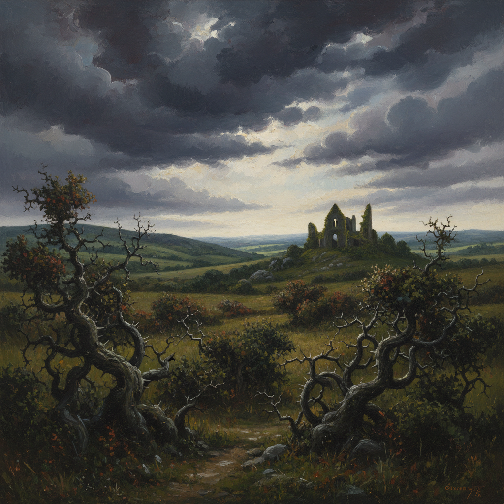

# Neo-Romanticism Painting 新浪漫主义绘画

> **时期：** 1920年代–1950年代  
> **关键词：** 田园风景、情感回归、反现代主义、英国画派、诗意自然

## 概述

Neo-Romanticism Painting（新浪漫主义绘画）是20世纪20至50年代在英国和法国兴起的绘画运动——在机械化和战争的阴影下，画家们重新转向自然风景和情感表达。格雷厄姆·萨瑟兰的威尔士荆棘、约翰·派珀的废墟教堂——他们用浪漫主义的眼光重新发现了被工业文明遗忘的土地，在荒野中寻找精神慰藉。

## 风格特征

- **诗意风景**：带有情感投射的自然描绘
- **有机形态**：扭曲的树木、岩石和荆棘
- **戏剧光线**：暴风雨前的天空和斜射阳光
- **废墟美学**：战争遗迹中的崇高感
- **暗沉色调**：深绿、褐色和灰蓝

## 代表人物与作品

- 格雷厄姆·萨瑟兰 威尔士风景
- 约翰·派珀 废墟教堂
- 保罗·纳什 战争风景
- 约翰·米顿 地中海幻想

## 概念图

