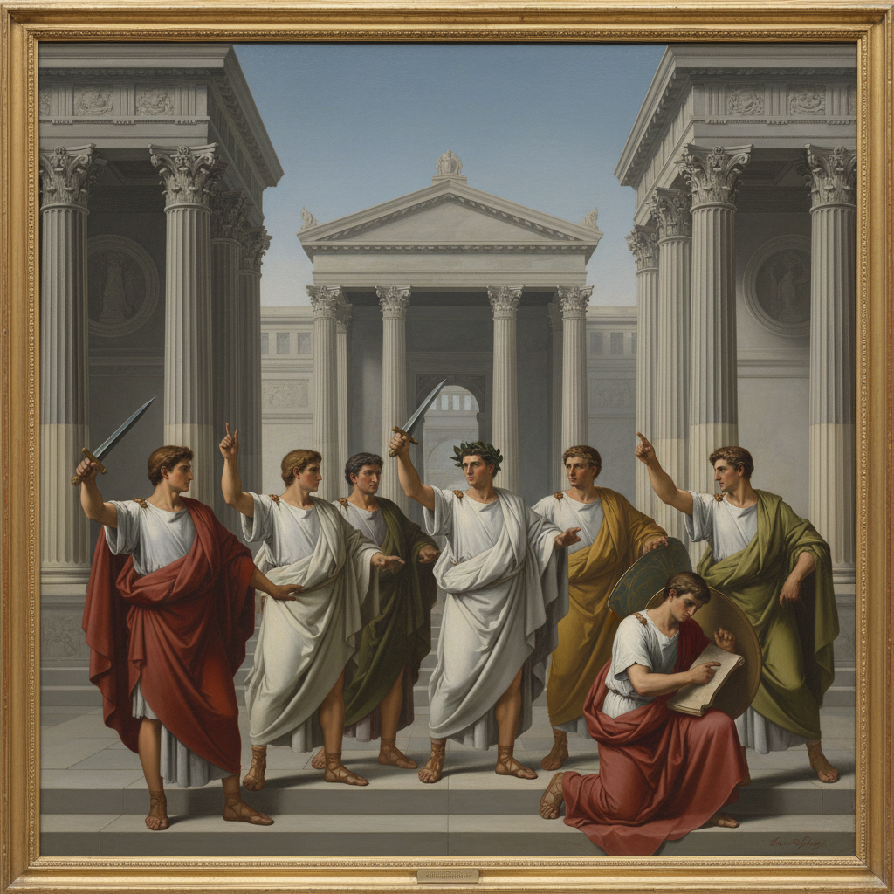

# Neoclassicism Painting 新古典主义绘画

> **时期：** 1760年代–1850年代  
> **关键词：** 古典复兴、理性秩序、道德崇高、线条优先、罗马共和

## 概述

Neoclassicism Painting（新古典主义绘画）是对巴洛克和洛可可的反动——回归古希腊罗马的理性、秩序和道德崇高。大卫的《荷拉斯兄弟之誓》以清晰的线条、严肃的主题和古典的构图，宣告了一个新时代的美学理想：艺术应当教育公民、激发美德，而非取悦感官。

## 风格特征

- **线条优先**：清晰轮廓线优于色彩渲染
- **古典题材**：罗马共和国的英雄故事
- **理性构图**：严格的几何秩序和对称
- **雕塑感**：人物如大理石雕像般坚实
- **道德教化**：传达公民美德和牺牲精神

## 代表人物与作品

- 雅克-路易·大卫《荷拉斯兄弟之誓》《马拉之死》
- 安格尔《大宫女》《泉》
- 安东尼奥·卡诺瓦 新古典雕塑
- 安杰莉卡·考夫曼 历史画

## 概念图

