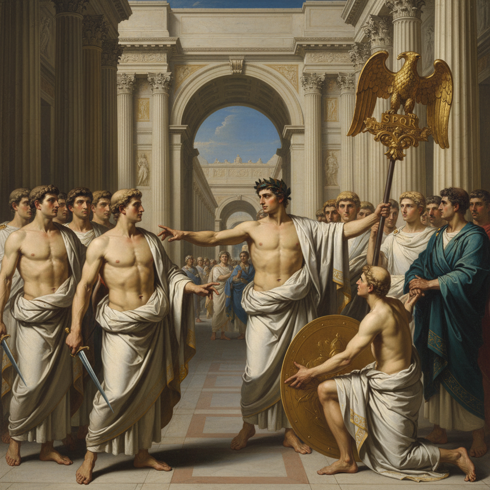

# Neoclassicism 新古典主义



> **"回到希腊罗马的理性与秩序——在革命的时代，用古典的纯净对抗洛可可的轻浮。"**

## 概述

| 维度 | 描述 |
|------|------|
| 时期 | 1760–1850/影响至今 |
| 别名 | Neoclassicism, Neo-Classical, 新古典主义 |
| 核心色彩 | 大理石白、深蓝、金色、赭石、冷灰 |
| 关键元素 | 古典比例、对称构图、理想化人体、历史题材、克制情感 |
| 代表人物 | Jacques-Louis David, Jean-Auguste-Dominique Ingres, Antonio Canova |
| 关联风格 | Renaissance, Baroque, Academic Art, Romanticism(对立), Art Deco |

---

## 历史脉络

| 年份 | 事件 |
|------|------|
| 1748 | 庞贝古城发掘——古典热潮 |
| 1755 | Winckelmann《古代艺术史》——新古典主义理论 |
| 1784 | David《荷拉斯兄弟之誓》——新古典主义绘画巅峰 |
| 1789 | 法国大革命——新古典主义成为革命美学 |
| 1800s | 拿破仑时代——帝国风格 |
| 1850s | 被浪漫主义和写实主义取代 |
| 2020s | 新古典建筑元素在当代设计中延续 |

### 核心哲学

新古典主义的精神是**"美 = 秩序 + 理性 + 古典"**：
- 理性 = 美（"洛可可太轻浮了——回到古典的严肃"）
- 古典 = 永恒（"希腊罗马的美是永恒的标准"）
- 克制 = 高贵（"不表达过度的情感——克制才是力量"）
- 道德 = 目的（"艺术应该教育人——不只是取悦人"）
- David: "艺术应该为共和国服务"

---

## 视觉语法

### 色彩系统

```
主色：
  大理石白 (#F5F5F5) — 纯净、古典
  深蓝 (#000080) — 理性、权威
  金色 (#DAA520) — 帝国、荣耀
  赭石 (#CC7722) — 大地、古典

辅色：
  冷灰 (#808080) — 石头、建筑
  深红 (#8B0000) — 权力、牺牲
  橄榄绿 (#556B2F) — 月桂、胜利

规则：
  - 色彩克制、不过度鲜艳
  - 冷色调为主
  - 光线清晰、均匀
  - 色彩服务于形体

质感：
  大理石 — 光滑、冷
  油画 — 精细、看不见笔触
  织物 — 古典褶皱
  金属 — 盔甲、武器
```

### 标志性元素

| 类别 | 元素 |
|------|------|
| 构图 | 对称、稳定、古典比例、舞台化 |
| 人体 | 理想化、古典姿态、英雄体格 |
| 建筑 | 古典柱式、三角楣、穹顶 |
| 题材 | 历史、神话、英雄、道德故事 |
| 态度 | 理性、克制、高贵、道德、秩序 |
| 遗产 | → 政府建筑、银行、博物馆的"权威感" |

---

## 与千禧怀旧的关系

### "权威"的视觉语言
- 新古典建筑 = 全球政府/银行/博物馆的默认风格
- "当你想表达'权威'和'永恒'——你用新古典"
- 白宫、国会大厦、大英博物馆 = 新古典主义
- 奢侈品牌的"古典感" = 新古典主义DNA

### 对当代设计的影响
- 新古典 → 对称构图 → "高端感"设计
- → 古典字体(Serif) → 权威品牌
- → Art Deco 的几何古典
- "新古典主义教会了设计师：对称 = 权威"

---

## 中国语境

- 中国近代建筑中的新古典元素
- 中国美术教育中的古典训练传统
- 中国"学院派"绑画与新古典主义的关系
- 中国奢侈品/高端品牌的新古典视觉

---

## 设计应用

| 场景 | 应用方式 |
|------|----------|
| 品牌 | 高端+权威+永恒+经典+信任 |
| 建筑 | 政府+银行+博物馆+酒店 |
| 时尚 | 古典+优雅+结构+对称 |
| 包装 | 奢侈品+香水+珠宝+酒类 |

---

## 相关风格

← [Rococo 洛可可](rococo.md) | [Romanticism 浪漫主义](romanticism.md) →

↑ [返回千禧怀旧目录](README.md) | [返回总目录](../README.md)
