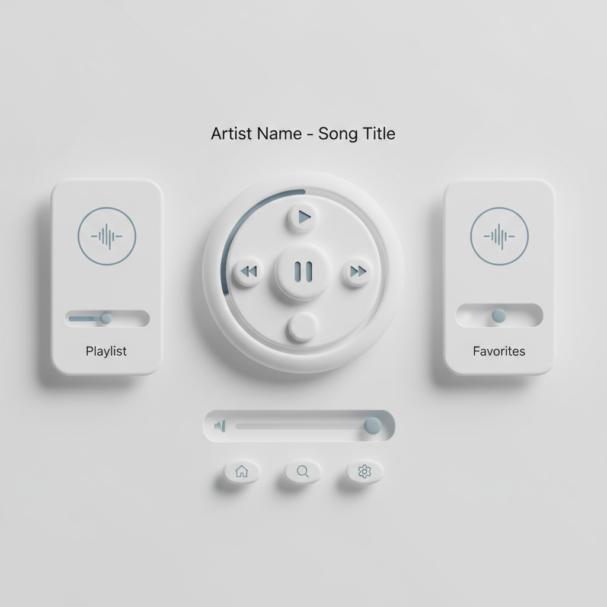

# Neomorphism 新拟态



> **"柔和阴影、内凹外凸、单色系统——UI设计中最'触感'的数字风格。"**

## 概述

| 维度 | 描述 |
|------|------|
| 时期 | 2019–至今 |
| 别名 | Neumorphism, Soft UI, 新拟态 |
| 核心色彩 | 单色系（浅灰、米白、淡蓝）+柔和阴影 |
| 关键元素 | 柔和投影、内凹/外凸、单色背景、圆角、极简 |
| 代表人物 | Alexander Plyuto (Dribbble), UI设计社区 |
| 关联风格 | Skeuomorphism, Flat Design, Glassmorphism, Material Design |

---

## 历史脉络

| 年份 | 事件 |
|------|------|
| 2007 | iPhone——拟物化设计(Skeuomorphism)全盛 |
| 2013 | iOS 7——扁平化革命 |
| 2014 | Material Design——"有深度的扁平" |
| 2019 | Alexander Plyuto 发布 Neumorphism 概念 |
| 2020 | Neumorphism 在 Dribbble 爆发 |
| 2021 | 争议：美观 vs 可用性 |
| 2022+ | 作为设计元素融入混合风格 |

### 核心哲学

新拟态的精神是**"数字界面也可以有'触感'——不是假装真实，而是创造新的真实"**：
- 柔和 = 舒适（"没有硬边——一切都是柔和的"）
- 单色 = 统一（"同一种颜色的深浅——创造深度"）
- 触感 = 新的（"不是模仿真实按钮——是创造数字按钮的触感"）
- 极简 = 纯粹（"去掉颜色的干扰——只留形状和光影"）
- "Neumorphism 是 Skeuomorphism 和 Flat Design 的孩子"

---

## 视觉语法

### 色彩系统

```
主色（单色系）：
  浅灰 (#E0E5EC) — 最常见背景
  米白 (#F0F0F3) — 温暖变体
  淡蓝 (#E3EDF7) — 冷色变体

阴影：
  亮面 — 白色/浅色阴影（左上）
  暗面 — 深色阴影（右下）
  
规则：
  - 背景和元素同色系
  - 通过阴影创造深度
  - 内凹(inset) vs 外凸(raised)
  - 极少使用强调色

质感：
  柔和 — 模糊阴影
  圆润 — 大圆角
  统一 — 单色系
  触感 — 可按压感
```

### 标志性元素

| 类别 | 元素 |
|------|------|
| 阴影 | 双向柔和阴影（亮+暗） |
| 形状 | 圆角矩形、圆形、pill形 |
| 状态 | 外凸(raised)、内凹(pressed)、平面(flat) |
| 色彩 | 单色系、极少强调色 |
| 图标 | 线性、单色、柔和 |
| 态度 | 柔和、触感、极简、统一、现代 |

---

## 与千禧怀旧的关系

### UI设计的"第三条路"
- 拟物化 (2007-2013): 模仿真实世界
- 扁平化 (2013-2019): 完全抽象
- 新拟态 (2019-): 抽象但有触感
- "Neumorphism 试图在扁平和拟物之间找到平衡"

### Dribbble 美学 vs 实际应用
- Dribbble 上的 Neumorphism = 视觉概念
- 实际产品中的应用 = 有限（可用性问题）
- "好看但不好用" 的争论
- 作为设计元素而非完整系统使用

---

## 中国语境

- 中国UI设计社区对新拟态的讨论
- 中国App中的新拟态元素
- 与中国"极简"设计趋势的交叉
- 作为UI设计教学案例

---

## 设计应用

| 场景 | 应用方式 |
|------|----------|
| UI | 按钮+卡片+输入框+开关+滑块 |
| 品牌 | 柔和+现代+触感+高级+极简 |
| 产品 | 智能家居UI+音乐播放器+仪表盘 |
| 概念 | Dribbble+设计探索+视觉实验 |

---

## 相关风格

← [Glassmorphism 玻璃态](glassmorphism.md) | [Flat Design 扁平设计](flat-design.md) →

↑ [返回千禧怀旧目录](README.md) | [返回总目录](../README.md)
