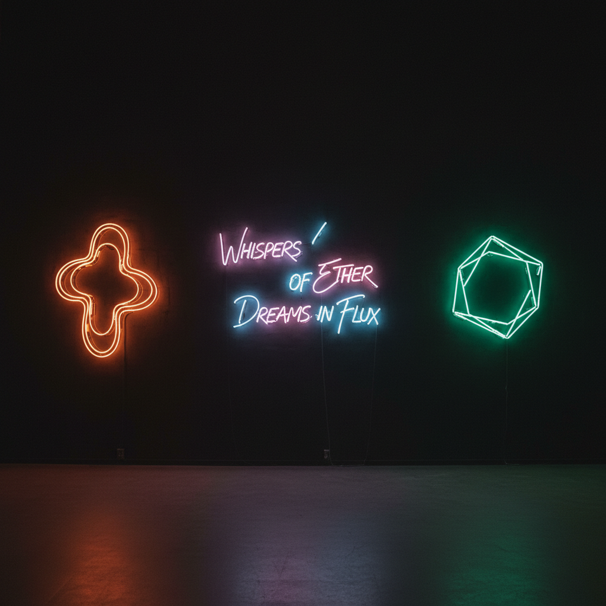

# Neon Art 霓虹艺术

> "Neon is the most democratic of all art forms — it speaks to everyone on the street." — Tracey Emin

## 概述

霓虹艺术（Neon Art）是使用霓虹灯管（充入惰性气体的玻璃管）作为创作媒介的艺术形式。从1960年代的极简主义艺术家开始将霓虹灯从商业广告中解放出来，霓虹成为了当代艺术的重要媒介——它既是光，也是线条，也是文字，也是色彩。

霓虹的魅力在于它的双重性——既是城市夜景的日常元素，又可以被提升为诗意的艺术表达。

## 核心特征

| 特征 | 描述 |
|------|------|
| 光媒介 | 以发光的气体管为媒介 |
| 线条性 | 玻璃管弯曲形成线条 |
| 色彩 | 不同气体产生不同色彩 |
| 文字性 | 常用于书写文字和标语 |
| 城市性 | 与城市夜景文化紧密相关 |
| 手工性 | 每根管子都是手工弯制 |

## 视觉特征

- **发光**：管子本身发出柔和的光
- **色彩**：红、蓝、绿、白、粉等霓虹色
- **线条**：连续的、流畅的光线条
- **文字**：手写体或印刷体的发光文字
- **暗背景**：通常在暗色背景上展示
- **氛围**：温暖的、怀旧的、都市的氛围

## 代表作品

| 作品 | 艺术家 | 年代 | 意义 |
|------|--------|------|------|
| *The True Artist Helps the World* | Bruce Nauman | 1967 | 霓虹文字艺术的先驱 |
| *One Hundred Live and Die* | Bruce Nauman | 1984 | 霓虹的观念性 |
| *My Bed (neon works)* | Tracey Emin | 1990s+ | 霓虹的亲密告白 |
| *Neon installations* | Dan Flavin | 1960s+ | 荧光灯的极简装置 |
| *Neon works* | Joseph Kosuth | 1960s+ | 霓虹的语言哲学 |
| *Neon works* | Cerith Wyn Evans | 2000s+ | 霓虹的诗意 |

## 历史时间线

| 时期 | 事件 |
|------|------|
| 1910 | Georges Claude发明霓虹灯 |
| 1920s-50s | 霓虹灯的商业广告黄金时代 |
| 1960s | 极简主义艺术家开始使用霓虹 |
| 1967 | Bruce Nauman的第一件霓虹作品 |
| 1990s | Tracey Emin——霓虹的个人化 |
| 2000s | LED开始替代传统霓虹 |
| 2010s-至今 | 霓虹的怀旧复兴和Instagram美学 |

## 中国语境

霓虹灯在中国城市景观中有重要地位——从上海南京路的霓虹到香港的霓虹招牌（正在消失的文化遗产）。中国当代艺术家如王功新等使用霓虹作为创作媒介。中国的"赛博朋克"美学和夜经济文化与霓虹紧密相关。香港的霓虹招牌保护运动引起了对这一城市文化遗产的关注。

## AI生成概念图

## 与其他风格的关系

- **Light Art** → 霓虹是灯光艺术的重要形式
- **Minimalism** → Dan Flavin的荧光灯极简装置
- **Conceptual Art** → 霓虹文字的观念性
- **Pop Art** → 霓虹的商业文化联想
- **Street Art** → 霓虹与城市街头文化
- **Installation Art** → 霓虹装置

---

*浮光艺志 | Chronicle of Artistry*
