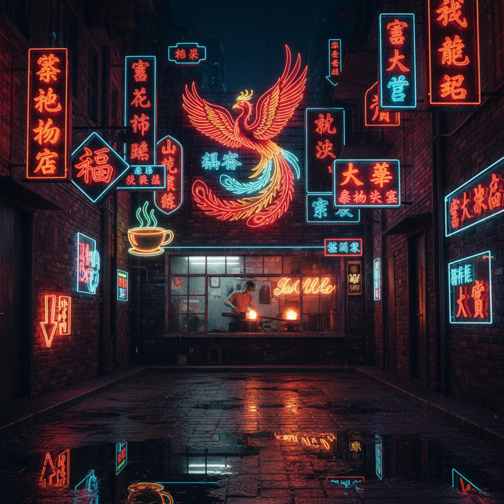

# Neon Sign Art 霓虹灯艺术

> "Neon is liquid fire trapped in glass — noble gases excited to incandescence, bent into words and shapes by the glassblower's breath and flame. A neon sign is simultaneously industrial craft and pure poetry: it turns language into light, commerce into beauty, and the night city into an illuminated manuscript written in fire." — Unknown

## 概述

霓虹灯艺术（Neon Sign Art）是以霓虹灯管为媒介进行艺术创作的实践——通过将惰性气体（氖气、氩气等）封入手工弯制的玻璃管中，通电后产生特定颜色的辉光，创造出发光的文字、图案和雕塑。霓虹灯艺术是工艺、设计和当代艺术的交汇。

霓虹灯艺术的实践包括：1）霓虹文字——用霓虹灯管书写文字和短语；2）霓虹雕塑——用霓虹灯管创造三维造型；3）霓虹装置——将霓虹灯融入大型艺术装置；4）霓虹招牌——商业招牌的艺术化设计；5）霓虹摄影——以霓虹灯为主题的摄影；6）LED仿霓虹——用LED技术模拟霓虹效果；7）霓虹修复——历史霓虹招牌的保护和修复。

## 核心特征

| 特征 | 描述 |
|------|------|
| 发光 | 自发光的媒介 |
| 色彩 | 特定的气体色彩 |
| 手工 | 手工弯管工艺 |
| 夜间 | 夜间最佳效果 |
| 城市 | 城市文化的象征 |
| 怀旧 | 怀旧的美学 |

## 视觉特征

- **辉光**：柔和的气体辉光
- **色彩**：红、蓝、绿、紫等纯色
- **线条**：连续的管状线条
- **光晕**：管周围的光晕
- **夜景**：黑暗背景下的发光
- **文字**：发光的文字和符号

## 代表作品

| 作品 | 艺术家 | 年代 | 意义 |
|------|--------|------|------|
| *Neon text works* | Tracey Emin | 1990年代至今 | 霓虹文字艺术 |
| *Neon installations* | Dan Flavin | 1960年代 | 荧光灯装置（相关） |
| *Human/Need/Desire* | Bruce Nauman | 1983 | 霓虹概念艺术 |
| *Hong Kong neon* | Various | 20世纪 | 香港霓虹招牌文化 |
| *Las Vegas signs* | Various | 20世纪 | 拉斯维加斯霓虹 |

## 历史时间线

| 时期 | 事件 |
|------|------|
| 1910 | Georges Claude发明霓虹灯 |
| 1920-30年代 | 霓虹招牌的商业化 |
| 1960年代 | 霓虹进入当代艺术 |
| 1980-90年代 | 霓虹艺术的黄金时代 |
| 当代 | 霓虹的复兴和LED替代 |

## 中国语境

霓虹灯艺术在中国有独特的文化记忆。中国的霓虹灯文化在1980-90年代达到高峰——上海南京路、北京王府井、广州北京路的霓虹招牌是那个时代城市繁华的象征。香港的霓虹招牌更是世界闻名——密集的中文霓虹招牌构成了独特的城市景观，成为无数电影和摄影作品的标志性背景。然而随着LED技术的普及和城市管理的规范化，中国的传统霓虹招牌正在快速消失——香港和内地都在经历"去霓虹化"的过程。中国的一些艺术家和文化保护者在记录和保存这些正在消失的霓虹遗产。中国当代艺术中，霓虹灯也被广泛用作创作媒介——用中文霓虹文字创作概念艺术作品。

## AI生成概念图

## 与其他风格的关系

- **Light Art** → 光艺术
- **Typography Art** → 字体艺术
- **Urban Art** → 城市艺术
- **Pop Art** → 波普艺术
- **Installation Art** → 装置艺术
- **Sign Painting** → 招牌绘画

---

*浮光艺志 | Chronicle of Artistry*
