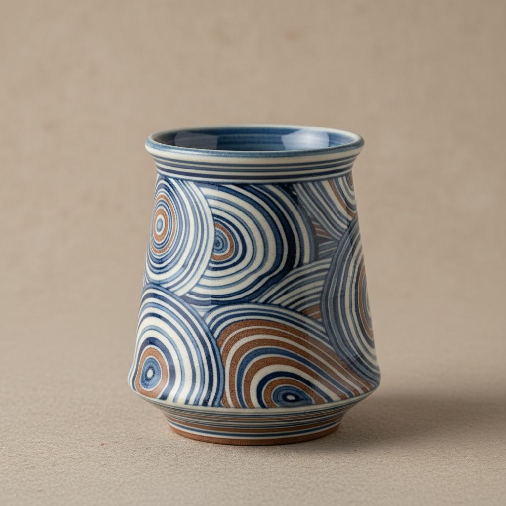

# Nerikomi Art 练込陶艺

> "Nerikomi is painting inside clay — different colored clays are layered, folded, and sliced to reveal internal patterns that run through the entire thickness of the wall, not merely on the surface. Every cross-section tells the same story. It is the ceramic equivalent of a stick of rock candy, where the pattern is not applied but inherent, built into the very structure of the material itself." — Unknown

## 概述

练込陶艺（Nerikomi Art）是一种将不同颜色的粘土层叠、折叠、扭转后切片组合的陶瓷技法——使图案贯穿整个器壁厚度而非仅在表面。Nerikomi（日语"練り込み"，意为"揉入"）创造出类似大理石纹、木纹或几何图案的效果，每一个截面都呈现相同的图案。这种技法要求对粘土收缩率的精确控制，因为不同颜色的粘土必须以相同的速率收缩才不会开裂。

练込陶艺的实践包括：1）色泥制备——用金属氧化物或色料调配不同颜色的粘土；2）层叠——将不同颜色的粘土薄片层叠；3）折叠扭转——反复折叠和扭转创造复杂图案；4）切片——将色泥块切成薄片；5）组合成型——将切片组合成器物形状；6）精修——修整表面使图案清晰；7）当代练込——将传统技法与现代设计结合的创作。

## 核心特征

| 特征 | 描述 |
|------|------|
| 内在 | 图案贯穿整体 |
| 色泥 | 使用多色粘土 |
| 切片 | 切片揭示图案 |
| 精确 | 需要精确控制 |
| 日本 | 源自日本的传统 |
| 独特 | 每件图案独特 |

## 视觉特征

- **层次**：多层色泥的层次
- **有机**：有机流动的图案
- **贯穿**：图案贯穿器壁
- **色彩**：丰富的色泥色彩
- **纹理**：大理石般的纹理
- **精致**：精致细腻的效果

## 代表作品

| 作品 | 艺术家/文化 | 年代 | 意义 |
|------|-------------|------|------|
| *Matsui Kosei works* | 日本 | 20世纪 | 练込人间国宝 |
| *Dorothy Feibleman works* | 英国 | 当代 | 西方练込大师 |
| *Thomas Hoadley works* | 美国 | 当代 | 美国练込陶艺 |
| *Contemporary nerikomi* | 国际 | 当代 | 当代练込发展 |
| *Geometric nerikomi* | 当代 | 当代 | 几何练込设计 |

## 历史时间线

| 时期 | 事件 |
|------|------|
| 唐代 | 中国绞胎陶的起源 |
| 江户时代 | 日本练込技法的发展 |
| 20世纪 | 松井康成将练込提升为艺术 |
| 1970年代 | 西方陶艺界的引入 |
| 当代 | 练込的全球化发展 |

## 中国语境

练込陶艺与中国陶瓷传统有直接的历史渊源。中国唐代的绞胎陶是练込技法的源头——将不同颜色的粘土绞合在一起创造纹理。中国当阳峪窑的绞胎瓷是中国绞胎陶的代表——以其精美的纹理著称。中国宋代的绞胎枕是重要的陶瓷文物——展示了中国古代的色泥技法。中国当代的陶艺家重新发掘绞胎传统——将其与现代设计结合。中国的陶瓷教育中，绞胎/练込作为一种重要的装饰技法——在各大美术学院教授。中国的一些陶艺工作室专注于绞胎创作——将这一古老技法发展为当代艺术表达。中国的非物质文化遗产中，绞胎陶瓷制作技艺被列入保护名录——传承这一独特的陶瓷传统。

## AI生成概念图

## 与其他风格的关系

- **Agateware** → 玛瑙纹陶
- **Millefiori** → 千花玻璃
- **Mokume-gane** → 木目金
- **Ceramics** → 陶瓷艺术
- **Pattern Design** → 图案设计
- **Marbling** → 大理石纹

---

*浮光艺志 | Chronicle of Artistry*
