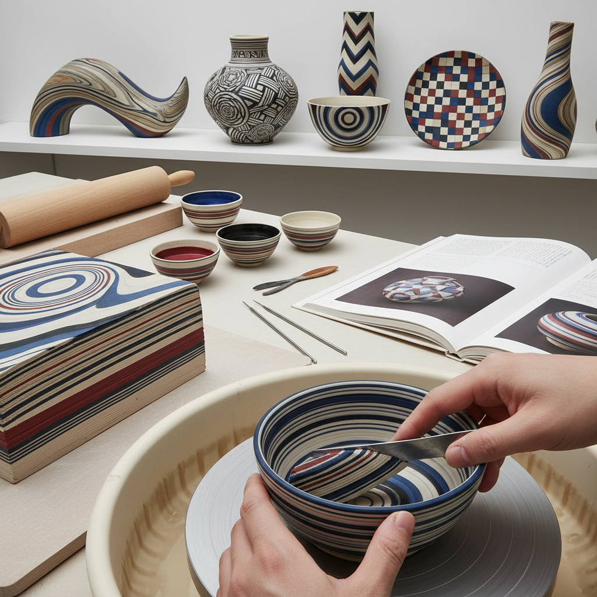

# Nerikomi Technique 练込技法

> "Nerikomi is painting with clay itself — colored clays layered, folded, and sliced like a geological cross-section, revealing patterns that run through the entire thickness of the wall, where surface and structure are one and the same." — Unknown

## 概述

练込技法（Nerikomi Technique）是一种使用不同颜色的粘土层叠、折叠、扭绞后切片组合的陶瓷成型和装饰技法——图案不是画在表面，而是贯穿整个器壁厚度。"Nerikomi"（練り込み）是日语，意为"揉入"或"混入"。这种技法也被称为"agateware"（玛瑙纹陶）或"millefiori"（千花）技法。

练込技法的过程：将不同颜色的粘土（通过添加金属氧化物或色料着色）制成薄片或条状，然后像制作千层糕一样层叠、折叠、扭绞，形成复杂的内部图案。将这些多色粘土块切成薄片，然后用这些薄片组装成器物——切面上显示出贯穿整个厚度的精美图案。练込技法要求极高的技术精度——不同颜色的粘土必须有相同的收缩率，否则在干燥和烧制过程中会开裂。

## 核心特征

| 特征 | 描述 |
|------|------|
| 多色 | 使用多色粘土 |
| 贯穿 | 图案贯穿器壁 |
| 层叠 | 层叠和折叠 |
| 切片 | 切片显示图案 |
| 精密 | 要求极高精度 |
| 结构 | 图案即结构 |

## 视觉特征

- **多色**：多色的图案
- **贯穿**：贯穿器壁的图案
- **几何**：几何的图案
- **有机**：扭绞产生的有机纹理
- **精密**：精密的色彩排列
- **独特**：每件都独一无二

## 代表作品

| 作品 | 艺术家 | 年代 | 意义 |
|------|--------|------|------|
| *Japanese nerikomi vessels* | 松井康成 | 20世纪 | 日本练込大师 |
| *Contemporary nerikomi* | Various | 当代 | 当代练込陶艺 |
| *Geometric nerikomi* | Various | 当代 | 几何图案练込 |
| *Organic nerikomi* | Various | 当代 | 有机纹理练込 |
| *Nerikomi jewelry* | Various | 当代 | 练込首饰 |

## 历史时间线

| 时期 | 事件 |
|------|------|
| 古代 | 早期多色粘土技法 |
| 唐代 | 中国绞胎瓷的发展 |
| 传统 | 日本练込传统的形成 |
| 20世纪 | 松井康成等大师的发展 |
| 当代 | 练込技法的全球传播 |
| 当代 | 当代陶艺家的练込创新 |

## 中国语境

练込技法在中国有重要的历史渊源——中国唐代的"绞胎瓷"（twisted body ware）是练込技法的早期形式。中国的当阳峪窑、巩义窑等窑口在唐宋时期生产了精美的绞胎瓷器。中国的绞胎瓷以其独特的木纹或羽毛纹图案闻名。中国的当代陶艺教育中，练込/绞胎技法作为一种高级成型和装饰技法被教授。中国的一些当代陶艺家在传承绞胎传统的基础上进行创新。

## AI生成概念图

## 与其他风格的关系

- **Agateware** → 玛瑙纹陶
- **Millefiori** → 千花技法
- **Mokume Gane** → 木目金
- **Ceramic Sculpture** → 陶瓷雕塑
- **Color Clay** → 色泥
- **Chinese Jiaotai** → 中国绞胎

---

*浮光艺志 | Chronicle of Artistry*
