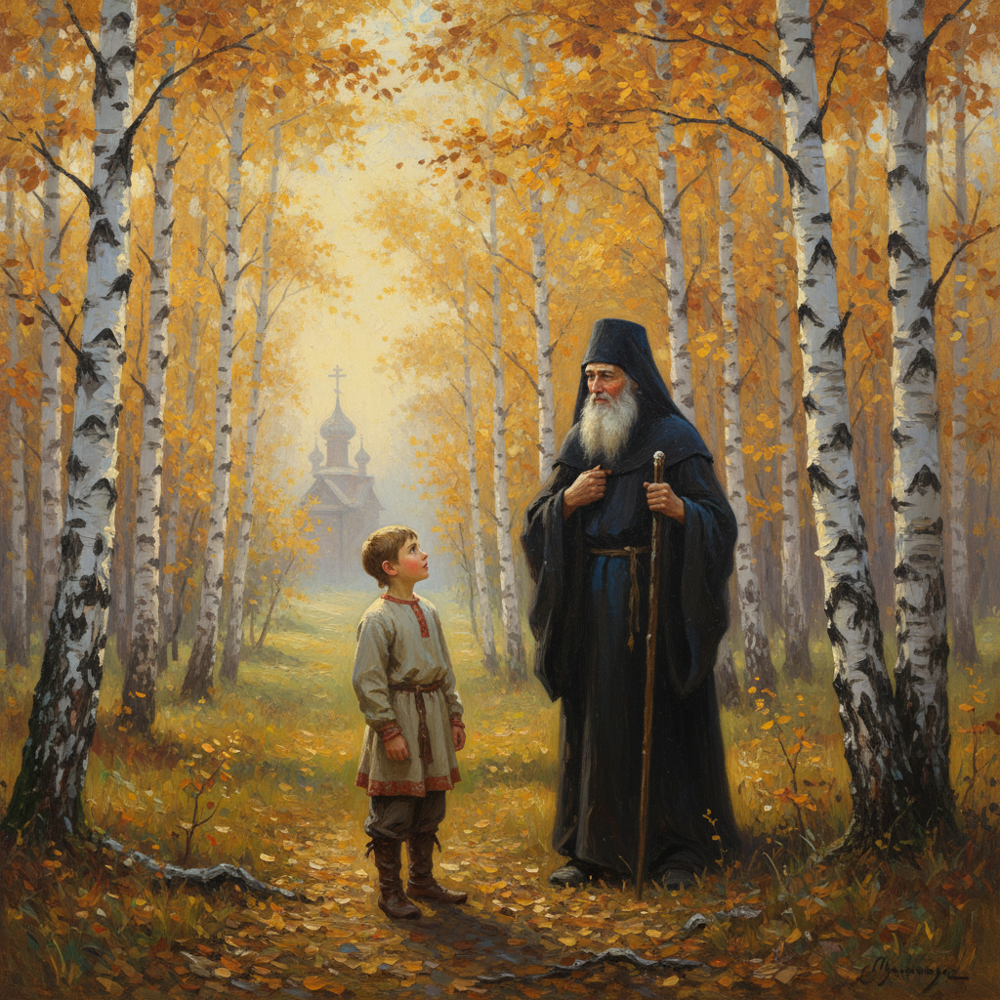

# Nesterov Art 涅斯捷罗夫艺术

> "I lived in my art. I loved only it, only in it I saw the meaning of my existence." — Mikhail Nesterov

## 概述

涅斯捷罗夫艺术（Nesterov Art）是19-20世纪俄罗斯画家米哈伊尔·瓦西里耶维奇·涅斯捷罗夫（Mikhail Vasilyevich Nesterov, 1862-1942）创立的宗教-抒情风景画风格。涅斯捷罗夫被誉为"俄罗斯灵魂的画家"——他将东正教的精神世界与俄罗斯自然风景融为一体，创造了一种独特的"精神风景画"。他的画作中，纤细的白桦、宁静的湖泊和沉思的修道者构成了一个充满灵性的世界。

涅斯捷罗夫最著名的作品《少年巴尔多洛缪的幻象》（1890）描绘了年幼的圣谢尔盖在森林中遇见一位神秘修道士的传说——秋天的白桦林、远处的教堂和神秘的光芒构成了一幅充满灵性的画面。他的"圣谢尔盖系列"以诗意的手法讲述了这位俄罗斯圣人的一生。涅斯捷罗夫晚年转向肖像画创作，为苏联时期的科学家和艺术家留下了深刻的肖像。

涅斯捷罗夫艺术的核心要素包括：1）精神风景——自然与灵性的融合；2）宗教诗意——东正教精神的诗意表达；3）俄罗斯灵魂——对俄罗斯精神世界的探索；4）纤细之美——纤细、柔和的美学；5）白桦意象——白桦树作为俄罗斯灵魂的象征；6）沉思氛围——宁静沉思的氛围；7）肖像深度——晚期肖像画的精神深度。

## 核心特征

| 特征 | 描述 |
|------|------|
| 精神风景 | 自然与灵性融合 |
| 宗教诗意 | 东正教精神诗意表达 |
| 俄罗斯灵魂 | 对俄罗斯精神世界探索 |
| 纤细之美 | 纤细柔和的美学 |
| 白桦意象 | 白桦树作为灵魂象征 |
| 沉思氛围 | 宁静沉思的氛围 |

## 视觉特征

- **纤细白桦**：细长的白桦树
- **秋色柔和**：柔和的秋天色调
- **修道者身影**：沉思的修道者形象
- **远处教堂**：远景中的教堂尖顶
- **柔和光线**：柔和而神秘的光线
- **垂直构图**：纤细的垂直线条

## 代表作品

| 作品 | 年代 | 意义 |
|------|------|------|
| *少年巴尔多洛缪的幻象* (Vision of Young Bartholomew) | 1890 | 最著名的作品 |
| *隐士* (The Hermit) | 1888-1889 | 精神风景的典范 |
| *圣俄罗斯* (Holy Russia) | 1901-1905 | 宗教画巅峰 |
| *在俄罗斯* (On the Hills of Russia) | 1916 | 俄罗斯灵魂 |
| *巴甫洛夫院士肖像* (Portrait of Pavlov) | 1935 | 晚期肖像杰作 |
| *哲学家* (The Thinkers) | 1917 | 精神对话 |

## 历史时间线

| 时期 | 事件 |
|------|------|
| 1862年 | 出生于乌法 |
| 1877-1886年 | 就读莫斯科绘画学校 |
| 1890年 | 创作《少年巴尔多洛缪的幻象》 |
| 1890-1910年代 | 宗教画和精神风景创作期 |
| 1920-1940年代 | 转向肖像画创作 |
| 1942年 | 在莫斯科去世 |

## 中国语境

涅斯捷罗夫在中国的知名度相对有限，但他的艺术理念对中国当代艺术有独特的启示。他将精神世界与自然风景融合的方法，与中国传统山水画中"天人合一"的理念有深刻的共鸣——都追求在自然景观中表达精神境界。涅斯捷罗夫的"精神风景画"概念为中国画家提供了一种将宗教/哲学精神融入风景画的可能路径。他对白桦树的诗意描绘——将其作为俄罗斯灵魂的象征——与中国画家将松、竹、梅作为精神象征的传统有异曲同工之妙。涅斯捷罗夫证明了风景画可以成为精神探索的载体——这一理念对中国当代风景油画的精神化追求有重要的参考价值。

## 概念图

## 与其他风格的关系

- **Levitan** → 列维坦（抒情风景）
- **Vasnetsov** → 瓦斯涅佐夫（民族浪漫）
- **Peredvizhniki** → 巡回展览画派
- **Symbolism** → 象征主义
- **Pre-Raphaelites** → 拉斐尔前派
- **Icon Painting** → 圣像画传统

---

*浮光艺志 | Chronicle of Artistry*
