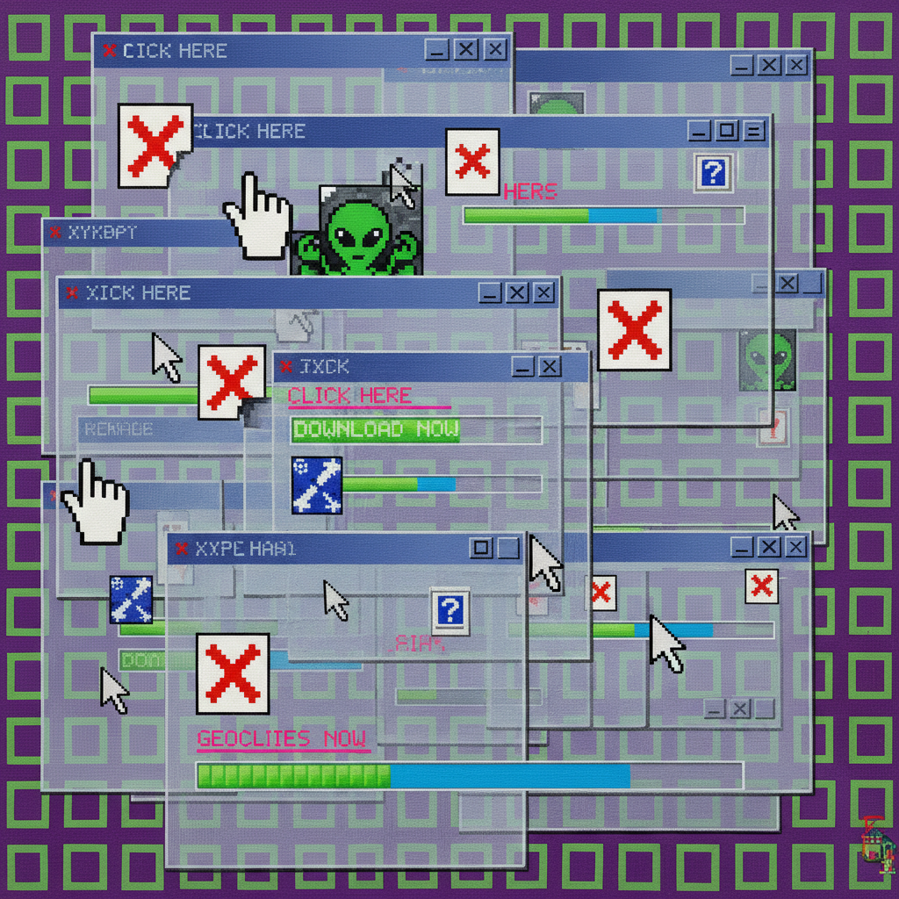

# Net Art Painting 网络艺术绘画

> **时期：** 1994年–至今  
> **关键词：** 互联网原生、浏览器美学、像素、超链接、数字民主

## 概述

Net Art Painting（网络艺术绘画）是1990年代中期随万维网诞生的艺术形式在绘画领域的投射。早期网络艺术家利用HTML、GIF动画、浏览器故障和像素美学创造了一种全新的视觉语言——它不是用互联网展示绘画，而是将互联网本身的视觉特征（加载条、断裂图像、光标轨迹）变为绘画的主题和材料。

## 风格特征

- **像素美学**：低分辨率和位图质感
- **浏览器元素**：窗口、光标、滚动条作为构图
- **故障美学**：错误信息和损坏图像
- **超链接逻辑**：非线性的视觉叙事
- **民主精神**：任何人都可以创作和分享

## 代表人物与作品

- JODI 浏览器艺术
- 奥利亚·利亚利娜 网页叙事
- 米利托斯·马内塔斯 互联网绘画
- 拉斐尔·罗森达尔 网页画作

## 概念图

