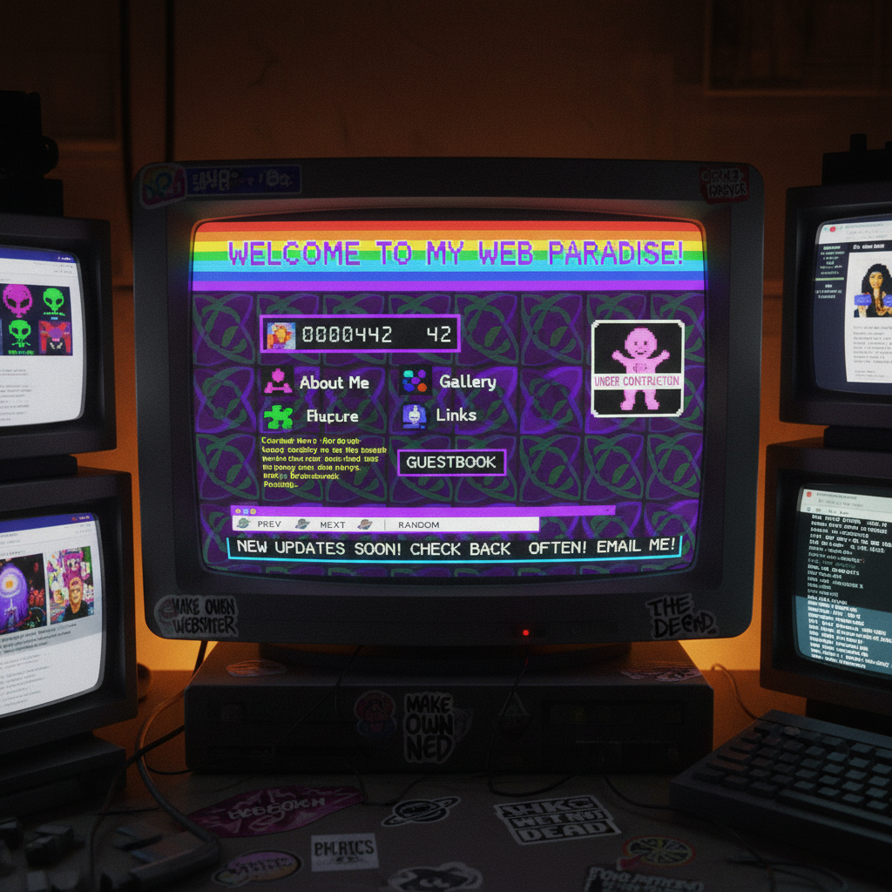

# Net Art Revival 网络艺术复兴

> "Net art revival is not nostalgia for the early internet — it is the recognition that the radical promise of the web was never fulfilled, that the open, decentralized, democratic network imagined by its pioneers was captured by platforms and surveillance capitalism, and that the aesthetic and political strategies of early net art — its DIY spirit, its refusal of gatekeepers, its celebration of the weird and the broken — are more relevant than ever in an age of algorithmic control, content moderation, and digital enclosure." — Unknown

## 概述

网络艺术复兴（Net Art Revival）是2010年代以来重新发现和延续1990年代网络艺术（net.art）精神的运动。1990年代的网络艺术——以Jodi、Olia Lialina、Vuk Ćosić等艺术家为代表——利用早期互联网的开放性和实验性创造了独特的艺术形式。网络艺术复兴运动认为，在社交媒体平台主导的当代互联网中，早期网络艺术的精神——开放、实验、去中心化、反商业——比以往更加重要。

网络艺术复兴的实践包括：1）复古网页美学——使用早期网页的视觉元素（GIF动画、像素字体、表格布局、访客计数器）；2）独立网站运动——建立个人网站而非依赖社交平台；3）网络考古——发掘和保存早期互联网的文化遗产；4）反平台实践——创造不依赖商业平台的网络艺术空间。

## 核心特征

| 特征 | 描述 |
|------|------|
| 复古 | 早期网络美学 |
| 独立 | 独立于平台 |
| 开放 | 开放和去中心化 |
| DIY | 自己动手 |
| 反商业 | 反商业化 |
| 实验 | 技术实验 |

## 视觉特征

- **像素**：像素化的图形
- **GIF**：闪烁的GIF动画
- **表格**：HTML表格布局
- **链接**：超链接的美学
- **故障**：网页故障效果
- **彩色**：鲜艳的网页色彩

## 代表作品

| 作品 | 艺术家 | 年代 | 意义 |
|------|--------|------|------|
| *Neocities websites* | Various | 2013至今 | 独立网站平台 |
| *Web revival movement* | Various | 2018至今 | 网络复兴运动 |
| *Digital gardens* | Various | 2020年代 | 数字花园 |
| *Small web* | Various | 2020年代 | 小型网络 |
| *IndieWeb* | Various | 2010年代 | 独立网络 |

## 历史时间线

| 时期 | 事件 |
|------|------|
| 1994-2000 | 原始网络艺术运动 |
| 2013 | Neocities平台创建 |
| 2018 | 网络复兴运动兴起 |
| 2020年代 | 数字花园和个人网站热潮 |
| 当代 | 与去中心化网络的融合 |

## 中国语境

网络艺术复兴在中国有独特的语境。中国的早期互联网文化（1990年代末-2000年代初）有自己的美学传统——个人主页、BBS论坛、Flash动画、QQ空间装扮等构成了中国特有的网络美学。随着微信、微博等平台的主导，这些早期网络文化逐渐消失。中国的一些年轻艺术家和设计师开始重新发现和复兴这些早期网络美学——复古的QQ空间风格、早期BBS的文字艺术、Flash动画的怀旧等。中国的"互联网考古"热潮——重新发掘和讨论早期中国互联网的文化遗产——也是网络艺术复兴的一部分。

## AI生成概念图

## 与其他风格的关系

- **Net Art** → 网络艺术
- **Glitch Art** → 故障艺术
- **Vaporwave** → 蒸汽波
- **Pixel Art** → 像素艺术
- **Digital Art** → 数字艺术
- **Post-Internet Art** → 后网络艺术

---

*浮光艺志 | Chronicle of Artistry*
