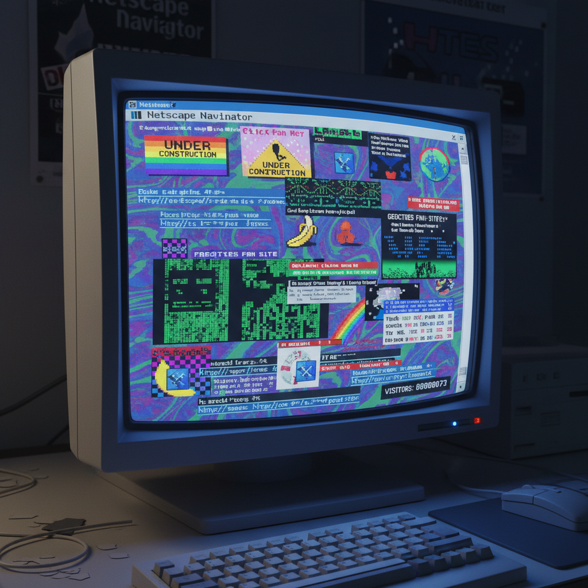

# Net Art 网络艺术

> "The Internet is not a tool. It's a place." — Olia Lialina

## 概述

网络艺术（Net Art / Net.art）是1990年代中期兴起的艺术形式，以互联网本身作为创作媒介和展示空间。它不是"在网上展示的艺术"，而是"只能在网上存在的艺术"——利用超链接、浏览器、HTML代码、网络协议和在线交互创造的作品。

Net Art诞生于万维网的早期乌托邦时代，艺术家们看到了一个去中心化、无等级、全球互联的新空间——一个可以绕过画廊和博物馆体制的自由领地。

## 核心特征

| 特征 | 描述 |
|------|------|
| 网络原生 | 只能在浏览器/网络中体验 |
| 交互性 | 观众通过点击、输入参与作品 |
| 去物质化 | 无实体，无法被收藏和买卖 |
| 代码即艺术 | HTML、JavaScript是创作材料 |
| 反体制 | 绕过画廊、博物馆、市场 |
| 全球可及 | 任何有网络的人都能访问 |

## 视觉特征

- **界面**：早期网页美学——蓝色链接、灰色背景、像素字体
- **动态**：闪烁的GIF、弹出窗口、无限循环
- **交互**：鼠标悬停效果、表单输入、随机生成
- **错误**：404页面、broken links作为美学元素
- **文本**：ASCII艺术、代码诗、超文本叙事
- **声音**：MIDI音乐、浏览器声音事件

## 代表作品

| 作品 | 艺术家 | 年代 | 意义 |
|------|--------|------|------|
| *My Boyfriend Came Back from the War* | Olia Lialina | 1996 | 超链接叙事的经典 |
| *jodi.org* | Jodi (Joan Heemskerk & Dirk Paesmans) | 1995+ | 浏览器作为画布 |
| *wwwwwwwww.jodi.org* | Jodi | 1995 | 源代码即作品 |
| *Kings Cross Phone-In* | Heath Bunting | 1994 | 网络与现实的交叉 |
| *Form Art* | Alexei Shulgin | 1997 | HTML表单元素作为视觉材料 |
| *Every Icon* | John F. Simon Jr. | 1997 | 算法穷举的无限性 |

## 历史时间线

| 时期 | 事件 |
|------|------|
| 1994 | 万维网向公众开放，早期实验开始 |
| 1995 | "net.art"一词在邮件列表中诞生 |
| 1996 | Lialina、Jodi、Shulgin等核心作品出现 |
| 1997 | documenta X首次展示网络艺术 |
| 1998-99 | 网络艺术获得机构认可 |
| 2000 | 互联网泡沫破裂，早期乌托邦终结 |
| 2000s | Web 2.0时代，社交媒体成为新平台 |
| 2010s | Post-Internet——网络艺术的遗产进入画廊 |

## 子类型

| 子类型 | 特征 |
|--------|------|
| 浏览器艺术 | Jodi——破坏/重构浏览器体验 |
| 超文本叙事 | Lialina——链接作为叙事结构 |
| 代码艺术 | 源代码本身是作品 |
| 黑客行动主义 | etoy、RTMark——网络作为政治行动空间 |
| 软件艺术 | 自定义软件作为艺术媒介 |

## 中国语境

中国的网络艺术发展受到特殊网络环境的影响。早期（2000年代）有艺术家在个人网站上进行实验，但大规模的Net Art社区未能形成。然而，中国独特的网络文化（弹幕、表情包、网络用语）本身就是一种大众化的网络创造力。当代中国数字艺术家如陆扬的虚拟世界作品，延续了网络艺术的精神。

## 争议与遗产

- **保存困境**：早期作品依赖过时的技术（Flash、Java Applet），大量已无法访问
- **体制化悖论**：反体制的艺术最终被博物馆收藏——如何展示"只能在线体验"的作品？
- **遗产**：为Post-Internet艺术、社交媒体艺术、NFT奠定基础
- **当代回响**：AI艺术、生成艺术、区块链艺术都延续了Net Art的精神

## AI生成概念图

## 与其他风格的关系

- **Fluxus** → 激浪派的邮件艺术是Net Art的模拟时代先驱
- **Conceptual Art** → 概念艺术的去物质化为Net Art铺路
- **Post-Internet** → 后网络艺术是Net Art进入画廊后的延续
- **Glitch Art** → 故障艺术继承了Net Art的错误美学
- **Webcore** → Webcore是对早期网络美学的怀旧
- **Generative Art** → 生成艺术共享代码创作的方法

---

*浮光艺志 | Chronicle of Artistry*
