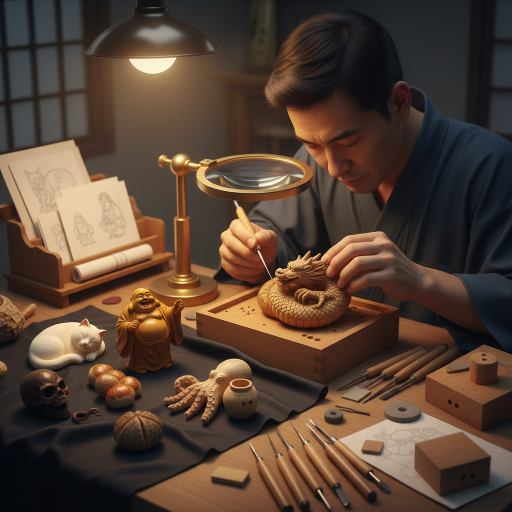

# Netsuke Art 根付艺术

> "Netsuke is sculpture compressed to the size of a walnut — an entire world of expression contained in a toggle no larger than two fingers' width. These miniature carvings served as functional fasteners on Japanese kimono sashes, yet their makers lavished upon them the same attention a Renaissance sculptor might give a marble saint. Every netsuke is a riddle in three dimensions: how to make something so small contain so much life." — Unknown

## 概述

根付艺术（Netsuke Art）是日本传统的微型雕刻艺术——根付是和服腰带（帯）上用于悬挂印笼、烟草袋等随身物品的小型雕刻装饰扣件。虽然起源于实用功能，但根付发展成为极其精美的微型雕塑艺术，以其精湛的工艺和丰富的题材著称于世。

根付艺术的实践包括：1）形彫——立体圆雕的根付；2）鏡蓋——扁平圆形的根付；3）面根付——面具形状的根付；4）柳左——细长形的根付；5）動物根付——动物题材的根付；6）人物根付——人物题材的根付；7）当代根付——将传统技法与现代题材结合的创作。

## 核心特征

| 特征 | 描述 |
|------|------|
| 微型 | 极其微小的尺寸 |
| 精细 | 极其精细的雕刻 |
| 功能 | 兼具实用功能 |
| 触感 | 适合手中把玩 |
| 幽默 | 常带有幽默感 |
| 叙事 | 微型中的叙事 |

## 视觉特征

- **微缩**：极小尺寸中的丰富细节
- **圆润**：适合握持的圆润造型
- **表情**：生动的面部表情
- **动态**：充满动感的姿态
- **材质**：象牙、木材等的温润质感
- **孔洞**：穿绳用的himotoshi孔

## 代表作品

| 作品 | 艺术家/文化 | 年代 | 意义 |
|------|-------------|------|------|
| *Tomotada animals* | 友忠 | 18世纪 | 京都派动物根付 |
| *Gyokuzan figures* | 玉山 | 19世纪 | 人物根付大师 |
| *Masanao works* | 正直 | 18世纪 | 伊势派根付 |
| *Contemporary netsuke* | Various | 当代 | 当代根付创作 |
| *Kaigyokusai* | 懐玉斎 | 19世纪 | 大阪派根付 |

## 历史时间线

| 时期 | 事件 |
|------|------|
| 17世纪 | 根付作为实用品出现 |
| 18世纪 | 根付艺术的黄金时代 |
| 19世纪 | 根付工艺的巅峰 |
| 明治维新 | 和服衰落，根付功能消失 |
| 当代 | 根付作为收藏艺术品复兴 |

## 中国语境

根付艺术虽然是日本特有的艺术形式，但与中国有密切的文化关联。中国的微型雕刻传统（如核雕、微雕）与根付有相似的审美追求——在极小的空间中创造丰富的艺术表达。中国的核雕（橄榄核雕刻）是中国版的"微型雕塑"——在一颗橄榄核上雕刻出精美的人物、山水和故事场景。中国的把玩文化（文玩）与根付的触感美学有相通之处——都强调手中把玩的触觉体验。中国当代的一些微雕艺术家受到根付艺术的启发——将中国传统题材用微型雕塑的形式表现。中国的收藏市场中，日本古代根付是重要的收藏品类——高品质的古代根付在拍卖市场上价值不菲。中国的一些雕刻师也开始创作根付风格的作品——将中国传统造型与根付的形式语言相结合。

## AI生成概念图

## 与其他风格的关系

- **Ivory Carving** → 牙雕艺术
- **Miniature Art** → 微型艺术
- **Japanese Art** → 日本艺术
- **Sculpture** → 雕塑
- **Wood Carving** → 木雕艺术
- **Functional Art** → 功能艺术

---

*浮光艺志 | Chronicle of Artistry*
