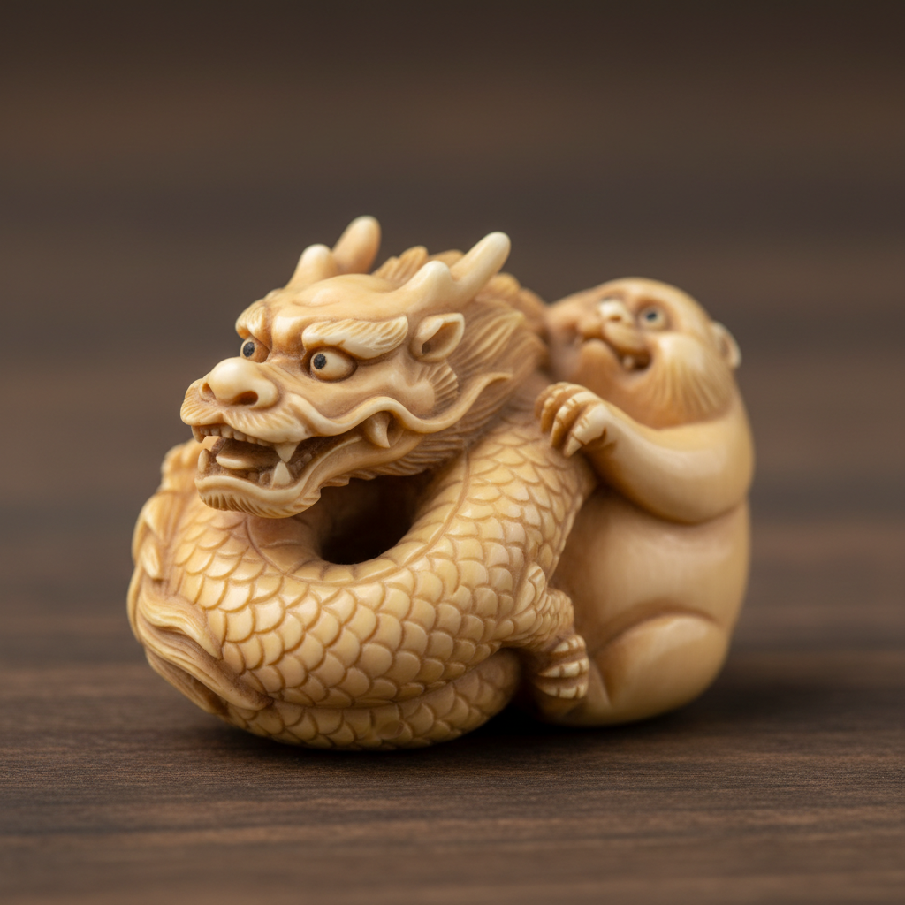

# Netsuke 根付 | 根付

> **"掌中的宇宙——日本工匠在核桃大小的象牙上雕刻出整个浮世的故事。"**

## 概述

根付（Netsuke / 根付 ねつけ）是日本江户时代（1603-1868）的微型雕刻艺术，最初是和服腰带上悬挂印笼（inrō）或烟草袋的固定扣件。因为和服没有口袋，日本人用根付将随身物品系在腰带上。这种实用物件逐渐发展为精湛的微型雕刻艺术——在3-5厘米的象牙、黄杨木或鹿角上雕刻出极其精细的人物、动物、神话场景和日常生活。根付是日本工艺美学"小中见大"的极致体现。

## 主要材料

| 材料 | 特征 |
|------|------|
| 象牙 | 最经典，细腻 |
| 黄杨木 | 温润，精细 |
| 鹿角 | 天然形态 |
| 珊瑚 | 红色，珍贵 |
| 金属 | 精密铸造 |
| 漆器 | 蒔絵装饰 |

## 核心特征

- **微型**：通常3-5厘米
- **圆雕**：360度可观赏
- **实用性**：作为腰带扣件使用
- **无锐角**：圆润不伤衣物
- **穿绳孔**：隐蔽的穿绳通道
- **极精细**：微型中的极致细节

## 常见题材

| 题材 | 特征 |
|------|------|
| 十二生肖 | 动物造型 |
| 七福神 | 吉祥人物 |
| 鬼怪 | 妖怪百鬼 |
| 日常人物 | 町人生活 |
| 动物 | 写实或幽默 |
| 植物/果实 | 自然造型 |

## 视觉特征

- 掌中大小的微型雕刻
- 极精细的表面细节
- 圆润的整体造型
- 象牙的温润光泽
- 幽默和生动的表情
- 360度的完整构图

## 与其他风格的关系

| 风格 | 关系 |
|------|------|
| 浮世绘 Ukiyo-e | 共享江户时代美学 |
| 微型雕刻 | 全球微雕传统 |
| 当代玩具/手办 | 根付的精神后裔 |
| 珠宝设计 | 根付的当代转化 |
| 民藝 Mingei | 共享日本工艺传统 |

## 概念图

---

*浮光艺志 | Chronicle of Artistry*
