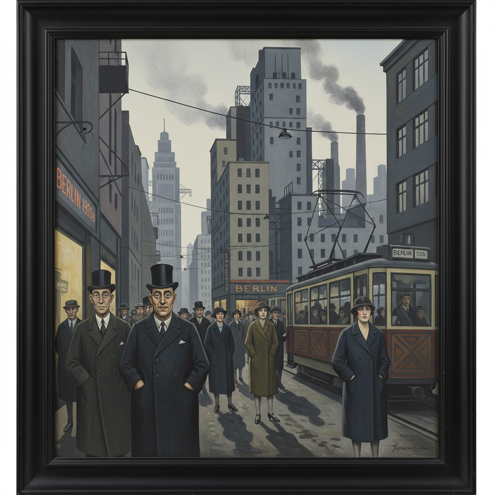

# Neue Sachlichkeit 新客观主义

> "I want to be understood by everyone." — George Grosz

## 概述

新客观主义（Neue Sachlichkeit，直译"新客观性"或"新即物主义"）是1920年代德国魏玛共和国时期的艺术运动，作为对表现主义主观情感泛滥的反动而兴起。它以冷静、精确、不带感情的目光审视战后德国社会——腐败的政客、暴发户、妓女、伤残军人和城市底层。

这不是回归古典的"客观"，而是一种带着讽刺和愤怒的"冷眼旁观"——用照相般精确的技法揭露社会的丑陋。

## 核心特征

| 特征 | 描述 |
|------|------|
| 冷静精确 | 照相式的精确描绘，拒绝表现主义的变形 |
| 社会批判 | 尖锐讽刺魏玛社会的腐败和堕落 |
| 反表现主义 | 拒绝主观情感的泛滥 |
| 日常题材 | 城市生活、工业、普通人 |
| 讽刺与怪诞 | 漫画式的夸张与精确写实的结合 |
| 政治性 | 左翼立场，揭露阶级矛盾 |

## 视觉特征

- **色彩**：冷调——灰、蓝灰、土黄、惨白
- **线条**：精确、锐利、无多余笔触
- **人物**：面具般的面孔，机械化的身体
- **空间**：清晰的透视，冷硬的建筑
- **光线**：均匀的、无情的照明
- **细节**：强迫症般的精确——每一颗纽扣、每一道皱纹

## 代表作品

| 作品 | 艺术家 | 年代 | 意义 |
|------|--------|------|------|
| *The Pillars of Society* | George Grosz | 1926 | 对魏玛精英的辛辣讽刺 |
| *Portrait of the Journalist Sylvia von Harden* | Otto Dix | 1926 | 新女性的冷酷肖像 |
| *The War* triptych | Otto Dix | 1929-32 | 战争创伤的精确记录 |
| *Self-Portrait with Model* | Christian Schad | 1927 | 冷漠的亲密关系 |
| *Agosta the Pigeon-Chested Man and Rasha the Black Dove* | Christian Schad | 1929 | 边缘人物的尊严 |
| *Still Life with Candle* | Georg Scholz | 1925 | 物品的超现实精确 |

## 历史时间线

| 时期 | 事件 |
|------|------|
| 1918 | 一战结束，德国社会剧变 |
| 1920 | Grosz和Dix开始转向精确写实 |
| 1923 | Gustav Hartlaub提出"Neue Sachlichkeit"概念 |
| 1925 | 曼海姆美术馆举办同名展览——运动正式命名 |
| 1927-29 | 运动高峰期 |
| 1933 | 纳粹上台，运动被压制为"堕落艺术" |
| 1937 | "堕落艺术"展览，新客观主义作品被没收 |

## 子类型

| 子类型 | 特征 |
|--------|------|
| 左翼真实主义（Verists） | Grosz、Dix——尖锐的社会讽刺 |
| 古典主义者 | Schad、Schrimpf——冷静的形式美 |
| 魔幻现实主义 | Radziwill、Kanoldt——日常中的超现实 |
| 新客观摄影 | Renger-Patzsch、Sander——精确的工业/人物摄影 |

## 中国语境

新客观主义的社会批判精神对中国左翼美术有间接影响。1930年代鲁迅推广的德国版画（珂勒惠支等）虽属表现主义，但其社会批判立场与新客观主义相通。当代中国的"政治波普"和"玩世现实主义"（方力钧、岳敏君）在精神上继承了新客观主义用冷静手法揭示社会荒诞的传统。

## 争议与遗产

- **争议**：被纳粹定性为"堕落艺术"，大量作品被销毁
- **"客观"的悖论**：看似客观的描绘实际充满主观讽刺
- **遗产**：为纪实摄影、社会纪录片、当代讽刺艺术奠基
- **当代回响**：当代超写实绘画、社会批判摄影、政治讽刺艺术

## 真实作品（公共领域）

| 作品 | 来源 |
|------|------|
| *The Pillars of Society* (Grosz) | [Nationalgalerie Berlin](https://www.smb.museum/en/museums-institutions/nationalgalerie/) |
| *Portrait of Sylvia von Harden* (Dix) | [Centre Pompidou](https://www.centrepompidou.fr/) |

> ⚠️ 本条目优先使用真实作品。

## AI生成概念图

## 与其他风格的关系

- **Expressionism** → 新客观主义是对表现主义的直接反动
- **Dadaism** → 达达的讽刺精神延续到新客观主义
- **Social Realism** → 社会现实主义继承了新客观主义的批判立场
- **Surrealism** → 魔幻现实主义分支与超现实主义有交集
- **Pop Art** → 波普艺术的冷静和讽刺与新客观主义遥相呼应
- **Photorealism** → 照相写实主义继承了新客观主义的精确技法

---

*浮光艺志 | Chronicle of Artistry*
