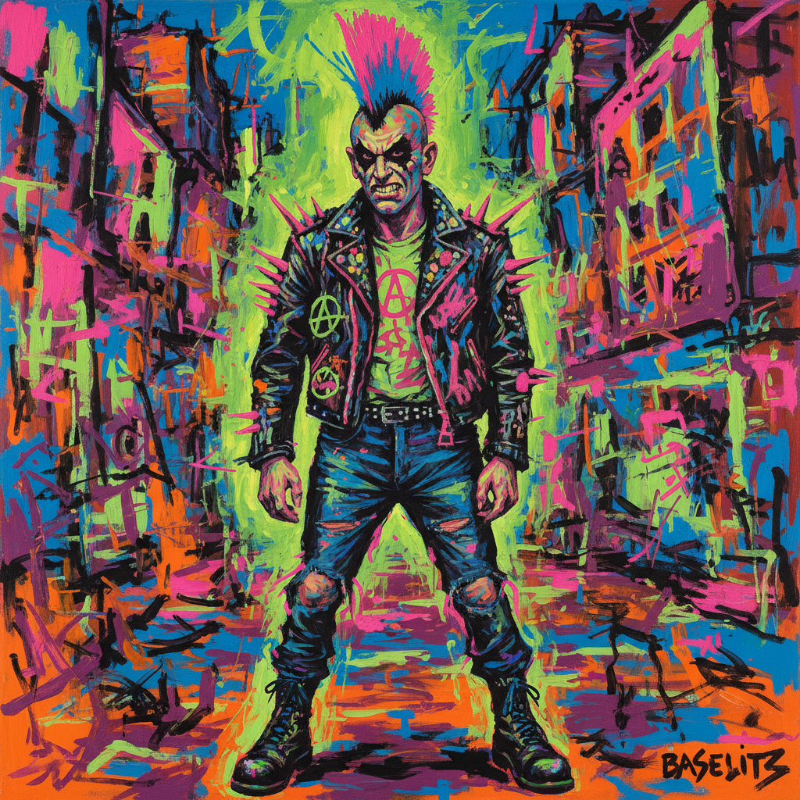

# Neue Wilde 新野兽派

> **时期：** 1978年–1985年  
> **关键词：** 德国新表现主义、狂野色彩、朋克精神、反理性、柏林地下

## 概述

Neue Wilde（新野兽派，又称"狂暴画家"）是1970年代末至1980年代初在德国——尤其是柏林和科隆——爆发的绘画运动。受朋克音乐和夜店文化影响，年轻画家们用粗暴的笔触、刺眼的色彩和挑衅的图像，反抗当时主导德国艺术界的极简主义和观念艺术。他们不要深思熟虑，只要即时的视觉冲击。

## 风格特征

- **狂野色彩**：荧光色、对比色的激烈碰撞
- **粗暴笔触**：快速、即兴、不修饰
- **朋克态度**：挑衅、反叛、不在乎
- **流行文化**：漫画、广告、夜生活元素
- **大尺幅**：压倒性的视觉冲击力

## 代表人物与作品

- 赖纳·费廷 柏林夜景
- 赫尔穆特·米登多夫 城市人物
- 萨洛梅 表演性绘画
- 埃尔维拉·巴赫 流行文化图像

## 概念图

