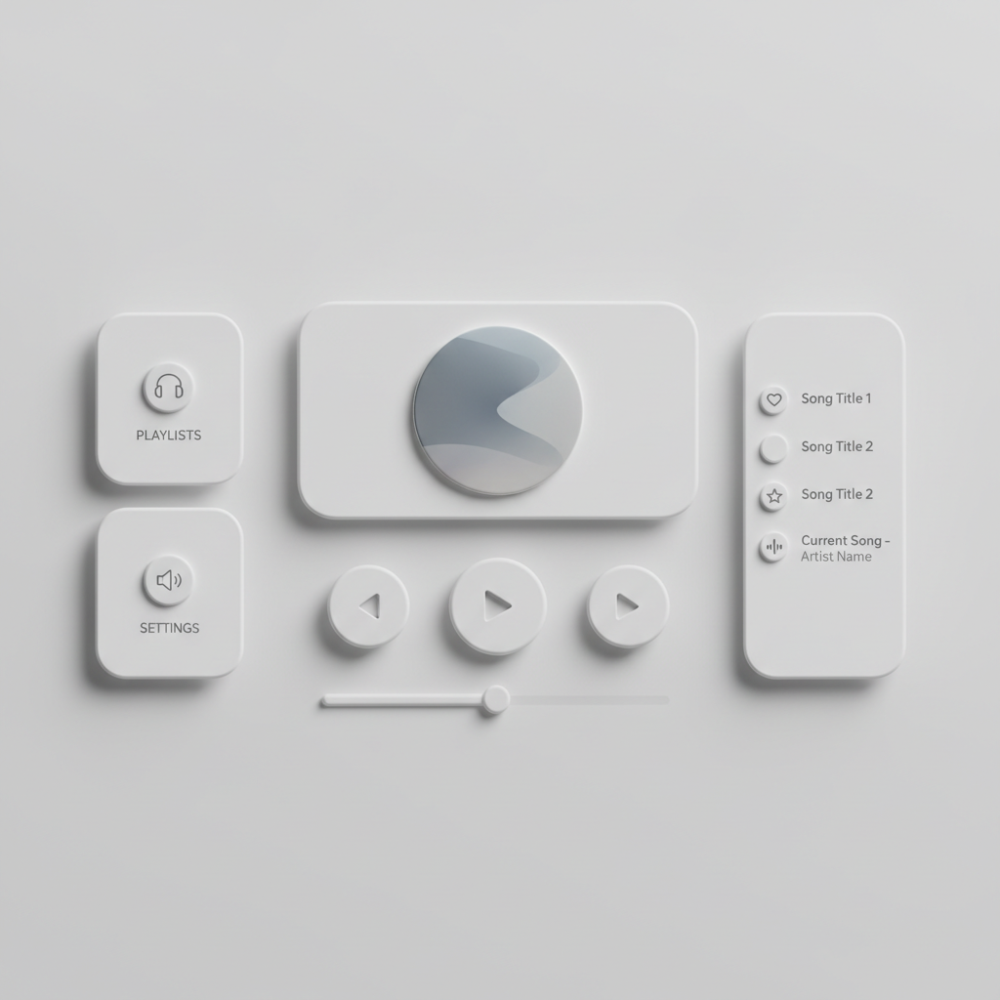

# Neumorphism 新拟物



> **"柔和的凸起与凹陷——当扁平设计想念阴影，但又不想回到拟物时代。"**

## 概述

| 维度 | 描述 |
|------|------|
| 时期 | 2019–2021（短暂流行） |
| 别名 | Neumorphism, Soft UI, Neo-Skeuomorphism |
| 核心色彩 | 浅灰、白色、柔和阴影色 |
| 关键元素 | 柔和凸起、内凹阴影、单色调、圆角 |
| 代表人物 | Alexander Plyuto (Dribbble)、Jason Kelley |
| 关联风格 | Flat Design, Skeuomorphism, Glassmorphism |

---

## 历史脉络

### 2019：Dribbble 上的实验

| 年份 | 事件 |
|------|------|
| 2019.11 | Alexander Plyuto 在 Dribbble 发布新拟物音乐播放器 |
| 2020.01 | "Neumorphism" 一词被创造 |
| 2020 | 设计社区疯狂讨论和实验 |
| 2020–21 | 少量产品尝试（主要是概念） |
| 2022+ | 热度消退，被 Glassmorphism 取代 |

### 设计史中的位置

```
拟物主义 (2007–2012)
    ↓ "太假了"
扁平设计 (2012–2019)
    ↓ "太平了"
新拟物 (2019–2021)
    ↓ "不好用"
玻璃拟态 Glassmorphism (2020–至今)
```

### 为什么它失败了？

| 问题 | 解释 |
|------|------|
| 可访问性 | 低对比度 → 视障用户无法使用 |
| 可用性 | 凸起/凹陷难以区分按钮状态 |
| 单调 | 只能用浅色，暗色模式几乎不可能 |
| 实用性 | 好看但不好用 |
| 局限性 | 只适合简单界面，复杂场景崩溃 |

---

## 视觉语法

### 色彩系统

```
主色：
  浅灰 (#E0E5EC) — 背景
  白色高光 (#FFFFFF) — 凸起的亮面
  深灰阴影 (#A3B1C6) — 凸起的暗面

规则：
  - 背景和元素同色（关键！）
  - 通过阴影创造深度
  - 极低对比度
  - 单色调为主
  - 偶尔的彩色点缀（按钮、图标）

阴影公式：
  凸起：box-shadow: 20px 20px 60px #a3b1c6, -20px -20px 60px #ffffff;
  凹陷：box-shadow: inset 20px 20px 60px #a3b1c6, inset -20px -20px 60px #ffffff;
```

### 标志性元素

| 类别 | 元素 |
|------|------|
| 按钮 | 柔和凸起、按下时凹陷 |
| 卡片 | 从背景"浮起"的圆角矩形 |
| 输入框 | 凹陷的文本区域 |
| 滑块 | 凹陷轨道 + 凸起滑块 |
| 图标 | 凹陷或凸起的圆形容器 |
| 整体 | 像是从同一块材料"挤压"出来的 |

---

## 与千禧怀旧的关系

### 对 Frutiger Aero 的间接怀念
- 新拟物是对"扁平太无聊"的回应
- 它试图找回拟物时代的"触感"
- 但用了一种更克制的方式
- 某种程度上是对 2007–2012 拟物时代的怀念

### 设计趋势的加速循环
- 从流行到消亡只用了 2 年
- 这本身就是千禧/Z世代注意力经济的产物
- 趋势的生命周期越来越短

---

## 中国语境

- "新拟物风格"在设计社区短暂流行
- 主要停留在 Dribbble/站酷的概念阶段
- 少数 App 的局部尝试（如音乐播放器）
- 很快被"毛玻璃"(Glassmorphism) 取代

---

## 设计应用

| 场景 | 应用方式 |
|------|----------|
| 概念设计 | 音乐播放器、计算器、时钟 |
| 局部元素 | 按钮、卡片、滑块 |
| 品牌 | 极简+柔和+高级感 |
| 注意 | 不适合复杂界面、暗色模式、可访问性要求高的场景 |

---

## 相关风格

← [Flat Design 扁平设计](flat-design.md) | [Frutiger Aero](frutiger-aero.md) →

↑ [返回千禧怀旧目录](README.md) | [返回总目录](../README.md)
