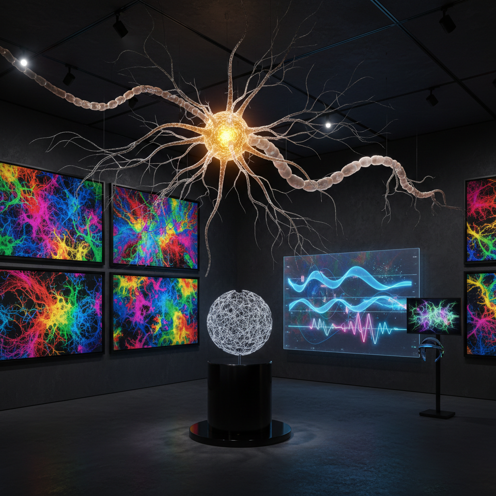

# Neural Art 神经艺术

> "Neural art makes the mind visible — it translates the electrical storms of thought into images, the architecture of memory into sculpture, the chemistry of emotion into color, revealing that the brain is not merely the organ that perceives art but is itself the greatest artwork in the known universe, a three-pound cosmos of a hundred billion neurons connected by a hundred trillion synapses, each firing pattern a unique and unrepeatable creation." — Unknown

## 概述

神经艺术（Neural Art）是以神经科学——大脑和神经系统的研究——为灵感、数据来源和创作方法的艺术实践。神经艺术将大脑的结构和功能——神经元的形态、突触的连接、脑电波的模式、神经递质的流动——转化为可感知的艺术体验。

神经艺术的实践包括：1）脑电波艺术——将EEG（脑电图）数据转化为视觉或听觉作品；2）神经元形态艺术——将神经元的树突和轴突结构作为视觉灵感；3）脑机接口艺术——使用脑机接口让思维直接控制艺术创作；4）神经可视化——将大脑的连接组（connectome）和活动模式可视化；5）神经美学——研究大脑如何感知和创造美。

## 核心特征

| 特征 | 描述 |
|------|------|
| 大脑 | 大脑作为灵感 |
| 电信号 | 神经电信号 |
| 连接 | 神经连接 |
| 可视化 | 神经活动可视化 |
| 接口 | 脑机接口 |
| 美学 | 神经美学 |

## 视觉特征

- **分支**：神经元的树突分支
- **网络**：神经网络的连接
- **电光**：神经放电的光芒
- **脑图**：大脑的结构图像
- **波形**：脑电波的波形
- **色彩**：功能区域的色彩编码

## 代表作品

| 作品 | 艺术家 | 年代 | 意义 |
|------|--------|------|------|
| *Brainbow* | Harvard researchers | 2007 | 彩色神经元 |
| *EEG art* | Various | 2010年代 | 脑电波艺术 |
| *Connectome visualizations* | Various | 2010年代 | 连接组可视化 |
| *BCI art* | Various | 2020年代 | 脑机接口艺术 |
| *Neuron sculptures* | Various | 当代 | 神经元雕塑 |

## 历史时间线

| 时期 | 事件 |
|------|------|
| 1906 | Ramón y Cajal的神经元绘画 |
| 2000年代 | 神经影像技术的进步 |
| 2007 | Brainbow技术 |
| 2010年代 | 脑机接口艺术的兴起 |
| 当代 | AI与神经科学的融合 |

## 中国语境

神经艺术在中国有活跃的发展。中国在脑科学研究领域投入巨大——"中国脑计划"的推进为神经艺术提供了科学基础和数据资源。中国传统文化中对"心"（mind/heart）的理解——中医认为"心主神明"——与当代神经科学有有趣的对话空间。中国当代的一些艺术家在探索神经艺术：利用脑电波数据创作互动装置、将中国传统的冥想和气功状态的脑电波模式可视化、以及探索中国书法和绘画创作时的神经活动模式。中国的脑机接口技术发展也为神经艺术提供了新的创作工具。

## AI生成概念图

## 与其他风格的关系

- **Science Art** → 科学艺术
- **Bio Art** → 生物艺术
- **Data Art** → 数据艺术
- **Interactive Art** → 互动艺术
- **Light Art** → 光艺术
- **Sonification Art** → 声化艺术

---

*浮光艺志 | Chronicle of Artistry*
