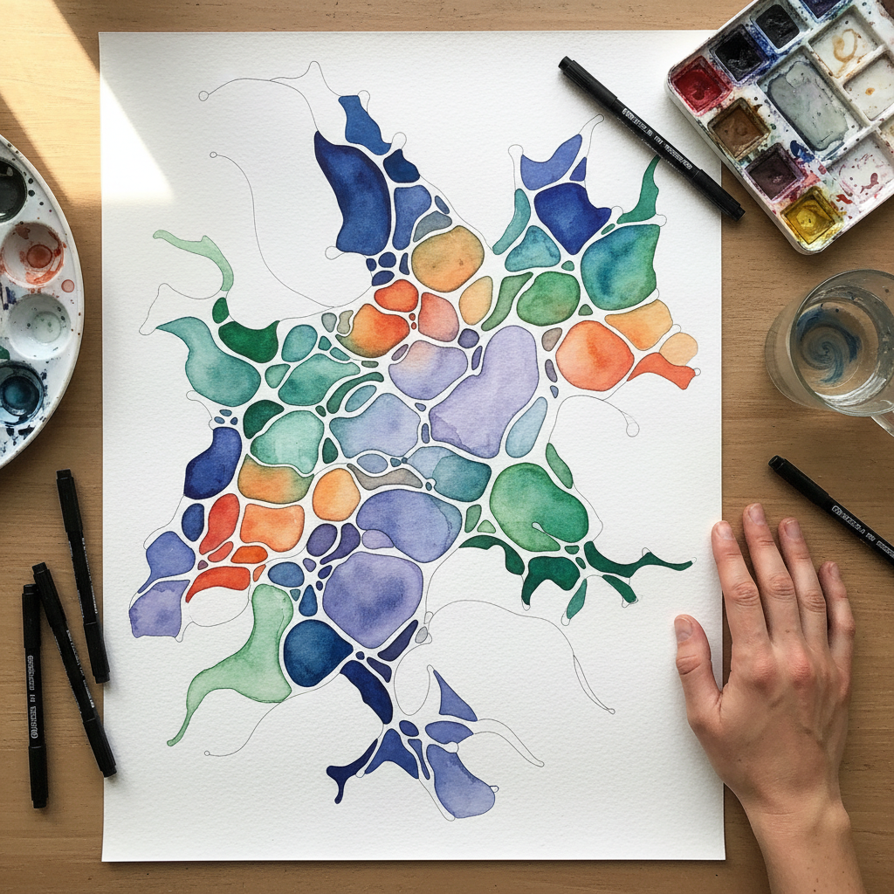

# Neurographic Art 神经图形艺术

> "Neurographic art is drawing as meditation — a method where the pen follows the neural pathways of thought, where random lines are softened into organic curves, where intersections become nodes of meaning, where the act of rounding sharp angles literally rewires the brain's response to conflict and stress, a practice that sits at the intersection of art therapy, neuroscience, and abstract drawing, proving that the simple act of making marks on paper can reorganize neural patterns, resolve internal contradictions, and transform anxiety into beauty through the patient repetition of a single algorithmic rule: wherever lines cross, round the corners." — Pavel Piskarev

## 概述

神经图形艺术（Neurographic Art / Нейрографика）是俄罗斯心理学家帕维尔·皮斯卡列夫（Pavel Piskarev）在2014年创立的一种创意方法，将绘画与神经科学和心理治疗结合。其核心原理是：通过特定的绘画算法（画随机线条、在交叉点处圆角化、填充色彩），可以影响大脑的神经通路，帮助处理情绪、解决问题和促进创造性思维。

神经图形的基本步骤是：1）设定意图或问题；2）在纸上画出随机的"神经线"；3）在所有线条交叉处将尖角圆滑化；4）用色彩填充形成的区域；5）添加额外的图形元素。这个过程被认为能够将大脑从"问题模式"转换到"解决模式"。神经图形已经发展成为一个全球性的实践社区，被用于艺术治疗、个人发展和创意表达。

## 核心特征

| 特征 | 描述 |
|------|------|
| 算法 | 基于算法的绘画 |
| 神经 | 与神经科学的联系 |
| 治疗 | 艺术治疗的功能 |
| 圆角 | 交叉点的圆角化 |
| 有机 | 有机的曲线形态 |
| 冥想 | 冥想式的过程 |

## 视觉特征

- **曲线**：流动的有机曲线
- **圆角**：所有交叉点的圆滑
- **色彩**：丰富的色彩填充
- **层次**：多层次的线条网络
- **有机**：类似细胞或神经的形态
- **和谐**：整体的视觉和谐

## 代表作品

| 作品 | 艺术家 | 年代 | 意义 |
|------|--------|------|------|
| *Neurographic method* | Pavel Piskarev | 2014 | 方法的创立 |
| *Neurographic landscapes* | Various | 2010年代 | 神经图形风景 |
| *Therapeutic sessions* | Various | 2014起 | 治疗性应用 |
| *Large-scale murals* | Various | 2020年代 | 大型壁画应用 |
| *Digital neurographics* | Various | 2020年代 | 数字化的神经图形 |

## 历史时间线

| 时期 | 事件 |
|------|------|
| 2014 | Piskarev创立神经图形方法 |
| 2016 | 方法的国际传播 |
| 2020 | 疫情期间的爆发式增长 |
| 2020年代 | 全球社区的形成 |
| 当代 | 与AI和数字工具的结合 |

## 中国语境

神经图形艺术在中国有一定的传播，特别是在艺术治疗和心理健康领域。中国的一些心理咨询师和艺术治疗师将神经图形作为工具使用。中国传统的书法和绘画本身就具有"修身养性"的功能——通过笔墨的运动来调节身心状态——这与神经图形的理念有相似之处。中国的禅绕画（Zentangle）社区也与神经图形有交叉。在中国的社交媒体上，神经图形作为一种"减压绘画"方法有一定的流行度，特别是在年轻白领群体中。

## AI生成概念图

## 与其他风格的关系

- **Art Therapy** → 艺术治疗
- **Zentangle** → 禅绕画
- **Abstract Art** → 抽象艺术
- **Automatic Drawing** → 自动绘画
- **Mandala Art** → 曼陀罗艺术
- **Meditative Art** → 冥想艺术

---

*浮光艺志 | Chronicle of Artistry*
