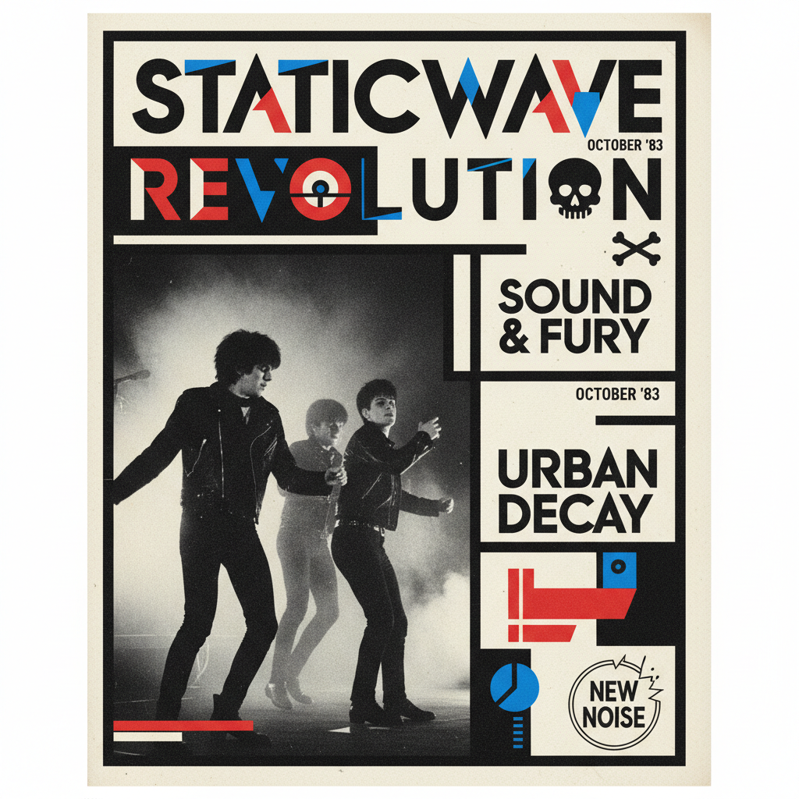

# Neville Brody 内维尔·布罗迪

> **时期：** 1957–至今  
> **关键词：** The Face杂志、后朋克排版、自创字体、数字先锋

## 概述

Neville Brody 是英国平面设计师和字体设计师，1980年代《The Face》杂志的艺术总监。他将后朋克的反叛精神注入排版设计——自创字体、打破栏目结构、将标题变成图形——定义了1980-90年代英国视觉文化的面貌。

## 风格特征

- **自创字体**：为每个项目设计独特的字体
- **后朋克美学**：粗犷、直接、反主流的视觉态度
- **符号化**：将文字简化为图形符号
- **实验排版**：打破传统杂志版面的所有规则
- **数字先锋**：最早拥抱数字工具的设计师之一

## 代表作品

- *The Face*杂志设计（1981–1986）
- *Arena*杂志设计
- *Fuse*字体实验项目（1991–至今）
- *Research Studios*品牌设计

## 概念图

