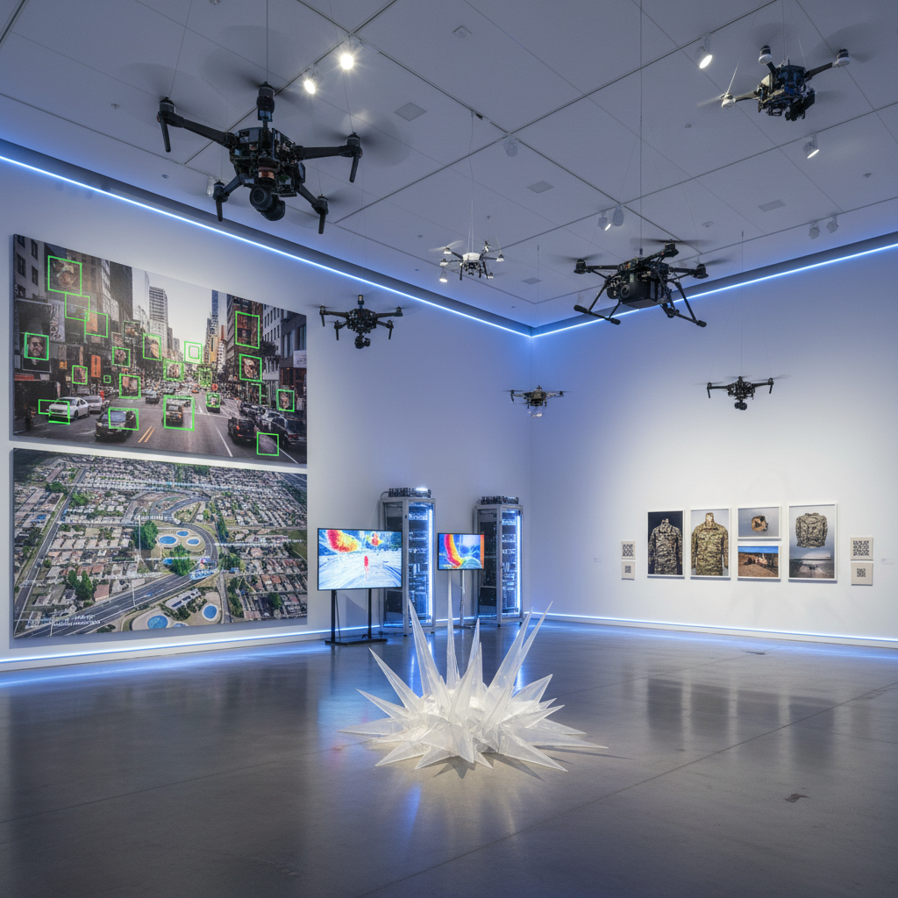

# New Aesthetic Art 新美学艺术

> "The New Aesthetic sees the world through the eyes of machines — satellite views that flatten cities into abstract patterns, facial recognition boxes that frame human faces as data, glitched surveillance footage that reveals the digital substrate beneath reality, drone perspectives that make landscapes alien, and pixelated eruptions where the digital world bleeds through into the physical, a sensibility that recognizes we now live in a world increasingly seen, mapped, and shaped by non-human vision systems." — Unknown

## 概述

新美学（The New Aesthetic）是英国艺术家和作家詹姆斯·布里德尔（James Bridle）在2011年提出的一个概念，用于描述数字技术的视觉语言渗透到物理世界中的现象。新美学关注的是：当机器"看"世界时，世界看起来是什么样的？——卫星视图、无人机视角、面部识别框、像素化的审查、故障图像、以及数字基础设施在物理空间中的可见痕迹。

新美学不是一种传统意义上的艺术运动，而是一种"观察方式"——注意到数字技术如何改变了我们的视觉环境。布里德尔最初通过一个Tumblr博客收集这些"数字渗透物理"的例子：像素化的伪装图案、无人机的阴影、Google Street View的拼接错误、3D打印的物理故障等。新美学后来发展成为一个更广泛的讨论，涉及监控、人工智能、自动化和非人类视觉。

## 核心特征

| 特征 | 描述 |
|------|------|
| 机器视觉 | 机器如何"看"世界 |
| 渗透 | 数字渗透物理 |
| 监控 | 监控技术的美学 |
| 像素 | 像素化的物理世界 |
| 无人机 | 无人机和卫星视角 |
| 故障 | 数字故障的物理化 |

## 视觉特征

- **像素**：像素化的物理物体
- **卫星**：卫星和无人机视角
- **识别**：面部识别的框线
- **故障**：数字故障的痕迹
- **数据**：数据可视化的美学
- **监控**：监控摄像头的视角

## 代表作品

| 作品 | 艺术家 | 年代 | 意义 |
|------|--------|------|------|
| *The New Aesthetic blog* | James Bridle | 2011起 | 布里德尔的新美学博客 |
| *Dronestagram* | James Bridle | 2012 | 无人机打击地点的卫星图 |
| *Pixel camouflage* | Various militaries | 2000年代 | 像素化的军事伪装 |
| *Captchas as art* | Various | 2010年代 | 验证码的美学化 |
| *AI-generated faces* | Various | 2019起 | AI生成的人脸 |

## 历史时间线

| 时期 | 事件 |
|------|------|
| 2011 | James Bridle创建新美学博客 |
| 2012 | SXSW新美学面板讨论 |
| 2012 | Bruce Sterling的回应文章 |
| 2010年代 | 新美学概念的扩展 |
| 当代 | AI时代的新美学 |

## 中国语境

新美学在中国有独特的现实语境。中国作为全球监控技术最发达的国家之一，其城市空间中充满了新美学所关注的"机器视觉"痕迹——无处不在的摄像头、面部识别系统、健康码、以及各种数字基础设施的物理显现。中国的"智慧城市"建设本身就是新美学的大规模实践。中国的一些新媒体艺术家（如徐文恺aaajiao、陆扬等）在创作中探索类似新美学的主题——数字技术如何改变我们的感知和生活空间。中国的AI艺术和数据可视化社区也与新美学有密切关联。

## AI生成概念图

## 与其他风格的关系

- **Glitch Art** → 故障艺术
- **Post-Internet Art** → 后网络艺术
- **Surveillance Art** → 监控艺术
- **Data Art** → 数据艺术
- **Net Art** → 网络艺术
- **Speculative Design** → 推测设计

---

*浮光艺志 | Chronicle of Artistry*
