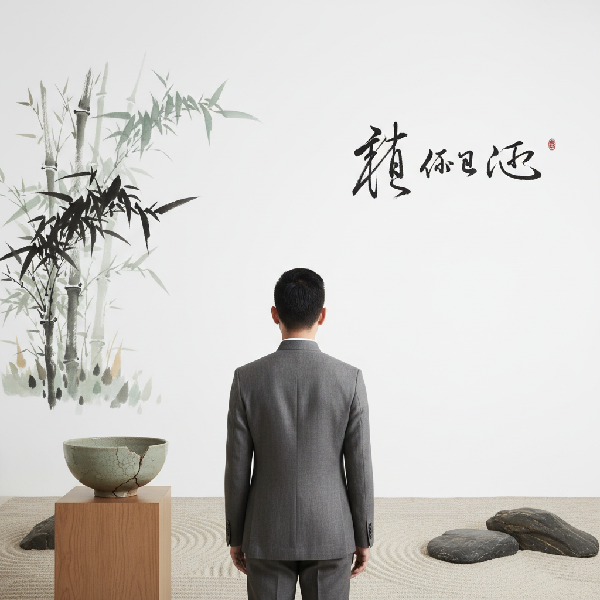

# New Chinese Style 新中式



> **"水墨留白、宋代极简、现代剪裁——让传统在当代呼吸。"**

## 概述

| 维度 | 描述 |
|------|------|
| 时期 | 2018–至今（根源更早） |
| 别名 | New Chinese Style, 新中式, Neo-Chinese, Chinese Minimalism |
| 核心色彩 | 墨黑、留白、朱红、靛蓝、竹青 |
| 关键元素 | 水墨、留白、盘扣、立领、竹、山水 |
| 代表人物 | 马可（无用）、上下SHANG XIA、密扇 |
| 关联风格 | Japandi, Minimalism, Wabi-Sabi, Dark Academia |

---

## 历史脉络

### 从传统到当代

| 年份 | 事件 |
|------|------|
| 2008 | 北京奥运会——中国文化自信觉醒 |
| 2010s | "国潮"概念萌芽 |
| 2018 | 李宁纽约时装周——"中国李宁"爆火 |
| 2019 | 汉服运动主流化 |
| 2020 | 新中式家居设计爆发 |
| 2022–至今 | 新中式穿搭成为小红书顶流 |
| 2024 | 新中式从亚文化变为主流审美 |

### 它不是什么？

| 旧中式 | 新中式 |
|--------|--------|
| 龙凤呈祥 | 水墨留白 |
| 大红大金 | 素雅克制 |
| 繁复刺绣 | 简约线条 |
| 旗袍复刻 | 现代剪裁+中式元素 |
| "中国风" | "中国的现代性" |
| 符号堆砌 | 意境传达 |

### 核心哲学

新中式的精神是**"传统不是博物馆里的标本——它可以活在当下"**：
- 取意不取形——要的是精神，不是符号
- 留白 = 呼吸空间
- 少即是多（宋代美学的当代回响）
- "我穿的不是传统——我穿的是文化自信"
- 东方美学不需要西方认证

---

## 视觉语法

### 色彩系统

```
主色：
  墨黑 (#1A1A1A) — 水墨、书法
  留白 (#FAFAFA) — 空间、呼吸
  朱红 (#C41E3A) — 印章、点缀
  靛蓝 (#1B3A5C) — 青花、扎染
  竹青 (#789262) — 自然、文人

辅色：
  檀色 (#B36D41) — 木、茶
  鸦青 (#424C50) — 瓦、石
  月白 (#D6ECF0) — 瓷、水
  藕荷 (#E4C6D0) — 花、丝

规则：
  - 低饱和度
  - 大量留白
  - 色彩克制（一画面不超过3色）
  - 朱红只做点缀
  - 自然色为主

质感：
  水墨 — 晕染、流动
  宣纸 — 纤维、透光
  丝绸 — 光泽、流动
  竹木 — 自然、温润
  陶瓷 — 温润、素雅
  麻布 — 粗朴、自然
```

### 标志性元素

| 类别 | 元素 |
|------|------|
| 服装 | 改良旗袍、立领衬衫、盘扣外套、宽松裤 |
| 图案 | 水墨山水、竹兰梅菊、云纹、几何化传统纹样 |
| 空间 | 留白墙面、原木家具、屏风、枯山水 |
| 器物 | 青瓷茶具、香炉、文房四宝 |
| 字体 | 宋体、楷体、书法、现代衬线 |
| 氛围 | 茶室、庭院、山水、禅意 |

---

## 与千禧怀旧的关系

### Z世代的文化自信
- 千禧/Z世代成长于中国崛起时代
- 不再需要"西方认证"
- 新中式 = "我的文化本身就很酷"
- 从"追赶西方"到"定义自己"

### 与全球极简主义的共鸣
- 宋代美学 ≈ 日本侘寂 ≈ 北欧极简
- 但新中式强调"东方独有的意境"
- 留白不是"空"——是"满"
- 与 Japandi 的对话和区别

---

## 设计应用

| 场景 | 应用方式 |
|------|----------|
| 品牌 | 留白+书法+朱红印章+素雅配色 |
| 空间 | 原木+白墙+竹+水墨画+茶席 |
| 时尚 | 立领+盘扣+现代剪裁+天然面料 |
| 包装 | 宣纸质感+极简+书法+印章 |
| 数字 | 大量留白+宋体+水墨动效+克制配色 |

---

## 相关风格

← [Japandi 日式北欧](japandi.md) | [Minimalism 极简主义](minimalism.md) →

↑ [返回千禧怀旧目录](README.md) | [返回总目录](../README.md)
