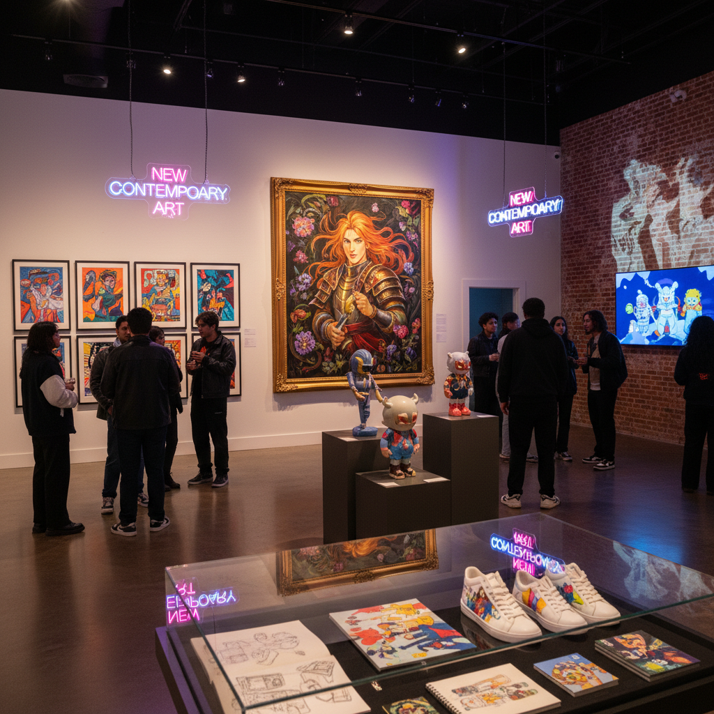

# New Contemporary Art 新当代艺术

> "New Contemporary is the art world's acknowledgment that the most vital creative energy of the 21st century comes not from MFA programs and biennial circuits alone, but from the convergence of illustration, animation, street art, tattoo culture, comics, gaming, and digital media — a movement that refuses the old hierarchies between fine art and popular culture, that recognizes technical skill and visual storytelling as virtues rather than embarrassments, and that builds its audience through Instagram and limited editions rather than waiting for institutional validation." — Unknown

## 概述

新当代艺术（New Contemporary Art）是一个涵盖性术语，指21世纪初以来从流行文化、插画、动画、街头艺术、纹身文化和数字媒体中发展出来的当代艺术实践。它与"城市当代"（Urban Contemporary）有重叠，但范围更广——不仅包括街头文化根源的作品，也包括来自插画、动画、游戏和数字艺术背景的创作者。

新当代艺术的特征包括：高度的技术性（精湛的绘画或数字技巧）、强烈的叙事性和角色设计、与流行文化的紧密联系、通过社交媒体和限量发售建立受众、以及对传统艺术界等级制度的挑战。代表性的平台和机构包括：《Hi-Fructose》杂志、《Juxtapoz》杂志、Corey Helford Gallery、Jonathan LeVine Projects等。新当代艺术已经成为一个庞大的生态系统，连接着艺术、设计、收藏和社区。

## 核心特征

| 特征 | 描述 |
|------|------|
| 技巧 | 精湛的技术能力 |
| 叙事 | 强烈的叙事性 |
| 流行 | 流行文化的融合 |
| 数字 | 数字媒体的原生性 |
| 社区 | 社区驱动的生态 |
| 跨界 | 艺术与商业的跨界 |

## 视觉特征

- **精细**：极度精细的细节
- **角色**：独特的角色设计
- **色彩**：丰富饱和的色彩
- **叙事**：暗示故事的场景
- **混合**：多种风格的混合
- **数字**：数字工具的痕迹

## 代表作品

| 作品 | 艺术家 | 年代 | 意义 |
|------|--------|------|------|
| *Various works* | James Jean | 2000年代起 | 插画到纯艺术 |
| *Paintings* | Audrey Kawasaki | 2000年代起 | 木板绘画 |
| *Sculptures* | Takashi Murakami | 2000年代起 | 超扁平的商业化 |
| *Digital paintings* | Various | 2010年代起 | 数字原生艺术 |
| *NFT art* | Various | 2021 | 数字收藏的爆发 |

## 历史时间线

| 时期 | 事件 |
|------|------|
| 2000年代 | 新当代生态的形成 |
| 2005 | 《Hi-Fructose》创刊 |
| 2010年代 | 社交媒体时代的爆发 |
| 2021 | NFT和数字收藏的高峰 |
| 当代 | 后NFT时代的重新定位 |

## 中国语境

新当代艺术在中国有蓬勃的发展。中国的新当代艺术场景包括：潮流艺术（Art Toy）的爆发式增长、数字艺术家通过社交媒体建立国际影响力、插画和动画背景的艺术家进入画廊系统、以及中国特色的"国潮"美学与新当代的融合。中国的一些平台和机构在推动新当代艺术的发展——如各种潮流艺术展、数字艺术平台和限量版画市场。中国年轻一代的艺术家往往不再区分"纯艺术"和"商业艺术"，而是在两者之间自由流动，这与新当代艺术的精神高度一致。

## AI生成概念图

## 与其他风格的关系

- **Urban Contemporary** → 城市当代
- **Pop Surrealism** → 波普超现实主义
- **Digital Art** → 数字艺术
- **Illustration** → 插画
- **Street Art** → 街头艺术
- **Art Toy** → 潮流玩具

---

*浮光艺志 | Chronicle of Artistry*
