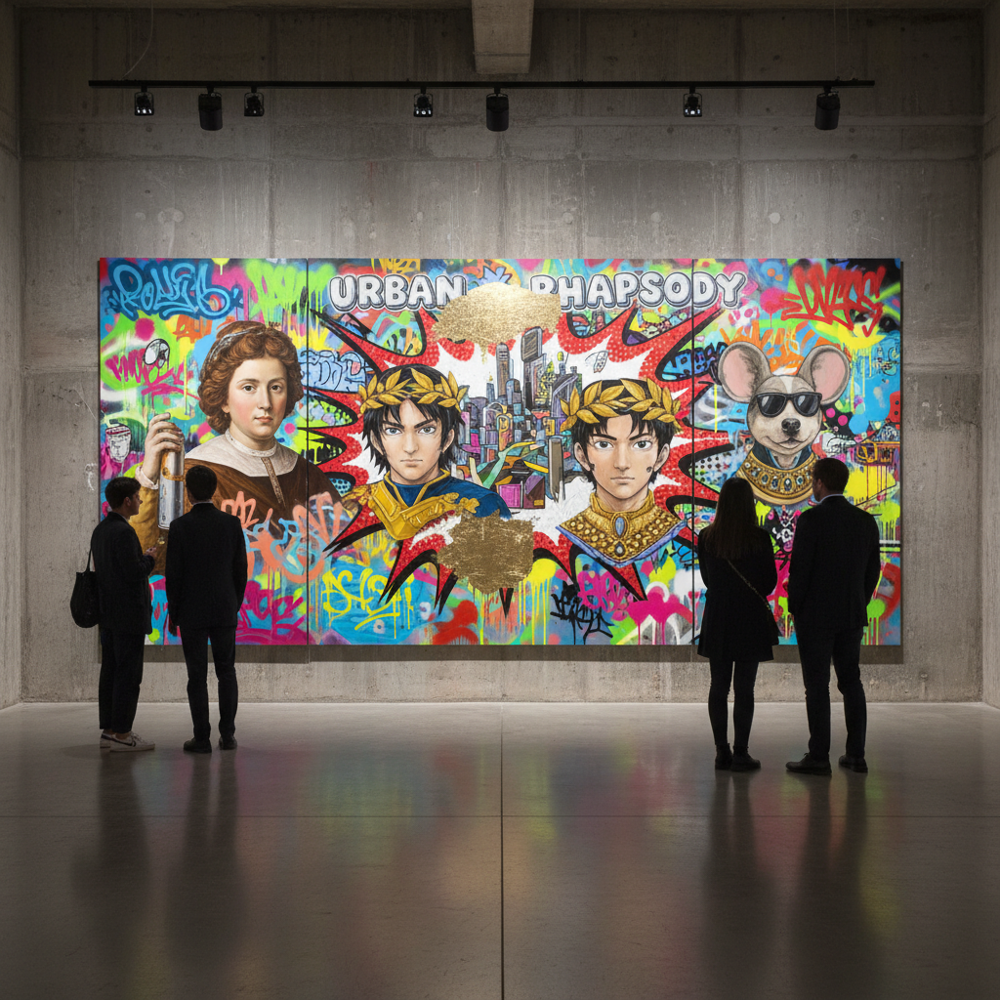

# New Contemporary 新当代艺术

> **时期：** 2000年代–至今  
> **关键词：** 街头与画廊融合、流行文化、跨界创作、收藏热潮、民主化

## 概述

New Contemporary（新当代艺术）是21世纪兴起的艺术运动，融合了街头艺术、插画、涂鸦、纹身、滑板文化和流行文化元素，打破了"高雅艺术"与"低俗文化"的界限。它通过社交媒体传播、限量版画销售和跨界合作，创造了一种更民主、更可及的当代艺术生态。

## 风格特征

- **跨界融合**：街头、插画、设计的混合
- **流行文化**：动漫、游戏、音乐的视觉引用
- **技法多元**：从喷漆到油画的广泛媒介
- **叙事性**：个人故事和社会评论
- **可及性**：版画、玩具、服装等多渠道传播

## 代表人物与作品

- KAWS（跨界艺术商业帝国）
- 村上隆（超扁平+奢侈品合作）
- Shepard Fairey（OBEY/Hope海报）
- James Jean（插画转纯艺术）

## 概念图

