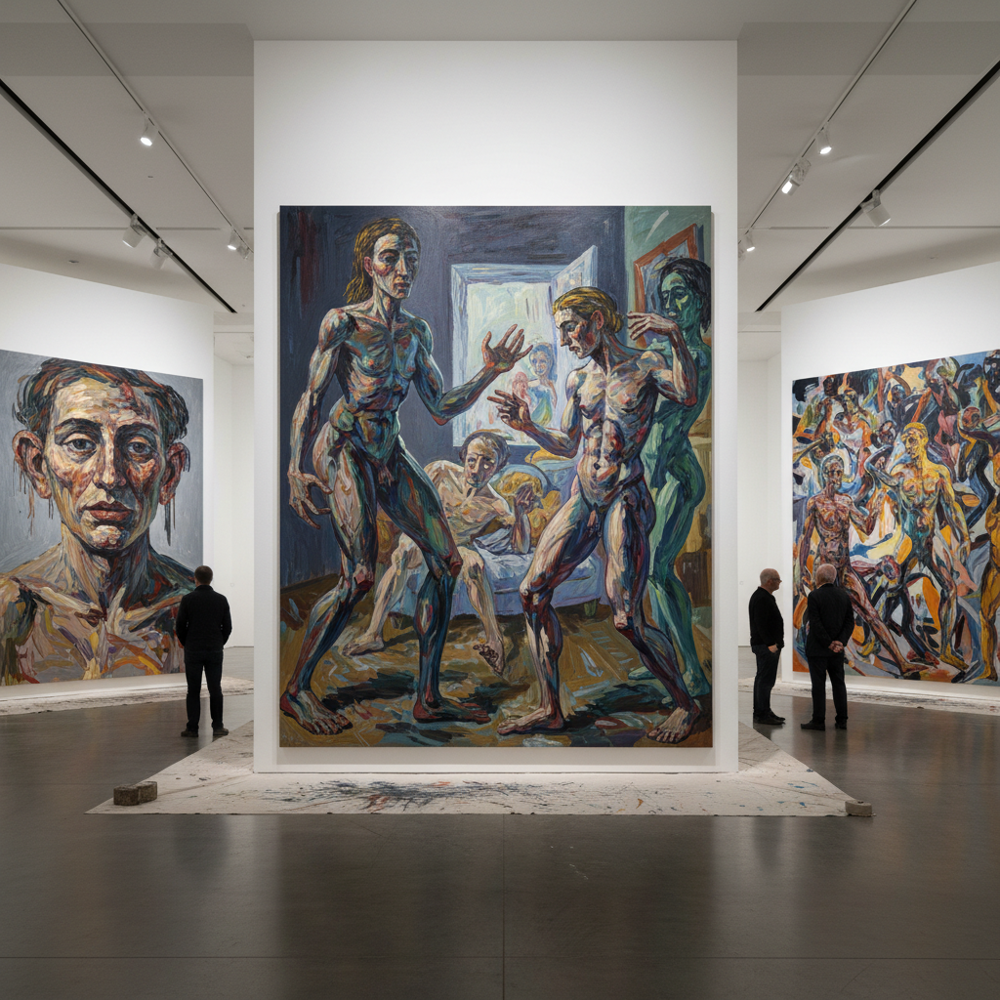

# New Figuration Art 新具象艺术

> "New Figuration is the human body's refusal to disappear from art — after abstraction declared the figure obsolete, after conceptualism declared painting dead, after minimalism stripped the gallery bare, the figure kept coming back, kept insisting on its presence, kept demanding to be painted, sculpted, photographed, and projected, because we are embodied creatures who understand the world through bodies, and any art that permanently excludes the human form eventually feels like a room with no one in it." — Unknown

## 概述

新具象（New Figuration / Nouvelle Figuration / Nueva Figuración）是一个广泛的术语，指20世纪中期以来多次出现的"回归人物形象"的艺术运动。最早的新具象运动出现在1960年代，作为对抽象表现主义主导地位的反应——艺术家们重新将人物形象引入绘画，但不是回到传统的写实主义，而是以变形、表现性或概念性的方式处理人体。

新具象的不同版本包括：1960年代的法国"新具象"（Nouvelle Figuration，如Bacon、Giacometti的影响）、阿根廷的"新具象"（Nueva Figuración，如Luis Felipe Noé、Ernesto Deira）、1980年代的"新形象绘画"（New Image Painting）、以及2000年代以来的"新具象绘画"复兴。当代的新具象绘画是当前艺术市场中最活跃的领域之一，代表性的艺术家包括：Cecily Brown、Dana Schutz、Nicole Eisenman、Lynette Yiadom-Boakye等。

## 核心特征

| 特征 | 描述 |
|------|------|
| 人物 | 人物形象的回归 |
| 变形 | 变形的身体 |
| 表现 | 表现性的处理 |
| 绘画 | 绘画性的强调 |
| 身体 | 身体的政治性 |
| 叙事 | 叙事的暗示 |

## 视觉特征

- **人体**：变形或表现性的人体
- **笔触**：可见的表现性笔触
- **色彩**：强烈的色彩
- **空间**：模糊的空间
- **情感**：情感的直接性
- **尺度**：大尺幅的画布

## 代表作品

| 作品 | 艺术家 | 年代 | 意义 |
|------|--------|------|------|
| *Study after Velázquez* | Francis Bacon | 1953 | 新具象的先驱 |
| *Caos y Creación* | Luis Felipe Noé | 1963 | 阿根廷新具象 |
| *New Image Painting* exhibition | Various | 1978 | 新形象绘画 |
| *Figures in motion* | Cecily Brown | 2000年代 | 当代新具象 |
| *Imagined portraits* | Lynette Yiadom-Boakye | 2010年代 | 虚构肖像 |

## 历史时间线

| 时期 | 事件 |
|------|------|
| 1960年代 | 第一波新具象运动 |
| 1978 | "New Image Painting"展览 |
| 1980年代 | 新表现主义中的具象 |
| 2000年代 | 当代具象绘画的复兴 |
| 当代 | 具象绘画的市场繁荣 |

## 中国语境

新具象在中国当代艺术中有重要的位置。中国的"新具象"发展有其独特的轨迹：从1980年代的"伤痕美术"和"乡土写实"，到1990年代的"政治波普"和"玩世现实主义"（方力钧、岳敏君），到2000年代的"新卡通一代"，再到当代的多元具象实践。中国当代具象绘画在国际市场上有重要的地位——从张晓刚的"血缘"系列到刘小东的现实主义大画，从曾梵志的面具系列到刘野的卡通化人物。中国的年轻一代画家也在探索新的具象可能性——将中国的视觉经验与全球当代绘画的语言结合。

## AI生成概念图

## 与其他风格的关系

- **Abstract Expressionism** → 抽象表现主义（反对）
- **Neo-Expressionism** → 新表现主义
- **Figurative Painting** → 具象绘画
- **Pop Art** → 波普艺术
- **Contemporary Painting** → 当代绘画
- **Portraiture** → 肖像画

---

*浮光艺志 | Chronicle of Artistry*
