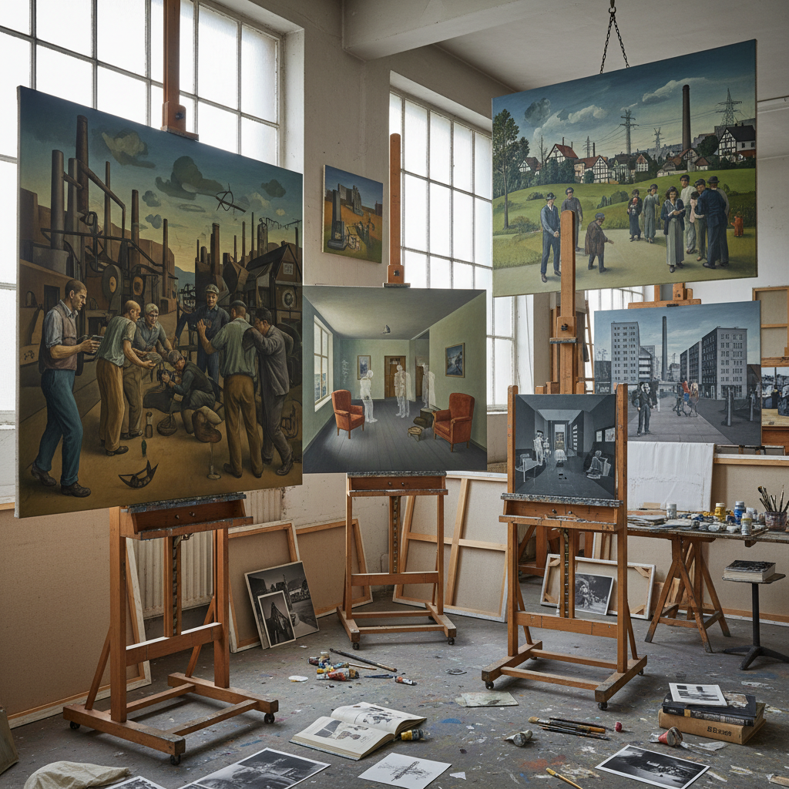

# New Leipzig School 新莱比锡画派

> "The New Leipzig School proved that painting could still matter in the twenty-first century — that in a city where the Berlin Wall's fall had left behind both ruins and possibilities, a generation of painters trained in the rigorous East German academic tradition could forge a new figurative language that was neither nostalgic nor ironic, that combined technical mastery with conceptual depth, that addressed history and memory through the patient accumulation of pigment on canvas, and that the art market's hunger for the next new thing could, for once, align with genuine artistic achievement." — Unknown

## 概述

新莱比锡画派（Neue Leipziger Schule / New Leipzig School）是2000年代初在德国莱比锡兴起的一个绘画运动，以莱比锡视觉艺术学院（Hochschule für Grafik und Buchkunst Leipzig）的毕业生为核心。代表艺术家包括尼奥·劳赫（Neo Rauch）、蒂姆·艾特尔（Tim Eitel）、马蒂亚斯·韦舍尔（Matthias Weischer）和大卫·施内尔（David Schnell）。

新莱比锡画派的独特性在于其双重遗产：一方面继承了东德时期严格的学院派绘画训练（素描、色彩、构图的扎实功底），另一方面在统一后的德国语境中发展出新的视觉语言。尼奥·劳赫的作品尤其具有代表性——他的大尺幅绘画融合了社会主义现实主义的技法、超现实主义的意象和当代生活的碎片，创造出一种"时间错位"的视觉体验。2000年代中期，国际艺术市场对新莱比锡画派的热烈追捧使其成为全球最受关注的绘画运动之一。

## 核心特征

| 特征 | 描述 |
|------|------|
| 具象 | 具象绘画的回归 |
| 技法 | 扎实的学院派技法 |
| 历史 | 东德历史的回响 |
| 叙事 | 神秘的叙事性 |
| 空间 | 模糊的空间感 |
| 色彩 | 独特的色彩运用 |

## 视觉特征

- **具象**：精湛的具象绘画技法
- **叙事**：神秘的叙事场景
- **空间**：模糊和多重的空间
- **人物**：穿着不同时代服装的人物
- **工业**：工业和建筑元素
- **色彩**：柔和而独特的色调

## 代表作品

| 作品 | 艺术家 | 年代 | 意义 |
|------|--------|------|------|
| *Revo* | Neo Rauch | 2005 | 劳赫的时间错位 |
| *Untitled (Interiors)* | Matthias Weischer | 2003 | 韦舍尔的室内空间 |
| *Untitled (Figures)* | Tim Eitel | 2004 | 艾特尔的孤独人物 |
| *Landscape paintings* | David Schnell | 2005 | 施内尔的抽象风景 |
| *Group exhibitions* | Various | 2004-06 | 国际群展 |

## 历史时间线

| 时期 | 事件 |
|------|------|
| 1990年代 | 莱比锡学院的转型 |
| 2002 | 国际关注的开始 |
| 2004 | 纽约展览引发热潮 |
| 2005-06 | 市场高峰期 |
| 当代 | 持续的影响力 |

## 中国语境

新莱比锡画派对中国当代绘画有重要的参照意义。中国和东德共享社会主义现实主义的绘画传统，中国的美术学院体系同样强调扎实的写实技法训练。新莱比锡画派展示了如何在保持技法传统的同时发展出当代的视觉语言——这对中国的学院派画家具有启发性。中国的一些年轻画家在2000年代受到新莱比锡画派的影响，探索如何将中国的社会主义视觉遗产转化为当代艺术表达。中国的艺术市场也曾经历类似的"绘画热"，对具象绘画的追捧与新莱比锡画派的市场现象有相似之处。

## AI生成概念图

## 与其他风格的关系

- **Socialist Realism** → 社会主义现实主义
- **Surrealism** → 超现实主义
- **Figurative Painting** → 具象绘画
- **Neo-Expressionism** → 新表现主义
- **Magic Realism** → 魔幻现实主义
- **Contemporary Painting** → 当代绘画

---

*浮光艺志 | Chronicle of Artistry*
