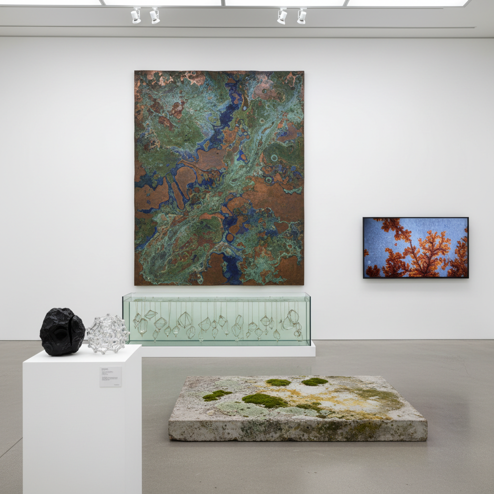

# New Materialism Art 新唯物主义艺术

> "New Materialism art takes matter seriously — not as passive stuff waiting to be shaped by human intention, but as vibrant, agential, and creative in its own right, an art that listens to what materials want to do rather than forcing them into predetermined forms, that recognizes the agency of stone and metal and plastic and code, that finds meaning not in human projection onto inert matter but in the active, self-organizing, surprising behavior of matter itself, and that asks what art looks like when we stop treating materials as servants and start treating them as collaborators." — Jane Bennett

## 概述

新唯物主义艺术（New Materialism Art）是基于"新唯物主义"哲学的艺术实践。新唯物主义是21世纪初兴起的哲学运动，挑战了将物质视为被动、惰性的传统观念，主张物质具有自身的能动性（agency）、活力和创造力。代表性的新唯物主义思想家包括：Jane Bennett（《Vibrant Matter》）、Karen Barad、Rosi Braidotti等。

新唯物主义艺术的实践包括：1）让材料"自己说话"——创造条件让材料展示其自身的行为和特性；2）关注物质的能动性——探索材料如何主动参与艺术创作过程；3）人与非人的纠缠——探索人类与物质世界的相互构成关系；4）过程性的作品——关注材料变化的过程而非最终形态；5）跨尺度的思考——从分子到地质尺度思考物质性。

## 核心特征

| 特征 | 描述 |
|------|------|
| 能动性 | 物质的能动性 |
| 活力 | 物质的活力 |
| 过程 | 关注物质过程 |
| 纠缠 | 人与物的纠缠 |
| 尺度 | 跨尺度的思考 |
| 合作 | 与材料合作 |

## 视觉特征

- **材料**：材料本身的展示
- **过程**：变化过程的记录
- **自组织**：自组织的形态
- **结晶**：结晶和生长
- **腐蚀**：腐蚀和转化
- **微观**：微观结构的放大

## 代表作品

| 作品 | 艺术家 | 年代 | 意义 |
|------|--------|------|------|
| *Crystal growing installations* | Roger Hiorns | 2008 | 结晶的能动性 |
| *Material processes* | Various | 2010年代 | 材料过程的艺术 |
| *Vibrant matter exhibitions* | Various | 2010年代 | 活力物质的展览 |
| *Geological art* | Various | 2020年代 | 地质尺度的艺术 |
| *Molecular aesthetics* | Various | 当代 | 分子美学 |

## 历史时间线

| 时期 | 事件 |
|------|------|
| 2010 | Jane Bennett《Vibrant Matter》出版 |
| 2010年代 | 新唯物主义艺术的兴起 |
| 2015 | 多个相关展览 |
| 2020年代 | 与生态思想的融合 |
| 当代 | AI和计算物质性 |

## 中国语境

新唯物主义艺术在中国有独特的哲学共鸣。中国传统思想中有丰富的"物质能动性"观念——道家的"道生万物"、气论中的"气"作为活跃的物质力量、以及中国传统工艺中对材料"性"的尊重（如玉匠"因材施艺"的理念）。中国传统的文人文化中，对材料的敏感——石头的纹理、木头的纹路、墨的浓淡——本身就体现了某种新唯物主义的精神。中国当代的一些艺术家在探索新唯物主义的可能性：让材料的自然过程成为作品的核心、探索传统材料（如墨、陶、漆）的能动性、以及将中国传统的物质观与当代哲学对话。

## AI生成概念图

## 与其他风格的关系

- **Process Art** → 过程艺术
- **Material Art** → 材料艺术
- **Bio Art** → 生物艺术
- **Posthumanism** → 后人类主义
- **Object-Oriented Art** → 物导向艺术
- **Land Art** → 大地艺术

---

*浮光艺志 | Chronicle of Artistry*
