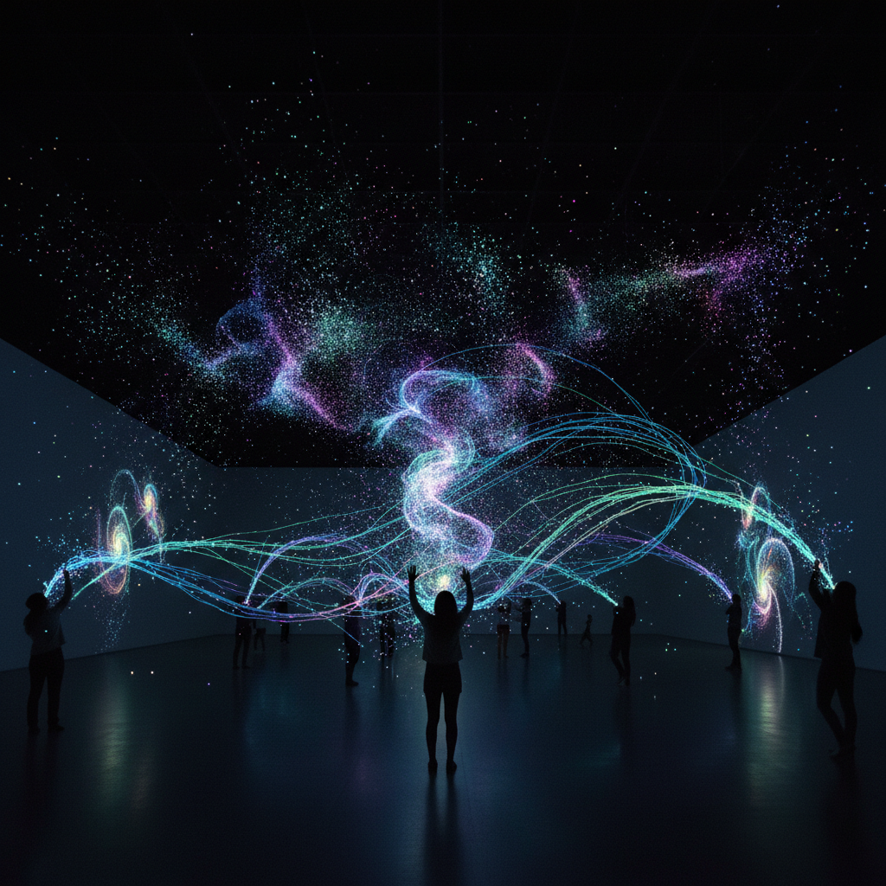

# New Media Art 新媒体艺术



> **"代码是画笔，数据是颜料，算法是构图——艺术的新物种。"**

## 概述

| 维度 | 描述 |
|------|------|
| 时期 | 1990s–至今 |
| 别名 | New Media Art, 新媒体艺术, Digital Art, 数码艺术, Net Art |
| 核心色彩 | 屏幕光谱——RGB全域、数据可视化色彩 |
| 关键元素 | 互动性、网络、代码、数据、算法、实时生成 |
| 代表人物 | Ryoji Ikeda, Casey Reas, Rafael Lozano-Hemmer, 徐冰 |
| 关联风格 | Video Art, Generative Art, Glitch Art, AI Art, Installation Art |

---

## 历史脉络

| 年份 | 事件 |
|------|------|
| 1990s | 互联网艺术(Net Art)兴起 |
| 1995 | Ars Electronica成为新媒体艺术中心 |
| 1997 | Documenta X首次展出网络艺术 |
| 2001 | Processing语言发布——艺术家编程工具 |
| 2005 | Arduino——物理计算+艺术 |
| 2010s | 数据艺术、AI艺术、VR艺术 |
| 2021 | NFT——数字艺术的市场革命 |

### 核心哲学

新媒体艺术的精神是**"技术不是工具——是媒介、是主题、是合作者"**：
- "代码可以是诗——算法可以是美"
- "互动不是按钮——是对话"
- "数据是21世纪的现成品(readymade)"
- "网络是画廊——也是画布——也是观众"
- "新媒体艺术不是用新技术做旧艺术——是发明新的艺术形式"

---

## 视觉语法

### 技术系统

```
编程：
  Processing — 视觉编程
  openFrameworks — C++创意编码
  TouchDesigner — 实时视觉
  Unity/Unreal — 3D实时

硬件：
  传感器 — 动作、声音、温度、心跳
  投影 — 映射、追踪、互动
  机器人 — 动态雕塑
  可穿戴 — 身体+技术

网络：
  实时数据 — 天气、社交、金融
  众包 — 集体创作
  分布式 — 区块链、去中心化

规则：
  - 技术是媒介不是装饰
  - 互动必须有意义
  - 过程和系统 > 最终形态
  - 开源和分享是价值观
```

### 标志性元素

| 类别 | 元素 |
|------|------|
| 互动 | 身体追踪、触摸、声音、数据输入 |
| 生成 | 算法图案、粒子系统、分形、噪声 |
| 数据 | 可视化、声音化、物理化 |
| 网络 | 在线、实时、分布式、社交 |
| 物理 | 机器人、动态装置、可穿戴 |
| 态度 | 实验、开源、跨学科、未来 |

---

## 与千禧怀旧/当代的关系

### NFT与数字艺术市场
- 2021 NFT热潮 = 新媒体艺术的市场突破
- Beeple $69M = 数字艺术的合法性
- "NFT不是新媒体艺术——但它让新媒体艺术被看见了"

### AI艺术——新媒体的最新前沿
- GAN、Diffusion Model = 新的创作工具
- "AI是合作者还是工具？——这是新媒体艺术的核心问题"
- 人机协作 = 新媒体艺术的未来

---

## 设计应用

| 场景 | 应用方式 |
|------|----------|
| 展览 | 互动装置+数据可视化 |
| 品牌 | 生成式设计+互动体验 |
| 教育 | STEAM+创意编程 |
| 城市 | 智慧城市+公共互动 |

---

## 相关风格

← [Video Art 录像艺术](video-art.md) | [AI Art AI艺术](ai-art.md) →

↑ [返回千禧怀旧目录](README.md) | [返回总目录](../README.md)
