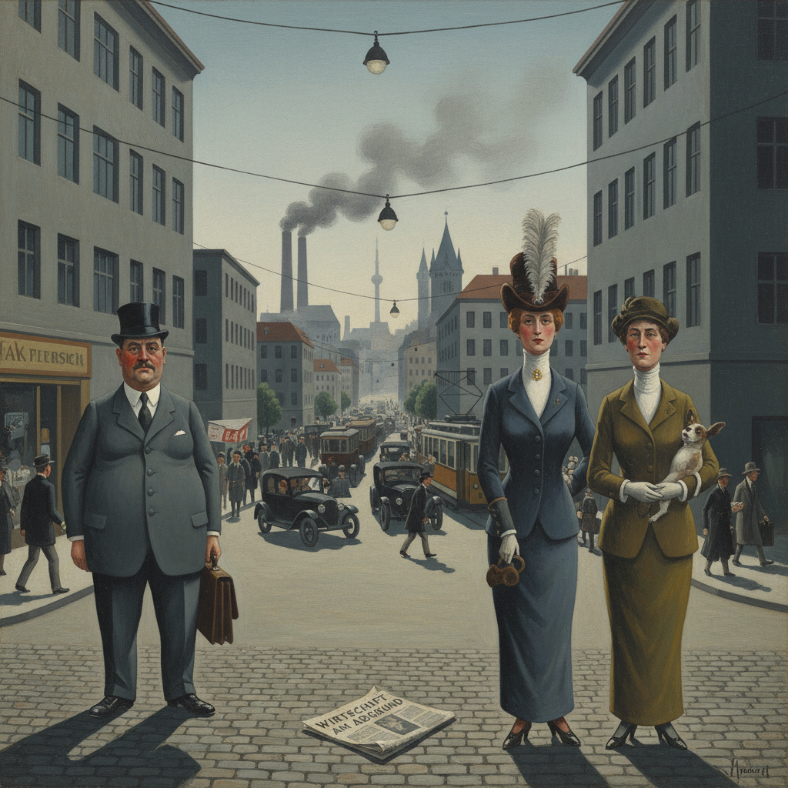

# New Objectivity 新客观主义

> **时期：** 1919年–1933年  
> **关键词：** 魏玛共和国、冷酷写实、社会批判、反表现主义、德国

## 概述

New Objectivity（新客观主义，德语Neue Sachlichkeit）是一战后德国对表现主义情感泛滥的反动——画家们用冷酷、精确、几乎残忍的写实手法描绘魏玛共和国的社会现实。奥托·迪克斯的战争伤残、乔治·格罗斯的资产阶级讽刺——他们不美化也不扭曲，只是用手术刀般的目光解剖一个疯狂的时代。

## 风格特征

- **冷酷写实**：精确但不带温情的描绘
- **社会批判**：揭露战后社会的丑陋和虚伪
- **讽刺漫画感**：夸张但基于现实的人物
- **硬边轮廓**：清晰锐利的形体边界
- **灰冷色调**：工业化的冷漠氛围

## 代表人物与作品

- 奥托·迪克斯《战争三联画》
- 乔治·格罗斯 柏林街头
- 马克斯·贝克曼 自画像系列
- 克里斯蒂安·沙德 肖像画

## 概念图

