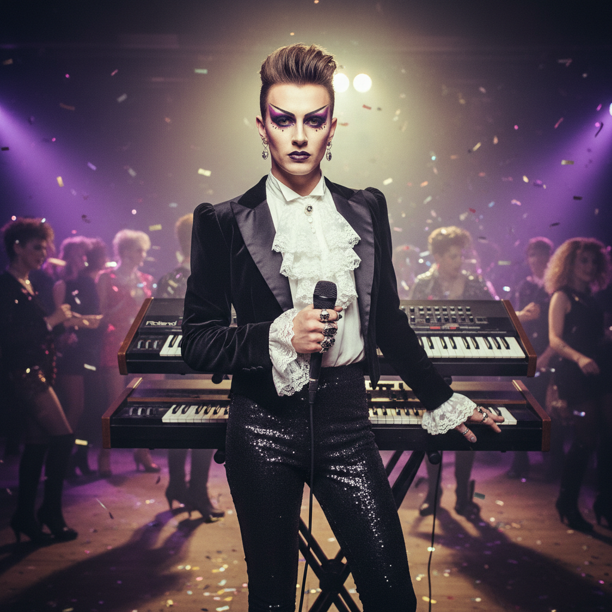

# New Romantic 新浪漫主义



> **"眼影、丝绒、合成器——80年代伦敦夜店里最华丽的一群人。"**

## 概述

| 维度 | 描述 |
|------|------|
| 时期 | 1979–1984 |
| 别名 | New Romantic, New Romanticism, Blitz Kids |
| 核心色彩 | 紫色、金色、黑色、宝蓝、酒红 |
| 关键元素 | 华丽妆容、丝绒/缎面、海盗衬衫、合成器音乐 |
| 代表人物 | Duran Duran, Adam Ant, Boy George, Spandau Ballet |
| 关联风格 | Glam Rock, Post-Punk, Visual Kei, Synthwave |

---

## 历史脉络

| 年份 | 事件 |
|------|------|
| 1979 | 伦敦 Blitz Club 开业——New Romantic 诞生地 |
| 1980 | Steve Strange 和 Rusty Egan 策划 Blitz 之夜 |
| 1981 | Duran Duran "Planet Earth"——主流突破 |
| 1982 | Adam Ant "Prince Charming"——视觉巅峰 |
| 1983 | Culture Club 全球走红——Boy George |
| 1984 | 运动衰落——但影响延续至今 |

### 核心哲学

New Romantic 的精神是**"朋克太丑了——我们要美、要华丽、要像贵族一样"**：
- 美 = 反叛（对朋克"丑即美"的反叛）
- 华丽 = 态度（"我们是新贵族"）
- 合成器 = 未来（"吉他太老了"）
- 夜店 = 舞台（"每晚都是表演"）
- "如果朋克说'任何人都能做'，New Romantic 说'但我们做得更美'"

---

## 视觉语法

### 色彩系统

```
主色：
  紫色 (#800080) — 贵族、神秘
  金色 (#FFD700) — 华丽、权力
  黑色 (#000000) — 基底、戏剧
  宝蓝 (#0000CD) — 深邃、优雅
  酒红 (#722F37) — 浪漫、深沉

辅色：
  白色 (#FFFFFF) — 面部、衬衫
  银色 (#C0C0C0) — 金属、未来
  粉色 (#FF69B4) — 妆容

质感：
  丝绒 — 外套、裤子
  缎面 — 衬衫、领带
  蕾丝 — 袖口、领口
  金属 — 配饰、纽扣
  羽毛 — 帽子、配饰
```

### 标志性元素

| 类别 | 元素 |
|------|------|
| 妆容 | 男性化妆、浓重眼影、腮红 |
| 发型 | 蓬松、不对称、染色 |
| 服装 | 海盗衬衫、丝绒外套、高腰裤 |
| 配饰 | 宽腰带、胸针、羽毛、头巾 |
| 音乐 | 合成器流行、电子鼓机 |
| 态度 | 华丽、浪漫、贵族、戏剧 |

---

## 与千禧怀旧的关系

### Synthwave/Retrowave 的精神祖先
- New Romantic (1980s) → Synthwave (2010s)
- 两者共享"合成器""霓虹""怀旧"
- New Romantic = 原版 / Synthwave = 致敬版
- "80s 的华丽在 2020s 以电子音乐的形式回归"

### MTV 时代的视觉先驱
- New Romantic = 第一批"为 MTV 而生"的乐队
- MV 美学 = New Romantic 的核心表达
- Duran Duran 的 MV = 80s 视觉文化的定义

---

## 中国语境

- 80年代港台流行文化中的 New Romantic 影响
- 张国荣的舞台形象与 New Romantic 的交叉
- 中国"复古"派对中的 80s 元素
- 与中国"华丽摇滚"的关系

---

## 设计应用

| 场景 | 应用方式 |
|------|----------|
| 音乐 | 合成器流行+MV+舞台+海报 |
| 时尚 | 丝绒+缎面+华丽+性别模糊+80s |
| 活动 | 80s 主题派对+复古夜店 |
| 数字 | 紫色+金色+合成器+霓虹+优雅 |

---

## 相关风格

← [Synthwave 合成器浪潮](synthwave.md) | [Post-Punk 后朋克](post-punk.md) →

↑ [返回千禧怀旧目录](README.md) | [返回总目录](../README.md)
