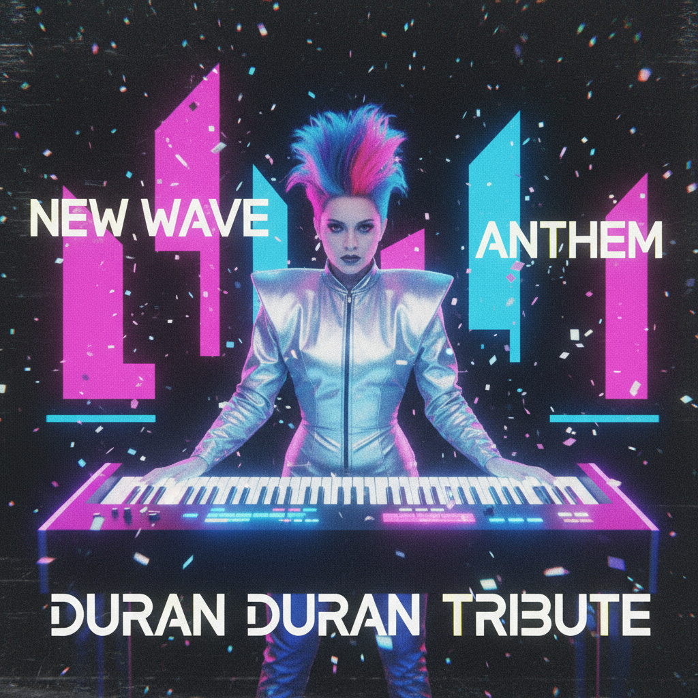

# New Wave 新浪潮



> **"合成器、几何发型、霓虹眼影——后朋克穿上了彩色西装。"**

## 概述

| 维度 | 描述 |
|------|------|
| 时期 | 1978–1986 原版 / 2020s 复兴 |
| 别名 | New Wave, Synth Pop, Post-Punk Pop |
| 核心色彩 | 霓虹粉、电子蓝、黑色、银色、紫色 |
| 关键元素 | 合成器音乐、几何发型、不对称、MTV |
| 代表人物 | Depeche Mode、Duran Duran、Siouxsie |
| 关联风格 | Synthwave, Post-Punk, Electropop 08, Nu-Rave |

---

## 历史脉络

### 从朋克的灰烬到MTV的黄金时代

| 年份 | 事件 |
|------|------|
| 1977 | 朋克"死了"——New Wave 从灰烬中诞生 |
| 1978 | Devo、Talking Heads 定义早期 New Wave |
| 1981 | MTV 开播——New Wave 成为视觉文化 |
| 1982 | Duran Duran "Rio"——New Wave 巅峰 |
| 1983 | 合成器流行全面主流化 |
| 1986 | New Wave 逐渐被 Hair Metal 取代 |
| 2020s | 合成器音乐和 New Wave 视觉复兴 |

### 核心哲学

New Wave 的精神是**"朋克的态度 + 艺术学院的品味 + 合成器的声音"**：
- 保留朋克的DIY精神
- 但加入艺术、时尚、电子音乐
- "我可以又叛逆又好看"
- 视觉和音乐同等重要
- MTV = 音乐变成了视觉艺术

---

## 视觉语法

### 色彩系统

```
主色：
  霓虹粉 (#FF1493) — 活力、现代
  电子蓝 (#00BFFF) — 合成器、科技
  黑色 (#000000) — 朋克遗产
  银色 (#C0C0C0) — 未来、金属
  紫色 (#800080) — 神秘、夜晚

辅色：
  黄色 (#FFFF00) — 能量
  白色 (#FFFFFF) — 对比
  红色 (#FF0000) — 唇膏

规则：
  - 高对比度
  - 霓虹色 + 黑色
  - 不对称
  - 几何图案
  - "人工"比"自然"更好

质感：
  合成面料 — 光泽、人工
  皮革 — 朋克遗产
  金属 — 配饰、未来
  塑料 — 现代、廉价奢华
```

### 标志性元素

| 类别 | 元素 |
|------|------|
| 发型 | 不对称、几何剪裁、染色、立起来 |
| 妆容 | 霓虹眼影、苍白底妆、红唇 |
| 服装 | 宽肩西装、皮夹克、不对称上衣 |
| 配饰 | 几何耳环、墨镜、皮手套 |
| 视觉 | MTV 音乐录影带、几何图形、合成器 |
| 字体 | 几何无衬线、斜体、霓虹效果 |

---

## 与千禧怀旧的关系

### Synthwave 的"前世"
- Synthwave (2010s) = 对 New Wave 的怀旧
- 两者共享合成器美学
- New Wave = 真实的80年代
- Synthwave = 对80年代的浪漫化记忆

### 2020s 复兴
- 合成器音乐再次流行
- 80年代时尚元素回归（宽肩、霓虹）
- Stranger Things 等影视推动
- "80年代比现在更有趣"的怀旧

---

## 中国语境

- "新浪潮"/"合成器流行"在中国独立音乐圈
- 与"复古迪斯科"/"电子音乐"的交叉
- 中国 New Wave 乐队的兴起
- 80年代中国流行文化的类似美学

---

## 设计应用

| 场景 | 应用方式 |
|------|----------|
| 音乐 | 霓虹色+几何+合成器视觉+不对称 |
| 品牌 | 霓虹+黑色+几何字体+80年代 |
| 活动 | 霓虹灯+合成器+复古未来 |
| 数字 | 霓虹渐变+几何+动态+黑色背景 |

---

## 相关风格

← [Synthwave 合成波](synthwave.md) | [Electropop 08](electropop-08.md) →

↑ [返回千禧怀旧目录](README.md) | [返回总目录](../README.md)
