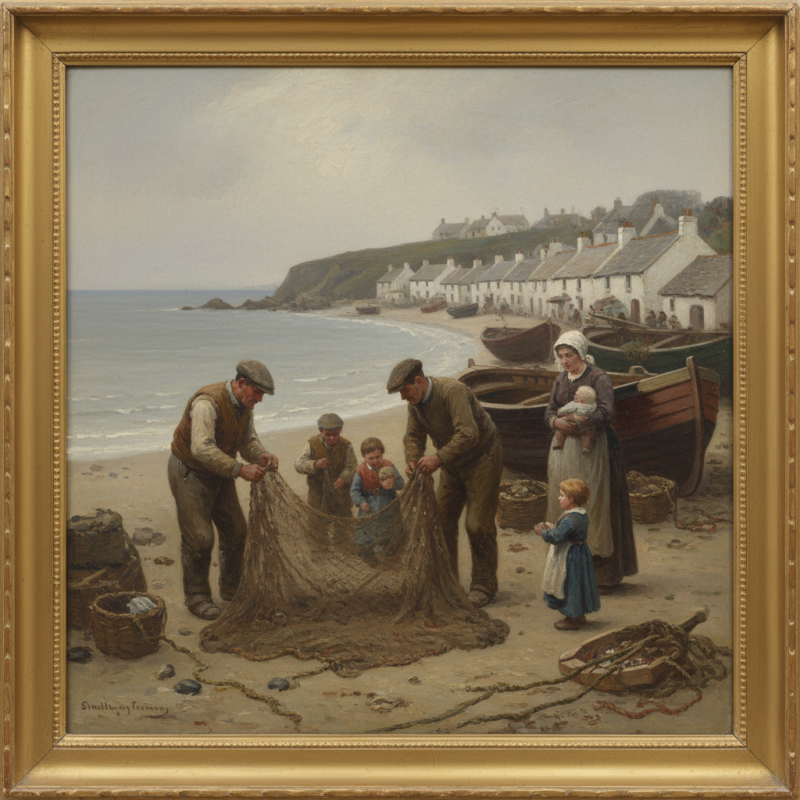

# Newlyn School 纽林画派

> "We paint what we see, and we see what we love." — Stanhope Forbes

## 概述

纽林画派（Newlyn School）是19世纪末至20世纪初（约1880–1910）在英国康沃尔郡纽林渔村形成的外光画派（plein air）艺术家群体。受法国巴比松画派和印象派影响，这群画家选择在纽林定居，直接在户外描绘渔民生活、海岸风景和乡村劳动场景。

纽林画派是英国对法国外光画运动的最重要回应，也是英国印象主义的重要组成部分。

## 核心特征

| 特征 | 描述 |
|------|------|
| 外光写生 | 在户外自然光下完成作品 |
| 渔村题材 | 渔民、渔船、海岸、鱼市 |
| 自然光线 | 康沃尔独特的海洋光线 |
| 社会关怀 | 对渔民艰苦生活的同情描绘 |
| 方形笔触 | 特征性的方形色块笔触 |
| 灰色调 | 英国海岸的灰蓝色调 |

## 视觉特征

- **光线**：康沃尔海岸的柔和银灰光线
- **色调**：灰蓝、银绿、沙色为主
- **笔触**：方形色块（square brush technique）
- **题材**：渔民劳作、海岸、渔船、村庄
- **构图**：自然主义的日常场景
- **氛围**：朴素、真实、带有社会关怀

## 代表人物

| 画家 | 代表作 | 特点 |
|------|--------|------|
| Stanhope Forbes | *A Fish Sale on a Cornish Beach* (1885) | 纽林画派领袖 |
| Walter Langley | *But Men Must Work* (1882) | 社会关怀，水彩 |
| Frank Bramley | *A Hopeless Dawn* (1888) | 渔民悲剧 |
| Elizabeth Armstrong Forbes | 儿童和花园 | 女性画家代表 |
| Norman Garstin | 海岸风景 | 印象派影响最强 |
| Laura Knight | 马戏团和海岸 | 后期代表 |

## 历史背景

1. **1882年**：Walter Langley 首先定居纽林
2. **1884年**：Stanhope Forbes 到达，成为群体核心
3. **1885年**：Forbes 的《康沃尔海滩鱼市》在皇家学院展出获得成功
4. **1890年代**：纽林画派鼎盛期，吸引大量画家
5. **1899年**：Forbes 夫妇创办纽林艺术学校
6. **1910年后**：随着现代主义兴起，画派影响力减弱

## 与其他风格的关系

- **Barbizon School** → 直接灵感来源
- **Plein Air** → 英国外光画的代表
- **Impressionism** → 英国印象主义的重要分支
- **Social Realism** → 对渔民生活的社会关怀
- **Grimshaw** → 同时代英国画家，共享对光线的关注

## 概念图

---

*浮光艺志 | Chronicle of Artistry*
