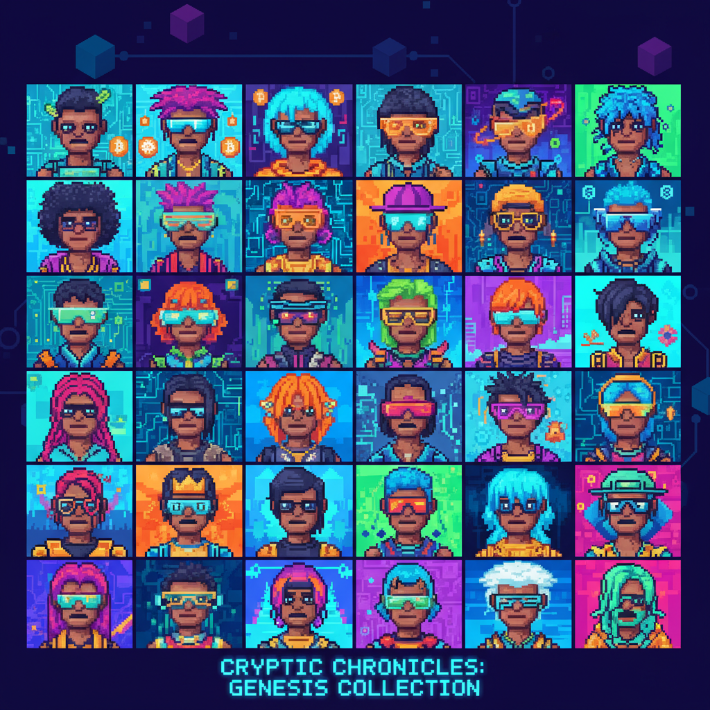

# NFT Art NFT艺术

> "NFTs are not about the technology, they're about the culture." — Beeple

## 概述

NFT艺术（Non-Fungible Token Art）是2020年代兴起的数字艺术形式，通过区块链技术为数字作品提供唯一性证明和所有权记录。NFT不是一种视觉风格，而是一种分发和收藏机制，但它催生了独特的视觉文化——生成式头像、动态艺术和加密美学。

NFT艺术的革命性在于：它第一次让数字原生艺术品拥有了"原作"的概念——稀缺性不再依赖物质载体。

## 核心特征

| 特征 | 描述 |
|------|------|
| 区块链验证 | 通过智能合约证明唯一性 |
| 数字原生 | 为数字环境而生的艺术 |
| 生成式 | 算法生成的大规模系列 |
| 社区驱动 | PFP（头像）文化和社区身份 |
| 动态性 | 可编程的、可变化的艺术 |
| 去中介 | 艺术家直接面对收藏者 |

## 视觉特征

- **头像系列**：统一模板+随机特征组合（PFP）
- **色彩**：高饱和度的数字色彩
- **动态**：循环动画、粒子效果
- **像素/体素**：复古数字美学的回归
- **生成图案**：算法产生的独特纹理
- **加密符号**：以太坊钻石、区块链图案

## 代表作品

| 作品 | 年代 | 意义 |
|------|------|------|
| *Everydays: The First 5000 Days* (Beeple) | 2021 | 6930万美元——NFT的里程碑 |
| *CryptoPunks* | 2017 | PFP文化的开创者 |
| *Bored Ape Yacht Club* | 2021 | 社区驱动的NFT |
| *Art Blocks* 生成艺术 | 2020– | 链上生成艺术平台 |
| *Fidenza* (Tyler Hobbs) | 2021 | 生成艺术的经典 |

## 真实作品（公共领域）

| 作品 | 来源 |
|------|------|
| *CryptoPunks* | [Larva Labs](https://www.larvalabs.com/cryptopunks) |
| *Art Blocks* | [Art Blocks](https://www.artblocks.io/) |
| *Beeple* | [beeple-crap.com](https://www.beeple-crap.com/) |

## AI生成概念图

## 与其他风格的关系

- **Generative Art** → 生成艺术是NFT的核心类型
- **Pixel Art** → CryptoPunks复兴了像素美学
- **Pop Art** → 共享大众文化和复制的主题
- **Conceptual Art** → 所有权本身成为艺术概念
