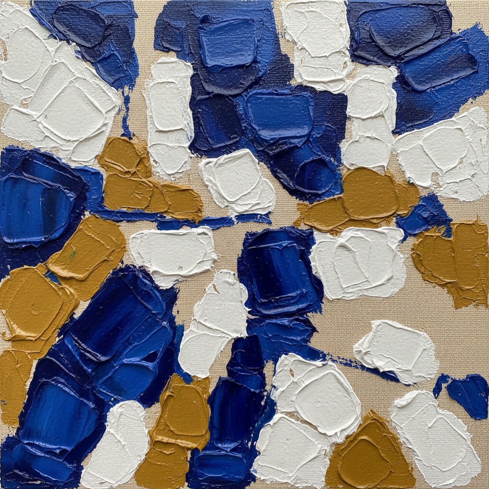

# Nicolas de Staël 尼古拉·德·斯塔埃尔

> **时期：** 1914–1955  
> **关键词：** 抽象与具象之间、厚涂色块、地中海光线、战后巴黎

## 概述

Nicolas de Staël 是俄裔法国画家，以在抽象与具象之间自由游走的厚涂色块绘画闻名。他的作品将风景、静物和人物简化为大面积的色彩方块，颜料堆积如砖墙般厚重，表面在光线下呈现宝石般的质感。他在创作巅峰期自杀，年仅41岁。

## 风格特征

- **厚涂色块**：颜料以调色刀大面积堆积，每个色块如同独立的色彩砖块
- **抽象-具象摇摆**：画面在可辨认的风景/静物与纯粹色彩构成之间持续切换
- **地中海色彩**：后期作品充满南法的蓝、白、赭和玫瑰色
- **边缘处理**：色块之间留有缝隙或重叠，创造出呼吸感和建筑感
- **光线感**：尽管是厚重的颜料，画面却传达出强烈的光感和空气感

## 代表作品

- *Les Toits*（1952）
- *Agrigente*（1954）
- *Le Concert*（1955）
- *Footballeurs*（1952）

## 历史意义

De Staël 证明了抽象与具象之间不存在不可逾越的鸿沟，他的工作方式——从观察出发走向抽象，又从抽象回归观察——为后来的画家提供了一种超越二元对立的路径。他的厚涂技法影响了整个战后欧洲绘画。

## 概念图

