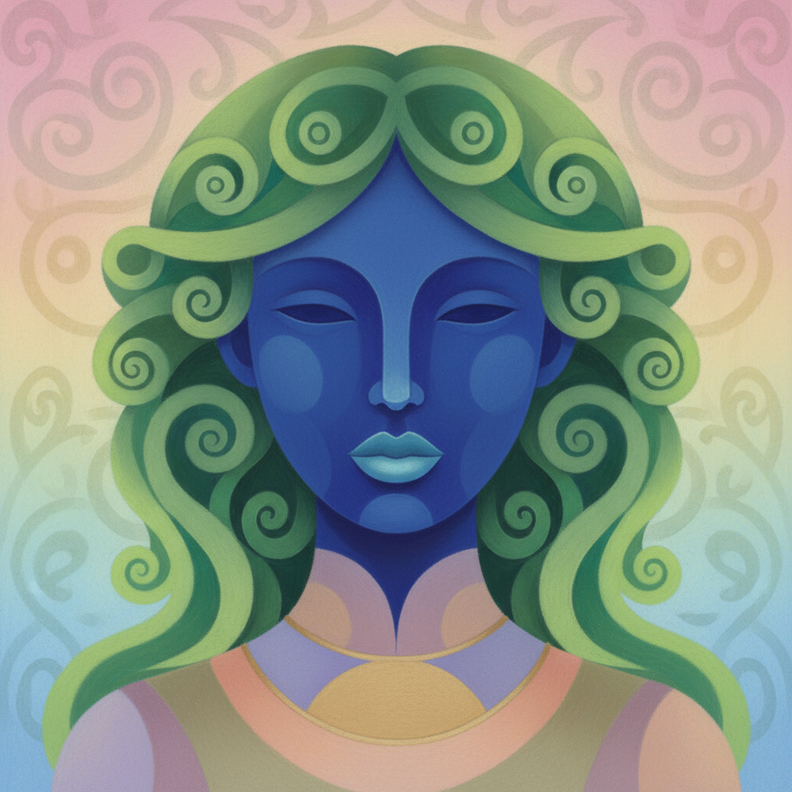

# Nicolas Party 尼古拉斯·帕蒂

> **时期：** 1980–至今  
> **关键词：** 粉彩肖像、饱和色彩、软边形态、当代装饰主义

## 概述

Nicolas Party 是瑞士当代画家，以使用软粉彩（soft pastel）在画布和墙面上创作的饱和色彩肖像和风景闻名。他的作品将现代主义的简化形态与装饰性的浓烈色彩结合，创造出一种既古典又超现实的视觉世界——人物面部如同彩色面具，风景如同舞台布景。

## 风格特征

- **软粉彩媒介**：以干粉彩为主要媒介，表面呈现天鹅绒般的哑光质感
- **饱和色彩**：大面积使用纯色——钴蓝面孔、翠绿头发、粉红天空
- **简化形态**：人物和景物被简化为圆润的几何形状，边缘柔和
- **正面肖像**：人物常以严格正面或四分之三侧面呈现，如同文艺复兴肖像
- **壁画实践**：频繁创作大型壁画，将绘画扩展到建筑空间

## 代表作品

- *Portrait with Flowers*（2019）
- *Sunset*（2017，壁画）
- *Three Trees*（2019）
- *Red, Blue and Green Portraits*（2018）

## 历史意义

Party 重新激活了粉彩这一被边缘化的媒介，证明了"装饰性"和"严肃性"并非对立。他的作品在极简主义和概念艺术之后，为纯粹的视觉愉悦重新争取了合法性。

## 概念图

