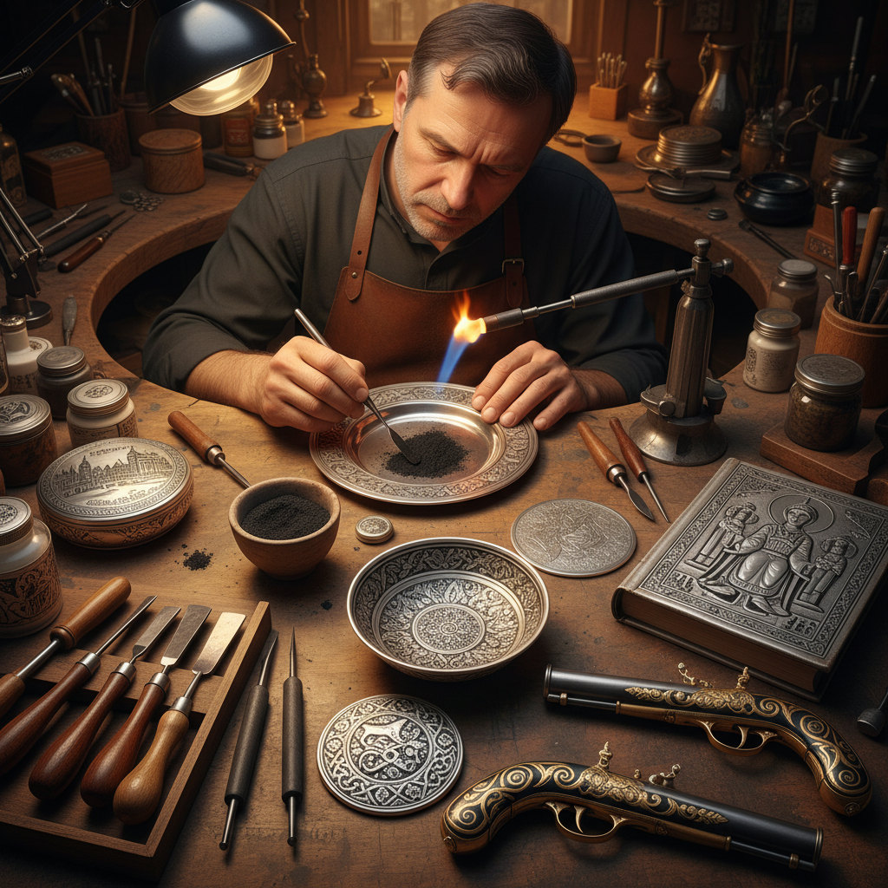

# Niello Art 黑金镶嵌艺术

> "Niello is darkness made decorative — a black alloy of sulfur, copper, silver, and lead that fills engraved lines in precious metal, creating contrast as sharp as ink on paper. Where damascene writes in gold upon iron, niello writes in shadow upon silver, turning engraved metal into a page where light and dark tell stories of extraordinary precision and beauty." — Unknown

## 概述

黑金镶嵌艺术（Niello Art）是一种将黑色合金（由硫、铜、银、铅等混合而成的黑色物质）填入金属表面的雕刻凹槽中，形成黑色图案的金属装饰工艺——通过在银或金表面雕刻图案后填入黑色niello合金，经过加热熔化和打磨，形成黑色图案与亮银/金色背景的强烈对比效果。

黑金镶嵌艺术的实践包括：1）首饰制作——niello装饰的戒指、手镯等；2）器物装饰——银器表面的niello装饰；3）武器装饰——刀剑上的niello图案；4）宗教器物——教堂银器的niello装饰；5）建筑装饰——门窗金属件的niello装饰；6）泰国niello——泰国特有的niello传统；7）当代niello——将传统技法与现代设计结合的创作。

## 核心特征

| 特征 | 描述 |
|------|------|
| 对比 | 黑白的强烈对比 |
| 精细 | 极其精细的雕刻 |
| 耐久 | niello填充极其耐久 |
| 平整 | 与金属表面齐平 |
| 古老 | 极其古老的技法 |
| 优雅 | 优雅的装饰效果 |

## 视觉特征

- **黑白**：黑色niello与银色的对比
- **线条**：精细的雕刻线条
- **图案**：精美的装饰图案
- **平整**：与表面齐平的填充
- **光泽**：银面的金属光泽
- **细节**：极其丰富的细节

## 代表作品

| 作品 | 艺术家/文化 | 年代 | 意义 |
|------|-------------|------|------|
| *Russian niello silver* | 俄罗斯传统 | 17-19世纪 | 俄罗斯黑金银器 |
| *Thai nielloware* | 泰国传统 | 古代至今 | 泰国黑金器 |
| *Byzantine niello* | 拜占庭 | 6-12世纪 | 拜占庭黑金 |
| *Tula steel niello* | 俄罗斯图拉 | 18-19世纪 | 图拉钢niello |
| *Anglo-Saxon niello* | 盎格鲁-撒克逊 | 7-9世纪 | 早期英国黑金 |

## 历史时间线

| 时期 | 事件 |
|------|------|
| 公元前2000年 | 最早的niello技术（埃及） |
| 古典时代 | 希腊罗马的niello |
| 中世纪 | 拜占庭和欧洲的niello |
| 17-19世纪 | 俄罗斯niello的黄金时代 |
| 当代 | niello工艺的传承 |

## 中国语境

黑金镶嵌艺术在中国虽然不如在俄罗斯和泰国那样普及，但中国有类似的金属装饰传统。中国古代的"错金银"技法与niello有相似之处——都是在金属表面的凹槽中填入不同材料形成装饰。中国的一些少数民族（如苗族）的银饰制作中也有类似的填充装饰技法。中国与泰国的文化交流中，泰国的niello工艺品曾作为贡品和贸易品进入中国。中国当代的一些金属工艺师开始学习和实践niello技法——将其与中国传统图案相结合。中国的珠宝设计教育中，niello作为一种重要的金属装饰技法被纳入课程。中国的银饰市场中，一些品牌开始推出niello风格的产品——利用黑银对比的视觉效果。

## AI生成概念图

## 与其他风格的关系

- **Damascene** → 大马士革镶嵌
- **Engraving** → 雕刻艺术
- **Silversmithing** → 银器艺术
- **Goldsmithing** → 金器艺术
- **Jewelry Art** → 珠宝艺术
- **Metal Inlay** → 金属镶嵌

---

*浮光艺志 | Chronicle of Artistry*
