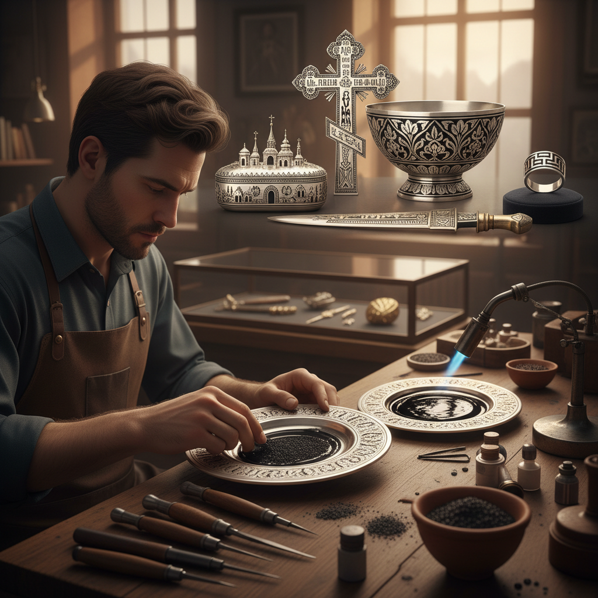

# Niello Metalwork 黑金镶嵌

> "Niello is darkness made permanent in metal — a black alloy of sulfur, copper, silver, and lead melted into engraved lines to create designs of startling contrast, the deep black filling every incised mark against polished silver or gold like ink on paper, producing metalwork that reads like the finest engraving but will never fade or wash away." — Unknown

## 概述

黑金镶嵌（Niello）是一种将黑色合金（niello，由硫、铜、银、铅等金属的硫化物混合而成）熔融填入金属表面的雕刻线条或凹槽中的金属装饰技法。Niello的黑色与银或金的光亮表面形成强烈对比，产生类似版画的视觉效果。

Niello的历史极其悠久——可以追溯到古埃及（公元前18世纪）。在古罗马、拜占庭、中世纪欧洲、俄罗斯（Tula niello）、中东和东南亚都有丰富的Niello传统。Niello的制作过程是：先在金属表面雕刻图案，然后将niello粉末填入刻痕，加热使其熔化流入凹槽，冷却后打磨表面直到只有凹槽中保留黑色niello。Niello常用于珠宝、银器、武器装饰和宗教器具。

## 核心特征

| 特征 | 描述 |
|------|------|
| 黑色合金 | 硫化物黑色合金 |
| 填入刻痕 | 填入雕刻凹槽 |
| 高对比 | 黑色与金属的对比 |
| 永久 | 极其永久的装饰 |
| 精细 | 精细的线条图案 |
| 古老 | 极其古老的技法 |

## 视觉特征

- **黑白**：黑色与银色的对比
- **精细**：精细的雕刻线条
- **版画感**：类似版画的效果
- **金属**：金属的光泽背景
- **永久**：永不褪色的黑色
- **装饰**：精美的装饰图案

## 代表作品

| 作品 | 艺术家 | 年代 | 意义 |
|------|--------|------|------|
| *Egyptian niello daggers* | 古埃及工匠 | 公元前18世纪 | 古埃及黑金匕首 |
| *Russian Tula niello* | 图拉工匠 | 18-19世纪 | 俄罗斯图拉黑金 |
| *Thai nielloware* | 泰国工匠 | 传统 | 泰国黑金器 |
| *Byzantine niello crosses* | 拜占庭工匠 | 6-12世纪 | 拜占庭黑金十字架 |
| *Contemporary niello jewelry* | Various | 当代 | 当代黑金珠宝 |

## 历史时间线

| 时期 | 事件 |
|------|------|
| 公元前18世纪 | 古埃及niello的起源 |
| 古罗马 | 罗马niello的发展 |
| 拜占庭 | 拜占庭niello的鼎盛 |
| 中世纪-近代 | 俄罗斯图拉niello |
| 当代 | Niello的传承与创新 |

## 中国语境

黑金镶嵌在中国有相关的传统——中国的"错金银"技法（在青铜器表面嵌入金银丝）与Niello有技法上的相似性，但使用的填充材料不同。中国的一些当代金属工艺师学习和实践Niello技法。中国云南的一些少数民族银饰中有类似Niello的黑色填充装饰。东南亚（特别是泰国）的Niello传统与中国南方有文化交流。

## AI生成概念图

## 与其他风格的关系

- **Engraving** → 雕刻
- **Metalwork** → 金属工艺
- **Damascening** → 大马士革镶嵌
- **Jewelry** → 珠宝
- **Silversmithing** → 银器工艺
- **Enameling** → 珐琅

---

*浮光艺志 | Chronicle of Artistry*
