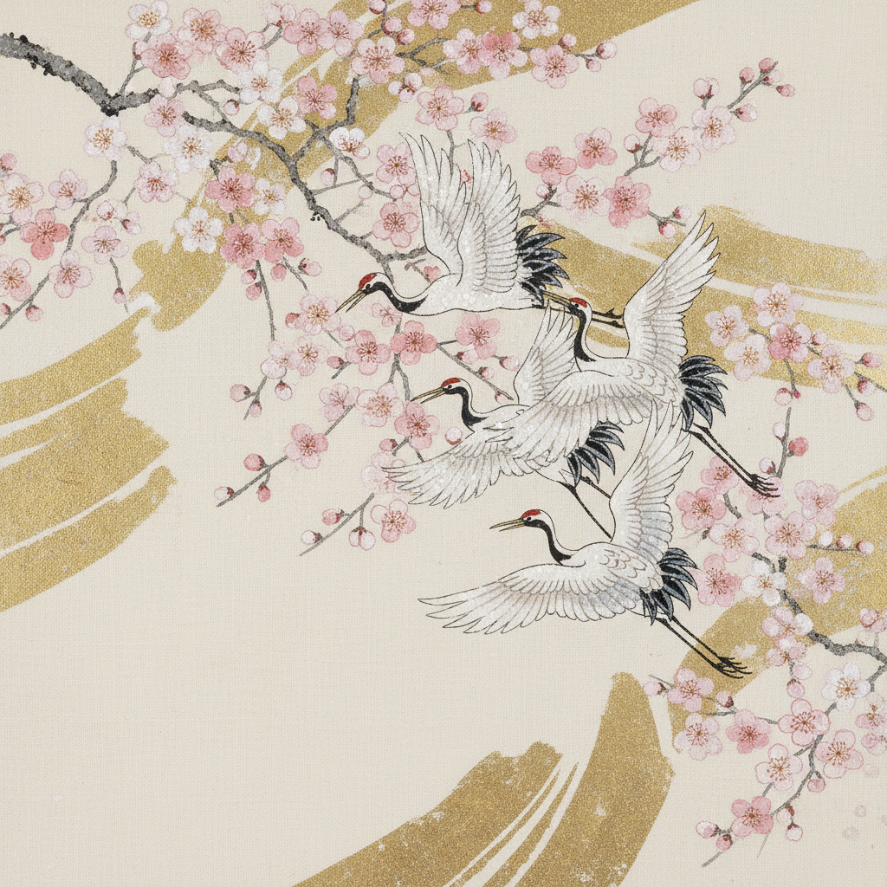

# Nihonga 日本画

> "Nihonga is not merely a technique, but a philosophy of seeing." — Yokoyama Taikan

## 概述

日本画（Nihonga，にほんが）是明治时代（1868年后）为区别于西洋画（Yōga）而确立的概念，指使用传统日本材料和技法创作的绘画。它继承了大和绘、琳派、狩野派等传统，使用岩绘具（矿物颜料）、和纸或绢本，以及胶（膠）作为粘合剂。

日本画不是一个历史风格，而是一个活的传统——当代日本画家仍在用千年前的材料探索全新的视觉可能性。

## 核心特征

| 特征 | 描述 |
|------|------|
| 矿物颜料 | 岩绘具——研磨矿石制成的颗粒状颜料 |
| 胶为媒介 | 动物胶（膠）作为颜料粘合剂 |
| 和纸/绢本 | 传统载体——非油画布 |
| 留白 | 空白即空间——余白的美学 |
| 装饰性 | 金箔、银箔的运用 |
| 四季主题 | 花鸟风月——自然的季节循环 |

## 视觉特征

- **质感**：矿物颜料的颗粒感和哑光表面
- **色彩**：群青、绿青、朱砂、胡粉——矿物色的沉稳
- **金银**：金箔银箔的装饰性运用
- **线条**：精细的墨线勾勒
- **空间**：大面积留白，非透视空间
- **主题**：花鸟、山水、人物、四季

## 代表作品

| 作品 | 年代 | 意义 |
|------|------|------|
| *屈原* (横山大観) | 1898 | 朦胧体的代表 |
| *落葉* (菱田春草) | 1909 | 无线描法的革新 |
| *序の舞* (上村松園) | 1936 | 美人画的巅峰 |
| *群鶴図* (加山又造) | 1970s | 现代琳派的继承 |
| *千住博の滝* (千住博) | 1995 | 当代日本画的国际化 |

## 真实作品（公共领域）

| 作品 | 来源 |
|------|------|
| *屈原* (横山大観) | [足立美術館](https://www.adachi-museum.or.jp/) |
| *落葉* (菱田春草) | [永青文庫](https://www.eiseibunko.com/) |
| *序の舞* (上村松園) | [東京藝術大学](https://www.geidai.ac.jp/) |

## AI生成概念图

## 与其他风格的关系

- **Ukiyo-e** → 浮世绘是日本画的一个分支
- **Rinpa** → 琳派的装饰传统延续
- **Chinese Ink Painting** → 共享东亚水墨传统
- **Art Nouveau** → 日本画的装饰性影响了新艺术
