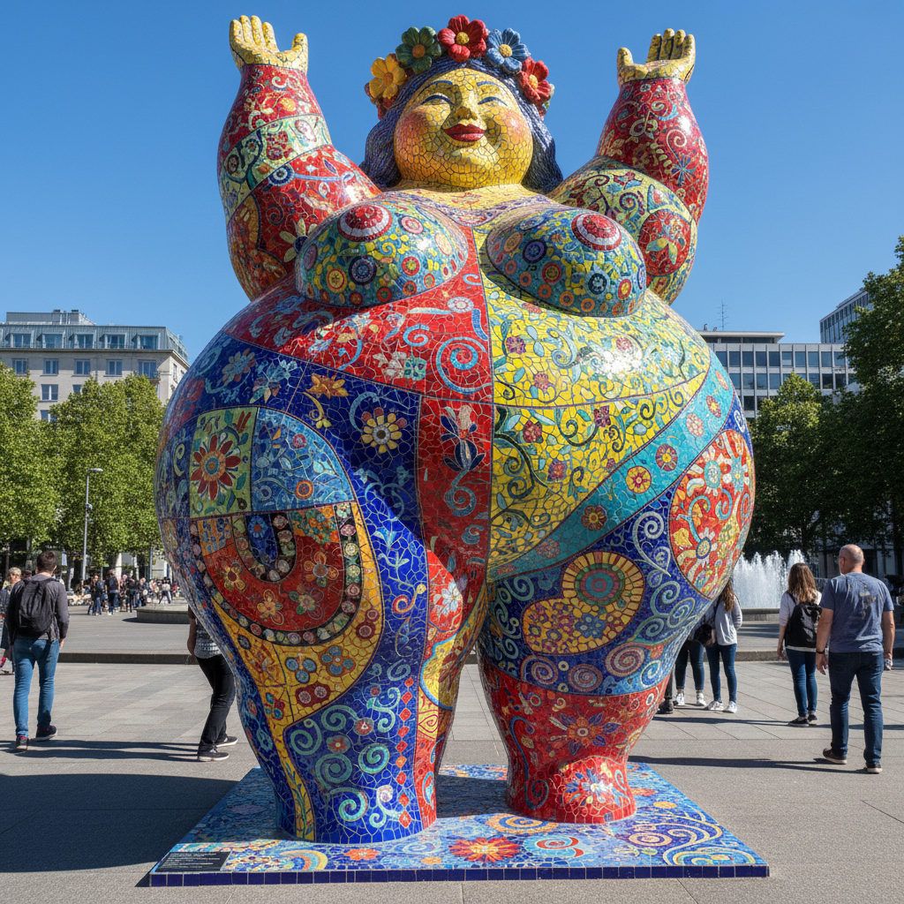

# Niki de Saint Phalle 妮基·德·圣法尔

> **时期：** 1930–2002  
> **关键词：** 娜娜雕塑、女性力量、色彩狂欢、建筑性雕塑

## 概述

Niki de Saint Phalle 是法裔美国艺术家，以巨大的、色彩斑斓的女性雕塑"Nanas"闻名——圆润、欢快、充满生命力的女性形态，涂以鲜艳的色彩和图案。她从早期的"射击绘画"演变为创造欢乐的公共雕塑和建筑性花园。

## 风格特征

- **圆润女性形态**：巨大的、丰满的女性身体，充满生命力和欢乐
- **鲜艳色彩**：大胆的原色和图案装饰，如同民间艺术
- **建筑尺度**：晚期作品达到可以进入的建筑规模
- **从暴力到欢乐**：早期的射击破坏演变为晚期的庆祝和治愈
- **公共性**：作品面向所有人，拒绝精英主义的封闭性

## 代表作品

- *Nanas*系列（1965–至今）
- *Hon/Elle*（1966）
- *Tarot Garden*（1979–1998）
- *Fontaine Stravinsky*（1983）

## 概念图

