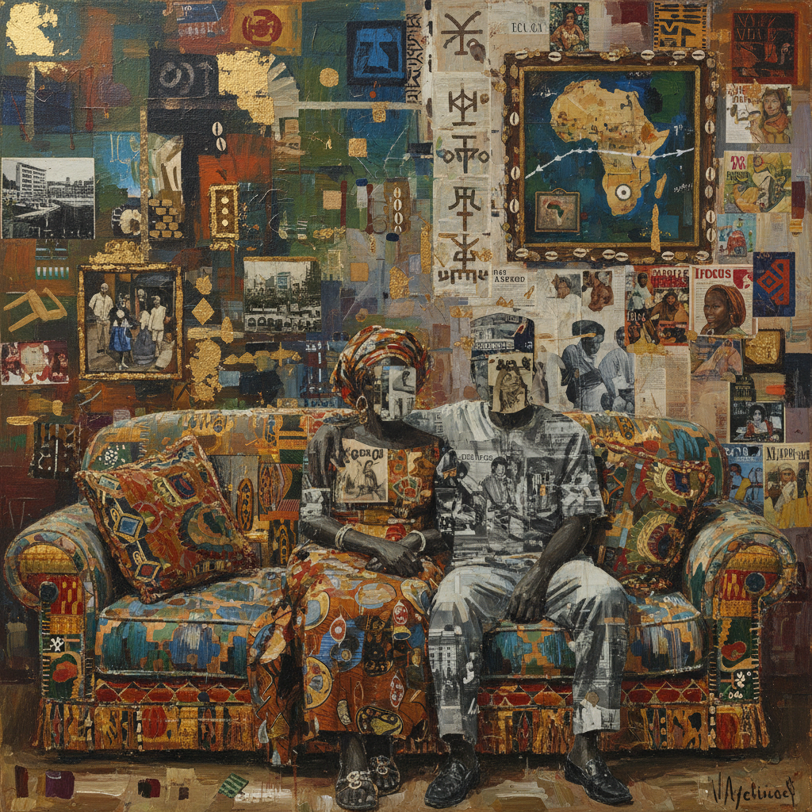

# Njideka Akunyili Crosby 恩吉德卡·阿库尼利·克罗斯比

> **流派**: 当代绘画 · 混合媒介  
> **时期**: 1983–至今 尼日利亚/美国  
> **关键词**: 跨文化拼贴、家庭场景、转印技法、双重身份

## 概述

恩吉德卡·阿库尼利·克罗斯比以大尺幅混合媒介绘画闻名，她将尼日利亚流行文化图像（杂志、广告、照片）转印到画面中，与精细的丙烯和彩铅绘画融为一体。她的作品描绘跨文化夫妻的日常家庭生活——做饭、看电视、拥抱——但每一个表面都密布着来自两种文化的视觉碎片，暗示着移民身份的复杂层次。

## 视觉特征

- **转印拼贴**: 尼日利亚杂志和照片转印到画面各处
- **家庭场景**: 亲密的室内空间和日常活动
- **密集表面**: 每一寸画面都充满细节和图像层次
- **大尺幅**: 作品通常超过2米
- **混合技法**: 丙烯、彩铅、转印、拼贴并用

## 代表作品

- 《前厅》(The Beautyful Ones, 2012)
- 《花园，说话》(Garden, Thriving, 2016)
- 《超级蓝色尼罗河》(Super Blue Omo, 2016)
- 惠特尼双年展 (2017)

## 历史影响

阿库尼利·克罗斯比为"移民经验"创造了全新的视觉语言——不是痛苦或怀旧，而是两种文化在日常生活中的自然共存。她的转印技法让文化记忆成为画面的物质肌理。

## 相关风格

- [Wangechi Mutu 万格奇·穆图](wangechi-mutu.md)
- [Collage Art 拼贴艺术](collage-art.md)
- [Contemporary Figurative Art 当代具象艺术](contemporary-figurative-art.md)
