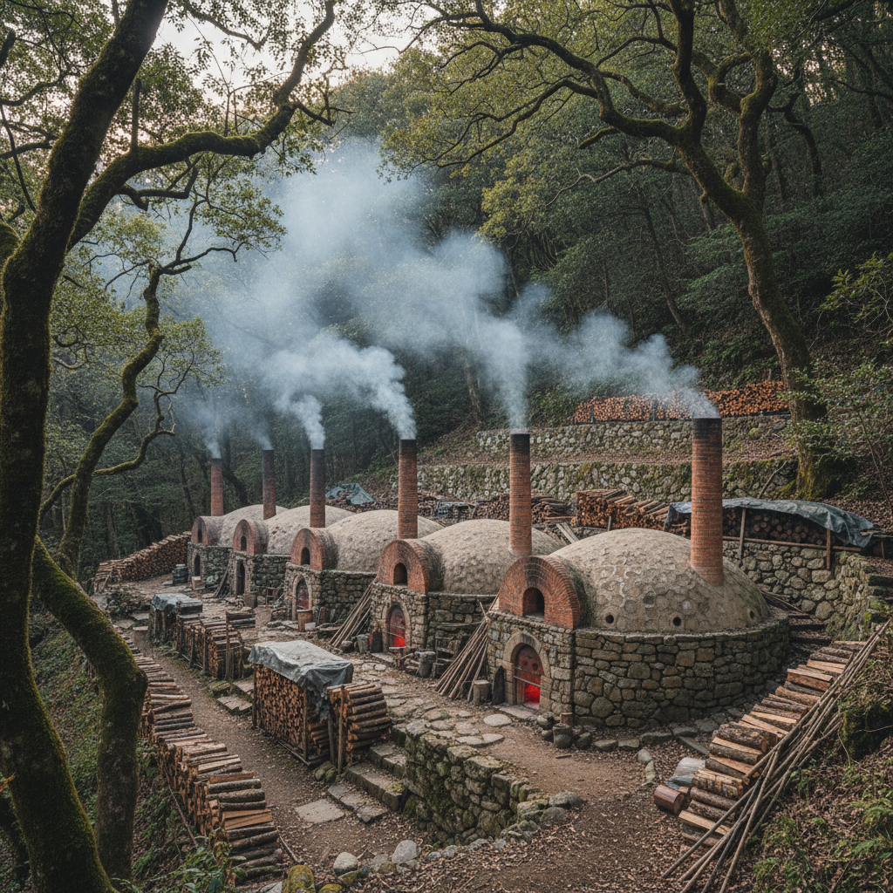

# Noborigama Art 登窑艺术

> "The noborigama is a dragon climbing a hillside — a series of connected chambers stepping up a slope, each feeding its waste heat to the next, fire entering at the bottom and climbing chamber by chamber toward the sky, the potter loading each room with different work suited to its particular temperature and atmosphere, a single firing producing the full spectrum from earthenware to stoneware to porcelain, architecture and thermodynamics married in brick and clay." — Unknown

## 概述

登窑艺术（Noborigama Art）是一种使用依山坡而建的多室阶梯窑（登窑/のぼりがま）烧制陶瓷的艺术形式。登窑由多个相连的窑室沿山坡阶梯式排列——火焰从最低的窑室进入，逐室上升，每个窑室的废热成为上一室的预热。这种设计极其高效，一次烧制可以在不同窑室获得不同的温度和气氛效果。登窑是东亚陶瓷传统中最重要的窑型之一。

登窑艺术的核心要素包括：1）多室结构——多个窑室阶梯排列；2）依山而建——沿山坡建造利用自然坡度；3）热量递进——废热逐室传递；4）效率极高——一次烧制多种效果；5）团队协作——需要多人协作烧窑；6）社区性——烧窑是社区活动；7）传统技术——数百年的窑业传统。

## 核心特征

| 特征 | 描述 |
|------|------|
| 多室阶梯 | 多个窑室沿坡排列 |
| 热量递进 | 废热逐室传递利用 |
| 高效率 | 极高的燃料效率 |
| 多种效果 | 不同窑室不同效果 |
| 团队协作 | 需要多人协作 |
| 社区活动 | 烧窑的社区性 |

## 视觉特征

- **多样效果**：同一窑次的多种效果
- **温度梯度**：不同窑室的温度差异
- **灰釉变化**：不同位置的灰釉效果
- **火痕差异**：各室不同的火痕
- **色彩范围**：从低温到高温的色彩
- **窑景壮观**：依山而建的壮观窑体

## 代表作品

| 作品 | 艺术家/文化 | 年代 | 意义 |
|------|-------------|------|------|
| *日本各产地登窑* | 日本 | 16世纪起 | 日本登窑传统 |
| *韩国登窑* | 韩国 | 各时期 | 韩国登窑传统 |
| *中国龙窑* | 中国 | 商代起 | 中国阶梯窑传统 |
| *当代登窑烧制* | 各地陶艺家 | 当代 | 登窑的当代实践 |
| *社区登窑活动* | 各地社区 | 当代 | 登窑的社区文化 |

## 历史时间线

| 时期 | 事件 |
|------|------|
| 商代 | 中国龙窑（登窑原型）的出现 |
| 16世纪 | 日本登窑技术从朝鲜传入 |
| 17-19世纪 | 日本各产地登窑的繁荣 |
| 20世纪 | 登窑在全球陶艺中的传播 |
| 当代 | 登窑作为社区和教育活动 |

## 中国语境

中国的龙窑是登窑的原型和近亲——中国南方的龙窑同样依山坡而建，利用自然坡度促进气流。中国的龙窑历史可以追溯到商代，是世界上最古老的阶梯式窑型。中国南方——浙江、福建、广东、江西——至今仍保留着大量古代龙窑遗址，其中一些仍在使用。中国当代陶艺中，龙窑烧制正在经历复兴——越来越多的陶艺家和社区组织龙窑烧制活动，将传统窑业文化与当代艺术实践结合。龙窑/登窑烧制的社区性和仪式感使其成为陶瓷文化传承的重要载体。

## AI生成概念图

## 与其他风格的关系

- **Anagama** → 穴窑
- **Dragon Kiln** → 龙窑
- **Wood Kiln** → 柴窑
- **Community Ceramics** → 社区陶艺
- **Japanese Ceramics** → 日本陶瓷
- **Kiln Architecture** → 窑炉建筑

---

*浮光艺志 | Chronicle of Artistry*
