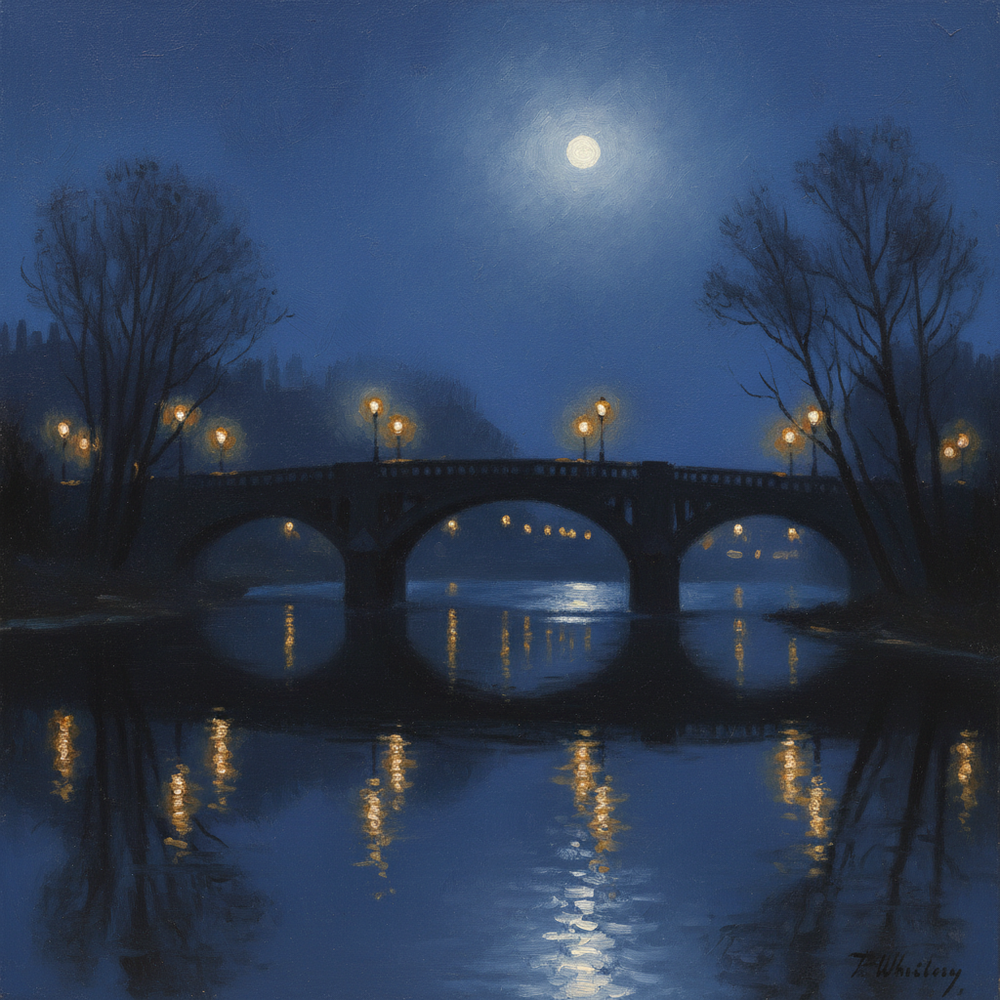

# Nocturne Painting 夜曲画派

> "I said to myself, 'I have been the inventor of Nocturnes until I saw Grimshaw's moonlit pictures.'" — James McNeill Whistler

## 概述

夜曲画派（Nocturne Painting）是19世纪后期以描绘夜景为核心主题的绘画流派，由詹姆斯·麦克尼尔·惠斯勒（James McNeill Whistler）命名并推广。"Nocturne"一词借自音乐术语（肖邦的夜曲），强调绘画如音乐般追求色调和谐与情绪氛围，而非叙事性内容。

惠斯勒和格里姆肖是这一流派的两大代表——前者追求朦胧诗意的色调抽象，后者则以精确写实的月光城市风景著称。

## 核心特征

| 特征 | 描述 |
|------|------|
| 夜景主题 | 专注于黄昏、月夜、人工灯光下的场景 |
| 色调和谐 | 追求统一的色调氛围而非细节描绘 |
| 音乐性 | 以音乐术语命名（夜曲、和声、交响曲） |
| 大气效果 | 雾气、月光、水面反射的朦胧美 |
| 反叙事 | 拒绝文学性叙事，追求纯视觉体验 |
| 唯美主义 | "为艺术而艺术"的美学立场 |

## 视觉特征

- **色调**：深蓝、靛青、银灰、金色光点
- **光源**：月光、煤气灯、烟火、窗户透光
- **水面**：河流和港口的光影倒映
- **大气**：雾气、烟霾、潮湿空气的朦胧感
- **剪影**：建筑和树木的暗色轮廓
- **笔触**：惠斯勒薄涂朦胧 vs 格里姆肖精确写实

## 代表人物

| 画家 | 代表作 | 特点 |
|------|--------|------|
| James McNeill Whistler | *Nocturne in Blue and Gold* (1872) | 色调抽象，朦胧诗意 |
| John Atkinson Grimshaw | *Boar Lane, Leeds* (1881) | 精确写实的月光城市 |
| Atkinson Grimshaw | *Liverpool Quay by Moonlight* (1887) | 港口月夜 |
| Whistler | *Nocturne in Black and Gold: The Falling Rocket* | 引发著名诉讼 |

## 惠斯勒 vs 格里姆肖

| 维度 | Whistler | Grimshaw |
|------|----------|----------|
| 手法 | 薄涂、朦胧、近乎抽象 | 精确写实、细节丰富 |
| 光线 | 柔和弥散的整体色调 | 精确的月光和煤气灯 |
| 构图 | 简化、留白、日本影响 | 精确的建筑透视 |
| 理念 | 纯形式美学 | 诗意的城市记录 |
| 影响 | 抽象艺术先驱 | 维多利亚城市画巅峰 |

## 历史背景

1. **1866年**：惠斯勒开始用"夜曲"命名画作
2. **1870年代**：格里姆肖发展出独特的月光城市风格
3. **1877年**：惠斯勒《黑与金的夜曲》引发与罗斯金的诽谤诉讼
4. **1880年代**：两人在切尔西相邻画室工作
5. **1890年代后**：夜景绘画传统被摄影和电影继承

## 与其他风格的关系

- **Aestheticism 唯美主义** → 惠斯勒是唯美主义运动核心人物
- **Japonisme** → 惠斯勒深受日本艺术影响
- **Tonalism** → 美国色调主义继承了夜曲的氛围美学
- **Impressionism** → 共享对光线和大气的关注
- **Grimshaw** → 夜曲画派的写实分支代表

## 概念图

---

*浮光艺志 | Chronicle of Artistry*
