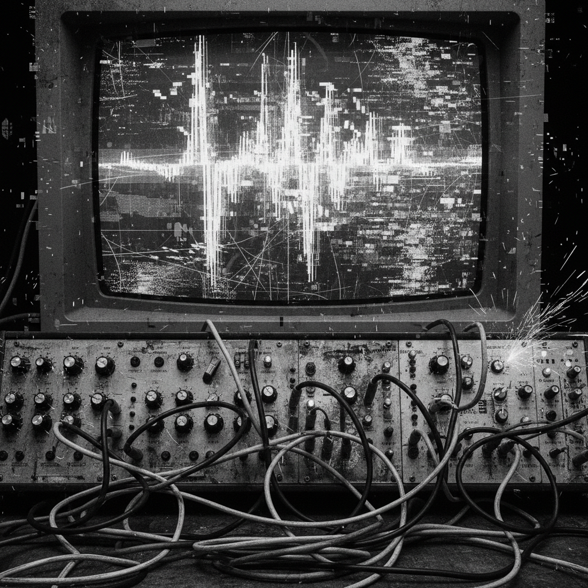

# Noise Art 噪音艺术

> **时期：** 1910年代–至今  
> **关键词：** 噪音即音乐、工业声响、反和谐、极端音量、声音暴力

## 概述

噪音艺术将传统音乐中被排斥的"噪音"——工业机器声、电子反馈、失真、静电——提升为艺术表达的核心材料。从未来主义者Luigi Russolo的《噪音的艺术》宣言（1913）到日本噪音（Japanoise）的极端实践，噪音艺术持续挑战"什么是音乐"的边界，将听觉不适转化为审美体验。

## 风格特征

- **反和谐**：拒绝传统的旋律、节奏和调性
- **极端音量**：将音量本身作为物理体验
- **电子反馈**：利用设备的"错误"和"故障"
- **即兴性**：不可重复的现场表演
- **跨感官**：声音引发的身体震动和空间感知

## 代表人物与作品

- Luigi Russolo《噪音的艺术》（1913）
- Merzbow 日本噪音
- Throbbing Gristle 工业音乐
- Wolf Eyes 美国噪音
- Ryoji Ikeda 数据噪音可视化

## 概念图

