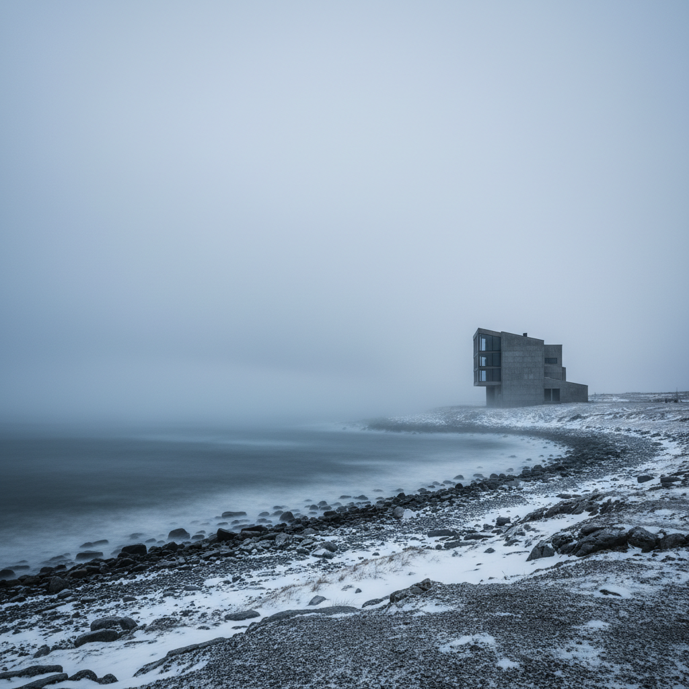

# Nordic Noir Art 北欧黑色艺术

> **时期：** 2000年代–至今  
> **关键词：** 斯堪的纳维亚忧郁、冷色调、极简阴暗、社会批判、自然荒凉

## 概述

Nordic Noir Art 从北欧犯罪小说和影视的视觉语言中汲取灵感，将斯堪的纳维亚特有的忧郁气质——漫长冬夜、荒凉海岸、功能主义建筑的冷峻——转化为一种独特的视觉美学。它不是简单的"黑暗"，而是一种克制的、低饱和度的情绪表达，暗示着福利社会表面之下的裂痕。

## 风格特征

- **冷色调**：灰蓝、深绿、铅白为主的色彩
- **极简构图**：大面积留白与孤独的人物/建筑
- **自然荒凉**：北欧峡湾、森林、冻土的空旷感
- **功能主义建筑**：混凝土和玻璃的冷峻几何
- **心理张力**：平静表面下的不安暗流

## 代表人物与作品

- 北欧犯罪剧视觉设计（《桥》《谋杀》）
- 丹麦极简主义摄影
- 冰岛荒原景观摄影
- 挪威黑金属专辑封面美学

## 概念图

