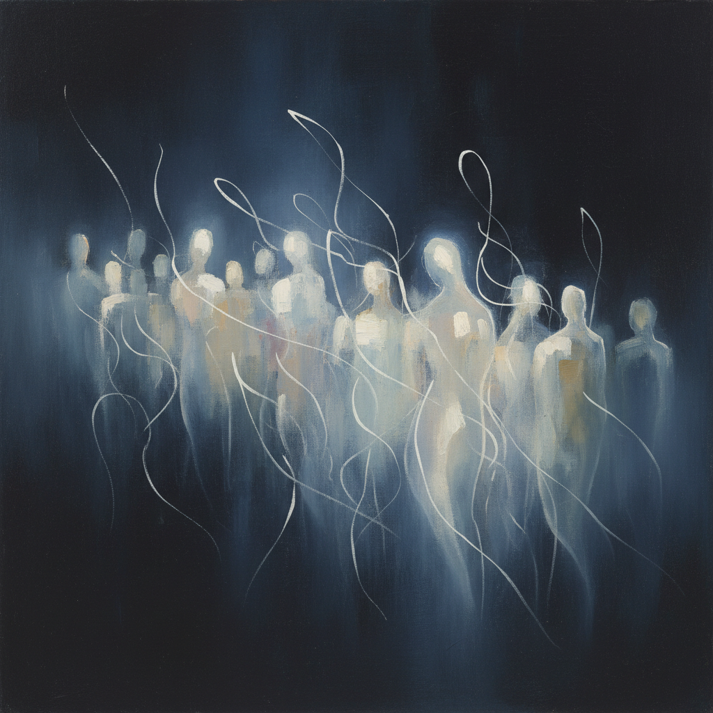

# Norman Lewis 诺曼·刘易斯

> **时期：** 1909–1979  
> **关键词：** 抽象表现主义、非裔美国先驱、书法性抽象、光与暗

## 概述

Norman Lewis 是第一位获得主流认可的非裔美国抽象表现主义画家，也是纽约画派的核心成员之一。他的作品从早期的社会现实主义逐渐演变为精致的书法性抽象，以微妙的光影变化和飘浮的线性形态著称。尽管与波洛克、德库宁同代，他长期被艺术史边缘化，直到近年才获得应有的重新评价。

## 风格特征

- **书法性线条**：细腻的线性形态在深色背景上飘浮，如同夜空中的萤火
- **微妙光影**：画面常以深色调为主，光线从内部渗透而出
- **有机抽象**：形态介于可辨识与纯抽象之间，暗示人群、仪式或自然现象
- **克制的色彩**：以黑、白、灰和深蓝为主调，偶尔点缀温暖色彩
- **社会隐喻**：抽象形态中隐含对种族集会、游行和社会运动的暗示

## 代表作品

- *Evening Rendezvous*（1962）
- *Processional*（1965）
- *American Totem*（1960）
- *Untitled (Alabama)*（1967）

## 历史意义

Lewis 打破了"非裔美国艺术家只能做具象社会现实主义"的偏见，证明抽象同样可以承载种族经验和政治意识。他是Spiral Group的创始成员，致力于探讨黑人艺术家在民权运动中的角色。

## 概念图

