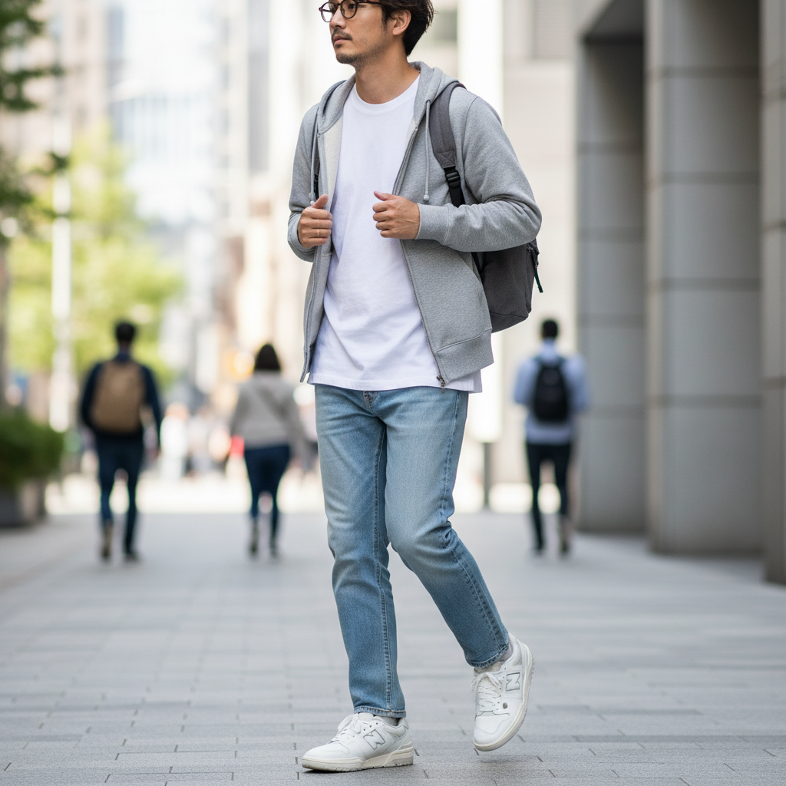

# Normcore 常规核



> **"白T恤、直筒牛仔裤、New Balance——当'不时尚'成为最时尚的事。"**

## 概述

| 维度 | 描述 |
|------|------|
| 时期 | 2014–至今 |
| 别名 | Normcore, Anti-Fashion, Basic Dressing |
| 核心色彩 | 白色、灰色、黑色、牛仔蓝、卡其 |
| 关键元素 | 基础款、无品牌感、舒适优先、"普通人"穿搭 |
| 代表人物 | Steve Jobs、Jerry Seinfeld、K-HOLE 集体 |
| 关联风格 | Clean Girl, Quiet Luxury, Minimalist, Gorpcore |

---

## 历史脉络

### 从讽刺到主流

| 年份 | 事件 |
|------|------|
| 2013 | K-HOLE 艺术集体发布《Youth Mode》报告 |
| 2014 | "Normcore" 一词进入主流媒体 |
| 2015 | 时尚界开始拥抱"反时尚" |
| 2016 | Vetements 的"普通人"美学 |
| 2020s | 从趋势变成永久的穿衣哲学 |

### 它反对什么？

| 时尚系统说 | Normcore 说 |
|-----------|------------|
| "你需要与众不同" | "融入也是一种选择" |
| "穿衣表达个性" | "不通过衣服表达也行" |
| "每季更新衣橱" | "基础款永远不过时" |
| "品牌=身份" | "我不需要品牌定义我" |
| "时尚是竞争" | "我退出这场竞争" |

### 核心哲学

Normcore 的精神是**"自由在于不需要通过外表证明什么"**：
- 穿衣不是表演——是生活
- "普通"不是贬义——是一种自由
- 舒适 > 好看
- 功能 > 形式
- "我不在乎你怎么看我穿什么"

---

## 视觉语法

### 色彩系统

```
主色：
  白色 (#FFFFFF) — T恤、运动鞋
  灰色 (#808080) — 卫衣、运动裤
  黑色 (#000000) — 基础款
  牛仔蓝 (#4169E1) — 直筒牛仔裤
  卡其 (#C3B091) — 休闲裤

规则：
  - 中性色
  - 无图案
  - 无logo（或极小logo）
  - 不引人注目
  - "看起来没花心思"

质感：
  棉 — 基础T恤
  牛仔 — 直筒、无破洞
  针织 — 简单、无装饰
  运动面料 — 功能性
  皮革 — 简单运动鞋
```

### 标志性元素

| 类别 | 元素 |
|------|------|
| 上装 | 白T恤、灰卫衣、基础针织 |
| 下装 | 直筒牛仔裤、卡其裤、运动裤 |
| 鞋 | New Balance、白色运动鞋、Birkenstock |
| 配饰 | 无（或极简手表） |
| 态度 | "我没有刻意穿搭" |
| 品牌 | Uniqlo、GAP、Muji、COS |

---

## 与千禧怀旧的关系

### 对"Instagram 时尚"的反叛
- 2010s = 每天都要"穿搭打卡"
- Normcore = "我拒绝参与这个游戏"
- 这是千禧一代对"永远在线"的疲劳反应
- Steve Jobs 的黑色高领 = Normcore 的精神图腾

### 与 Gorpcore 的交叉
- 两者都优先功能性
- Normcore = 城市基础款
- Gorpcore = 户外功能款
- 共同精神：实用 > 好看

---

## 中国语境

- "基础款穿搭"/"极简穿搭"在中国的流行
- 优衣库在中国的文化地位
- "不费力感"/"松弛感"的追求
- 与"程序员穿搭"的交叉（格子衫+牛仔裤）
- 对"精致穷"的反思

---

## 设计应用

| 场景 | 应用方式 |
|------|----------|
| 品牌 | 极简+无装饰+功能性+中性色 |
| 空间 | 简单+功能+无多余装饰 |
| 包装 | 白色+极简标签+无图案 |
| 数字 | 系统字体+无装饰+功能优先 |

---

## 相关风格

← [Clean Girl 干净女孩](clean-girl.md) | [Quiet Luxury 静奢](quiet-luxury.md) →

↑ [返回千禧怀旧目录](README.md) | [返回总目录](../README.md)
