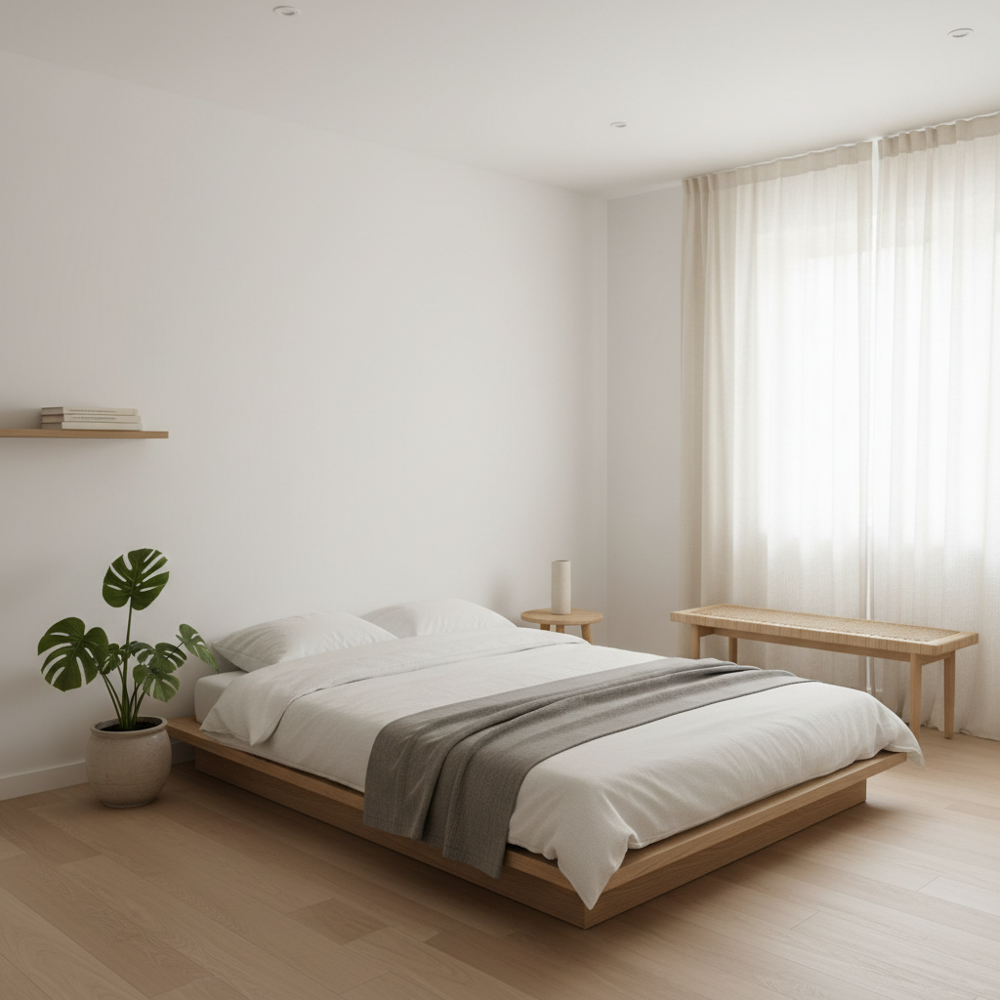

# Normcore 正常核




> **"故意穿得像你爸——当'没有风格'本身成为一种风格。"**

## 概述

| 维度 | 描述 |
|------|------|
| 时期 | 2013–2017（概念期）/ 持续影响至今 |
| 别名 | Normcore, Anti-Fashion, Dad Core, 性冷淡风 |
| 核心色彩 | 灰色、白色、米色、海军蓝、黑色（全部无印花） |
| 关键元素 | 纯色T恤、直筒牛仔裤、白色运动鞋、无logo |
| 代表人物 | Steve Jobs、Jerry Seinfeld、Mark Zuckerberg |
| 关联风格 | Minimalism, Muji 风, Clean Girl, Gorpcore |

---

## 历史脉络

### 2013：K-Hole 的宣言

"Normcore" 这个词由纽约趋势预测团体 **K-Hole** 在 2013 年的报告《Youth Mode: A Report on Freedom》中首次提出。

K-Hole 的原始定义并不是关于穿衣——它是一种**社交哲学**：
> "Normcore 不是关于一种特定的穿着方式。它是关于放弃'与众不同'的需求，拥抱'正常'作为一种自由。"

但媒体和时尚界迅速将它简化为一种穿衣风格：**故意穿得普通、无特征、反时尚**。

### 2014：媒体爆发

2014 年，Normcore 成为全球时尚媒体的热词：
- 《纽约时报》："Normcore: Fashion for Those Who Realize They're One in 7 Billion"
- 《Vogue》开始报道"反时尚"趋势
- New Balance 574、Birkenstock 凉鞋成为"Normcore 单品"
- Steve Jobs 的黑色高领毛衣+牛仔裤被追认为 Normcore 原型

### 文化背景

Normcore 的出现有其深刻的文化背景：

1. **社交媒体疲劳**：Instagram 时代，每个人都在"展示自我"→ 反向操作：不展示
2. **快时尚批判**：Zara/H&M 让每个人都能追赶潮流 → 反向操作：拒绝潮流
3. **硅谷文化**：科技精英用"不在乎穿什么"来表达"我在乎更重要的事"
4. **极简主义浪潮**：Marie Kondo、断舍离、"less is more"

### 2015–至今：遗产与变体

Normcore 作为一个标签在 2017 年后逐渐淡出，但它的影响深远：
- **Gorpcore**（2018–）：户外功能服装的日常化（始祖鸟、Salomon）
- **Clean Girl**（2021–）：极简妆容+基础款穿搭
- **Quiet Luxury**（2023–）：无logo的高端基础款（The Row、Loro Piana）
- **Old Money**（2023–）：低调的富人穿搭

---

## 视觉语法

### 色彩系统

```
核心色（全部为"非色彩"）：
  白色 (#FFFFFF) — T恤、运动鞋
  灰色 (#808080) — 卫衣、运动裤
  黑色 (#000000) — 基础款
  海军蓝 (#000080) — 牛仔裤、外套
  米色/卡其 (#F5F5DC) — 裤子、风衣

规则：
  - 无印花、无图案
  - 无明显logo
  - 无鲜艳色彩
  - 无对比色搭配
  - 一切都是"安全"的
```

### 标志性元素

| 类别 | 元素 | 反面（Normcore 拒绝的） |
|------|------|------------------------|
| 上衣 | 纯色圆领T恤 | 印花T恤、band tee |
| 外套 | 纯色卫衣/拉链衫 | 皮夹克、牛仔夹克 |
| 裤子 | 直筒牛仔裤/卡其裤 | 破洞牛仔裤、紧身裤 |
| 鞋 | 白色运动鞋/New Balance | 高跟鞋、厚底鞋 |
| 配饰 | 无/极简手表 | 项链、戒指、耳环 |
| 包 | 双肩包/帆布袋 | 名牌手袋 |
| 帽子 | 棒球帽（无logo） | 贝雷帽、渔夫帽 |

### "反风格"的悖论

Normcore 的核心悖论在于：**当"没有风格"成为一种风格时，它就不再是"没有风格"了**。

- 你"故意"穿得普通 ≠ 你"真的"穿得普通
- 选择 New Balance 574 而不是 Nike Air Max = 一个时尚决策
- "我不在乎穿什么" = 一种精心构建的人设
- Normcore 本身就是一种消费选择（Uniqlo、COS、Muji）

---

## 与千禧怀旧的关系

Normcore 与千禧怀旧的关系是**反向的**——它怀念的是**千禧年之前**的穿衣方式：

### 90年代的"正常"
- Jerry Seinfeld 的白色运动鞋+牛仔裤+纯色衬衫
- 90年代中产阶级的"不需要思考穿什么"
- Gap、Levi's、New Balance 的黄金时代
- 在快时尚和社交媒体出现之前，"穿得普通"不需要理由

### 对千禧过度的反动
Normcore 可以被理解为对 2000 年代视觉过剩的**反动**：
- McBling 的水钻和logo → Normcore 的无装饰
- Y2K 的未来感 → Normcore 的"现在感"
- Scene/Emo 的极端造型 → Normcore 的"正常"
- 快时尚的每周更新 → Normcore 的"永恒基础款"

---

## 中国语境

Normcore 在中国的对应概念：

### "性冷淡风"
- 2015–2017 年在中国互联网流行的标签
- 无印良品（MUJI）的生活方式美学
- 优衣库（UNIQLO）的基础款哲学
- "断舍离"文化的视觉表达

### 本土品牌
- MUJI → 中国"性冷淡风"的视觉标杆
- 网易严选 → "好的设计是没有设计"
- 小米 → 产品设计的极简主义

---

## 设计应用

| 场景 | 应用方式 |
|------|----------|
| 品牌设计 | 无衬线字体+大量留白+单色 |
| 包装 | 白色/牛皮纸+极简排版+无装饰 |
| 空间 | 白墙+木质+极少装饰+自然光 |
| UI | 大量留白+系统字体+无渐变无阴影 |

---

## 延伸阅读

- K-Hole《Youth Mode: A Report on Freedom》(2013)
- Aesthetics Wiki: [Normcore](https://aesthetics.fandom.com/wiki/Normcore)
- 《纽约时报》"Normcore" 专题报道 (2014)

---

## 相关风格

← [Frasurbane 郊区怀旧](frasurbane.md) | [Gorpcore 户外核](gorpcore.md) →

↑ [返回千禧怀旧目录](README.md) | [返回总目录](../README.md)
