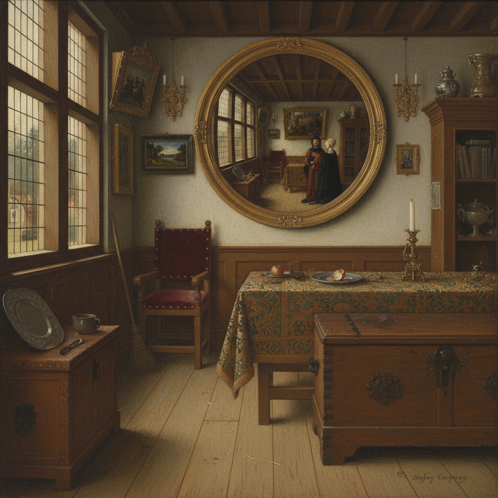

# Northern Renaissance Painting 北方文艺复兴绘画

> **时期：** 15世纪–16世纪  
> **关键词：** 油画技法、微观写实、日常生活、宗教象征、尼德兰

## 概述

Northern Renaissance Painting（北方文艺复兴绘画）是15世纪在尼德兰（今比利时、荷兰）独立发展的艺术革命——与意大利追求理想化人体和古典比例不同，北方画家追求的是对可见世界每一个细节的极致忠实。扬·凡·艾克的宝石般光泽、罗希尔的情感深度、博斯的地狱幻想——他们用油画新技法记录了一个比真实更真实的世界。

## 风格特征

- **微观写实**：每根毛发、每颗珠宝都清晰可见
- **油画光泽**：多层透明罩染的宝石效果
- **隐藏象征**：日常物品承载宗教含义
- **室内空间**：精确的透视和光线
- **小尺幅精品**：适合私人收藏的板上油画

## 代表人物与作品

- 扬·凡·艾克《阿尔诺芬尼夫妇像》
- 罗希尔·凡·德·韦登《卸下圣体》
- 希罗尼穆斯·博斯《人间乐园》
- 阿尔布雷希特·丢勒 版画与自画像

## 概念图

