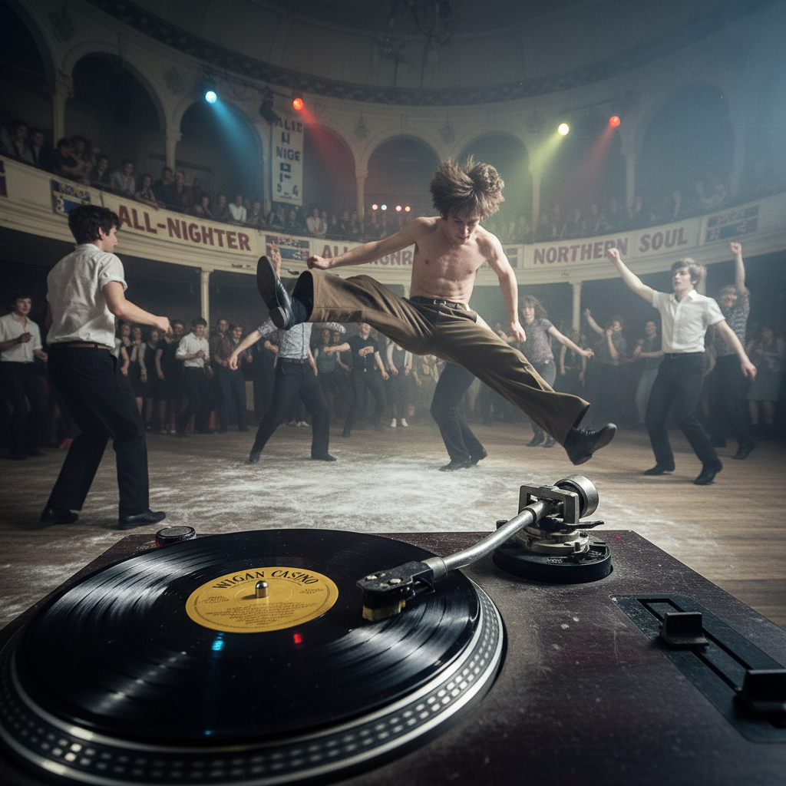

# Northern Soul 北方灵魂



> **"稀有黑胶、滑步舞、通宵舞厅——英格兰北部工人阶级的秘密宗教。"**

## 概述

| 维度 | 描述 |
|------|------|
| 时期 | 1968–至今 |
| 别名 | Northern Soul, Wigan Casino, All-Nighter |
| 核心色彩 | 黑色、白色、棕色、金色 |
| 关键元素 | 稀有黑胶唱片、宽腿裤、背心、滑步舞、通宵舞厅 |
| 代表人物 | Wigan Casino DJ、Ian Levine、Richard Searling |
| 关联风格 | Mod, Soul, Ska, Disco, Rare Groove |

---

## 历史脉络

| 年份 | 事件 |
|------|------|
| 1968 | 曼彻斯特 Twisted Wheel 俱乐部——Northern Soul 萌芽 |
| 1973 | Wigan Casino 开始 All-Nighter——圣地诞生 |
| 1975 | Billboard 评选 Wigan Casino 为"世界最佳迪斯科" |
| 1981 | Wigan Casino 关闭——但文化从未消失 |
| 2000s | Northern Soul 复兴——新一代发现 |
| 2014 | 电影《Northern Soul》上映 |

### 核心哲学

Northern Soul 的精神是**"越稀有越好——如果别人有这张唱片，它就不够好"**：
- 稀有 = 价值（"只有100张的唱片 > 百万销量"）
- 跳舞 = 信仰（"从午夜跳到早上8点"）
- 社区 = 家庭（"All-Nighter 就是教堂"）
- 工人阶级 = 骄傲（"我们的音乐，我们的舞步"）
- "Keep the Faith"——Northern Soul 的座右铭

---

## 视觉语法

### 色彩系统

```
主色：
  黑色 (#000000) — 唱片、夜晚
  白色 (#FFFFFF) — 背心、标签
  棕色 (#8B4513) — 皮革、木地板

辅色：
  金色 (#DAA520) — 唱片标签
  海军蓝 (#000080) — 服装
  红色 (#FF0000) — 唱片标签

规则：
  - 简洁、功能性
  - 为跳舞设计的服装
  - 宽松 = 自由移动
  - 滑粉 = 舞池必备

质感：
  黑胶 — 唱片
  棉 — 背心、T恤
  皮革 — 鞋底（滑步用）
  木 — 舞池地板
```

### 标志性元素

| 类别 | 元素 |
|------|------|
| 服装 | 宽腿裤(Oxford Bags)、背心、运动服 |
| 舞蹈 | 滑步、旋转、后空翻、地板动作 |
| 音乐 | 稀有60s美国灵魂乐、Motown未发行曲目 |
| 物品 | 黑胶唱片、唱片箱、滑粉 |
| 场所 | Wigan Casino、通宵舞厅 |
| 态度 | Keep the Faith、稀有、通宵、社区 |

---

## 与千禧怀旧的关系

### 最"纯粹"的亚文化之一
- Northern Soul = 完全由音乐驱动（不是时尚）
- 从未被主流商业化（太小众）
- "如果你知道 Northern Soul——你就是圈内人"
- 与 Mod 共享"工人阶级+灵魂乐+跳舞"

### 对 DJ 文化的影响
- Northern Soul DJ = 最早的"稀有唱片猎人"
- 影响了 Rare Groove、Acid Jazz、House
- "Northern Soul 发明了'DJ 作为策展人'的概念"

---

## 中国语境

- Northern Soul 在中国极为小众
- 与中国"黑胶收藏"文化的交叉
- 上海/北京的 Soul/Funk 夜场
- 作为"英国工人阶级文化"的研究对象

---

## 设计应用

| 场景 | 应用方式 |
|------|----------|
| 音乐 | 黑胶+唱片标签+通宵海报+灵魂乐 |
| 品牌 | 真实+社区+稀有+工人阶级+忠诚 |
| 活动 | 通宵舞会+黑胶市集+灵魂乐之夜 |
| 平面 | 唱片标签设计+复古海报+Keep the Faith |

---

## 相关风格

← [Mod 摩德文化](mod.md) | [Ska & 2 Tone](ska-2tone.md) →

↑ [返回千禧怀旧目录](README.md) | [返回总目录](../README.md)
