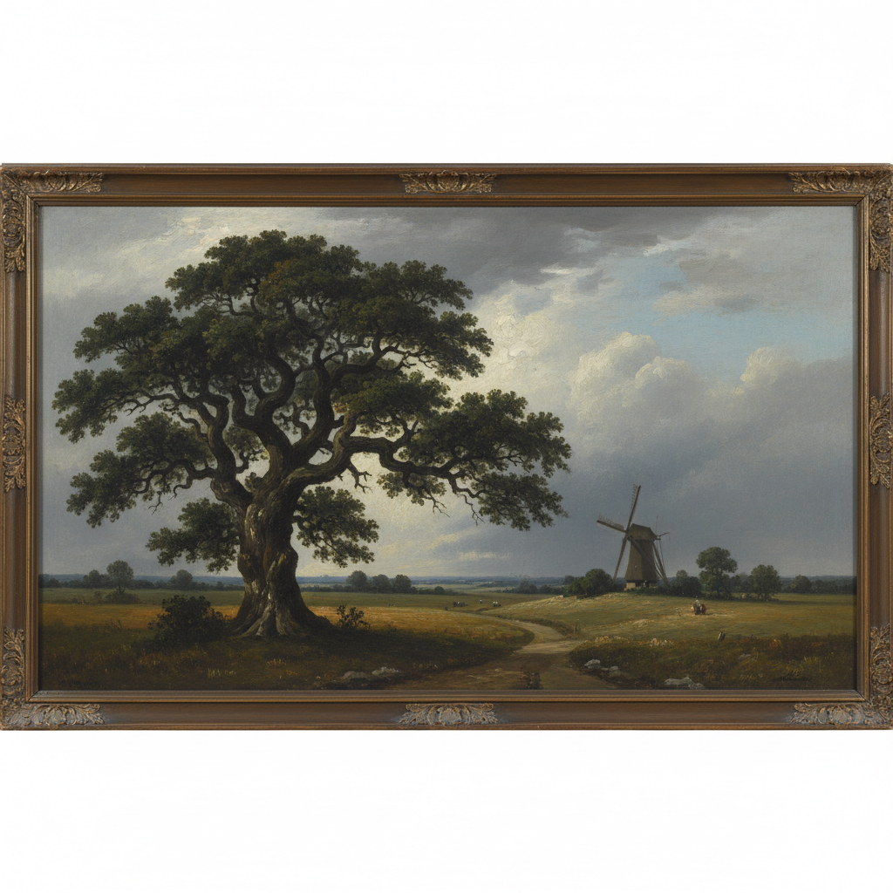

# Norwich School 诺里奇画派

> "I love every stile and stump, and every lane in the village." — John Crome

## 概述

诺里奇画派（Norwich School of Painters）是19世纪初（约1803–1833）英国唯一一个真正的地方性绘画流派，以东英格兰诺福克郡的诺里奇市为中心。由约翰·克罗姆（John Crome）创立的"诺里奇艺术家协会"是英国最早的地方艺术团体。

画家们专注于描绘诺福克的平坦风景——广阔的天空、风车、河流、沼泽和橡树——发展出一种朴素、真实、充满地方情感的英国风景画传统。

## 核心特征

| 特征 | 描述 |
|------|------|
| 地方性 | 专注于诺福克本地风景 |
| 荷兰影响 | 深受17世纪荷兰风景画影响 |
| 朴素真实 | 不追求理想化，忠实记录本地景观 |
| 广阔天空 | 诺福克平坦地形带来的壮阔天空 |
| 水彩传统 | 强大的水彩画传统 |
| 地方情感 | 对家乡风景的深厚感情 |

## 视觉特征

- **天空**：占据画面2/3以上的广阔天空
- **地平线**：极低的地平线
- **色调**：灰绿、银蓝、暖褐的英国色彩
- **树木**：粗壮的英国橡树是标志性元素
- **水面**：诺福克湖区（Broads）的静水
- **光线**：柔和的英国光线，多云天空

## 代表人物

| 画家 | 代表作 | 特点 |
|------|--------|------|
| John Crome | *Mousehold Heath* | 画派创始人，"老克罗姆" |
| John Sell Cotman | *Greta Bridge* (水彩) | 水彩大师，构图简洁 |
| John Berney Crome | 月光风景 | "小克罗姆"，夜景 |
| James Stark | 诺福克森林风景 | 精细的树木描绘 |
| George Vincent | 诺里奇市景 | 城市风景 |

## 与其他风格的关系

- **Dutch Golden Age** → 深受荷兰风景画（Ruisdael）影响
- **Constable** → 与康斯太勃尔同时代的英国风景画
- **Barbizon School** → 英国版的地方风景画运动
- **Plein Air** → 早期的户外写生实践
- **Watercolor Tradition** → 英国水彩画传统的重要组成

## 概念图

---

*浮光艺志 | Chronicle of Artistry*
